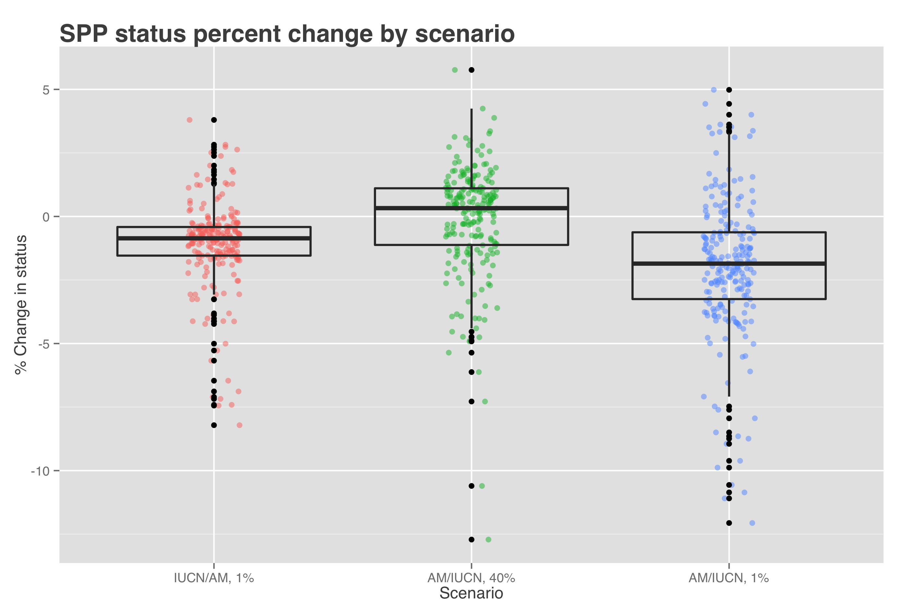

```{r, echo = FALSE, warning = FALSE, message = FALSE}

# Libraries and Paths

library(ggplot2)
library(maps)
library(readr)
library(raster)
library(data.table)
library(tidyr)
library(dplyr)
library(stringr)

dir_N <- c('Windows' = '//neptune.nceas.ucsb.edu/data_edit',
           'Darwin'  = '/Volumes/data_edit',
           'Linux'   = '/var/data/ohi')[[ Sys.info()[['sysname']] ]]

dir_anx <- file.path(dir_N, 'git-annex/globalprep/SPP_ICO')
```

```{r read_am_and_iucn_data, echo = FALSE, warning = FALSE, message = FALSE, results = 'hide'}

# Data files
#iucn spp cells WITHOUT extinct locations of IUCN subpopulations
iucn_spp_cells <- read_csv(file.path(dir_anx, 'explore_am_v_iucn/iucn_spp_cells_both.csv'), 
                           col_types = 'cdddd', progress = TRUE) %>%
  as.data.frame() %>%
  filter(presence != 5) ### removes extinct subpopulations

am_spp_cells   <- read_csv(file.path(dir_anx, 'explore_am_v_iucn/am_spp_cells.csv'), progress = TRUE)

### species info list - scinames, IUCN species ID, AM species ID, category etc
spp_list_base <- read.csv('shiny/data/spp_am_v_iucn.csv', stringsAsFactors = FALSE)

### LOICZID cell ID numbers - used in plotting rasters
loiczid_raster_file  <- 'shiny/data/loiczid_raster.grd'
loiczid_raster       <- raster(loiczid_raster_file)
names(loiczid_raster) <- 'loiczid'
```

``` {r ggplot_theme_setups, echo = FALSE}

### generic theme for all plots
ggtheme_plot <- theme(axis.ticks = element_blank(),
                    text = element_text(family = 'Helvetica', color = 'gray30', size = 8),
                    plot.title = element_text(size = rel(1.5), hjust = 0, face = 'bold'),
                    legend.position = 'right')

# ggtheme_map <- theme(axis.ticks = element_blank(), axis.text = element_blank(),
#                     text = element_text(family = 'Helvetica', color = 'gray30', size = 8),
#                     plot.title = element_text(size = rel(1.5), hjust = 0, face = 'bold'),
#                     legend.position = 'right')

### theme for species range maps - based on generic plot theme
ggtheme_map <- ggtheme_plot +
  theme(axis.text = element_blank())

```

``` {r species_map_functions, echo = FALSE, warning = FALSE, message = FALSE}

### Species Map Function ###
# This function takes a single species scientific name as input, then grabs all 
# occurrence cells and associated Aquamaps probability and/or IUCN proportional area
# per cell
get_spp_map <- function(species){
  spp_id <- spp_list_base %>%
    filter(sciname == species & is.na(parent_sid)) %>%
    dplyr::select(am_sid, iucn_sid, sciname) %>%
    unique()
  iucn_spp_map <- iucn_spp_cells %>%
    filter(sciname == species) %>%
    group_by(loiczid) %>%        
    summarize(iucn_area = max(prop_area))
  ### The group_by() and summarize() are to collapse cells with overlapped polygons, fixing the duplicate 'by' issue
  am_spp_map   <- am_spp_cells %>%
    filter(am_sid == spp_id$am_sid) %>%
    rename(am_prob = prob)
  spp_map <- full_join(iucn_spp_map, am_spp_map, by = 'loiczid')%>%
    as.data.frame()
  
  return(spp_map)
}

### Plot Species Map function
### uses ggplot to create a formatted map of species ranges, including
### Aquamaps, IUCN, and overlapped ranges; returns the plot object.
plot_rangemap <- function(spp) {
  map <- get_spp_map(spp)

  am_map <- map %>%
    filter(!is.na(am_prob))
  
  r_am_spp  <-  subs(loiczid_raster, 
                     am_map[ , c('loiczid', 'am_prob')], 
                     by = 'loiczid', 
                     which = 'am_prob', 
                     subsWithNA = TRUE)
  r_am_spp[!is.na(r_am_spp)] <- 1
      
  iucn_map <- map %>%
    mutate(iucn_pres = iucn_area > 0)
  r_iucn_spp <- subs(loiczid_raster, 
                     iucn_map[ , c('loiczid', 'iucn_pres')], 
                     by = 'loiczid', 
                     which = 'iucn_pres', 
                     subsWithNA = TRUE)
      
  spp_pts <- as.data.frame(rasterToPoints(r_iucn_spp)) %>%
    full_join(as.data.frame(rasterToPoints(r_am_spp)),
              by = c('x', 'y')) %>%
    mutate(presence = ifelse(am_prob & is.na(iucn_pres), 'am',
                             ifelse(iucn_pres & is.na(am_prob), 'iucn',
                                    ifelse(iucn_pres & am_prob, 'both', NA))))
  
  spp_plot <- ggplot(spp_pts, aes(x = x, y = y)) +
    ggtheme_map + 
    geom_raster(aes(fill = presence), alpha = .5) +
    scale_fill_manual(values = c('iucn' = 'blue', 'am' = 'red', 'both' = 'mediumorchid')) +
    borders('world', color='gray40', fill='gray45', size = .1) +  # create a layer of borders
    labs(title = spp, x = NULL, y = NULL) 
}


```
***  


```{r create_species_list_w_area, echo = FALSE, eval = FALSE, warning = FALSE, message = FALSE}

spp_list <- spp_list_base %>%
              mutate(total_area = NA,
                     am_area    = NA,
                     iucn_area  = NA,
                     perc       = NA,
                     am_perc    = NA,
                     iucn_perc  = NA,
                     sm_perc    = NA, #filled with % of smaller range that is within the larger range
                     sm_range   = NA) #what range is smaller


#there's likely a better way to do this than a for loop (lapply or sapply?)
for (i in 1:nrow(spp_list)){
  spp     <- spp_list[i, ]$sciname #species name
  spp_map <- get_spp_map(spp) #get species map
  
###get just the aquamaps cells
  am_spp_map <- spp_map %>%
    filter(!is.na(am_prob))%>%
    dplyr::select(loiczid, am_sid, am_prob) %>% 
      ### add in am_prob when we want to look at probability
    unique()
  
  if(any(duplicated(am_spp_map$loiczid))){
    am_spp_map <- am_spp_map %>%
      dplyr::select(loiczid, am_sid) %>% 
      unique()
    }
  
### rasterize aquamaps map
  r_am_spp <- subs(loiczid_raster, 
                   am_spp_map[ , c('loiczid', 'am_sid')], 
                   by = 'loiczid', 
                   which = 'am_sid', 
                   subsWithNA = TRUE)
  
  spp_list[i, ]$am_area <- area(r_am_spp, na.rm = TRUE)%>%
              cellStats(., stat='sum')
  
  
###  get the iucn cells
  iucn_map <- spp_map %>%
    mutate(iucn_pres = iucn_area > 0)%>%
      dplyr::select(loiczid, iucn_area, am_sid, am_prob, iucn_pres)%>%
        unique()
  
  #TODO: incorporate the iucn_area (area of cell that species overlaps with...I think thats what it is)
  
###this is incorporated because there are some duplications for loiczids with IUCN cells. I'm guessing this is because of the parent/subpopulations?
  
   if(TRUE %in% duplicated(iucn_map$loiczid))next()
   
### rasterize IUCN map
  r_iucn_spp <- subs(loiczid_raster, 
                     iucn_map[ , c('loiczid', 'iucn_pres')], 
                     by = 'loiczid', 
                     which = 'iucn_pres', 
                     subsWithNA = TRUE)

  spp_list[i, ]$iucn_area <- area(r_iucn_spp, na.rm = TRUE)%>%
                cellStats(., stat='sum')
  
  
### Get total area (IUCN and AM combined)
  allCells <- spp_map%>%
                dplyr::select(loiczid)%>%
                  mutate(value=1)%>%
                  unique()
            
  
  fullRange <- subs(loiczid_raster, 
                    allCells[ , c('loiczid', 'value')], 
                    by = 'loiczid', 
                    which = 'value', 
                    subsWithNA = TRUE)
  
  spp_list[i, ]$total_area <- area(fullRange, na.rm = TRUE)%>%
                              cellStats(., stat='sum')
  
### get percent overlap of map
  
   #iucn map cells
  cells_iucn<-iucn_map %>%
    filter(iucn_pres == TRUE) %>%
    .$loiczid
  cells_am <- am_spp_map %>%
    filter(!is.na(am_sid)) %>%
    .$loiczid
  
  cells_total <- unique(spp_map$loiczid)
  cells_overlap <- intersect(cells_iucn, cells_am)
  
  #I THINK THIS IS A DUPLICATE? r_iucn_spp raster created above... (JA 10/12/15)
#    r_iucn_spp <- subs(loiczid_raster, 
#                       iucn_map[ , c('loiczid', 'iucn_pres')], 
#                      by = 'loiczid', 
#                       which = 'iucn_pres', 
#                       subsWithNA = TRUE)
#   
  #percent overlap
  perc <- (length(cells_overlap) / length(cells_total)) * 100
  spp_list[i, ]$perc <- perc
  
  am_only <- setdiff(cells_am, cells_iucn)
  iucn_only <- setdiff(cells_iucn, cells_am)
  
  perc_am <- (length(am_only) / length(cells_total)) * 100
  perc_iucn <- (length(iucn_only) / length(cells_total)) * 100
  
  spp_list[i, ]$am_perc <- perc_am
  spp_list[i, ]$iucn_perc <- perc_iucn

  spp_list[i, ]$sm_range <- ifelse(length(cells_am)<length(cells_iucn), 'AM', 'IUCN') 
    ### what dataset has the smaller range
  spp_list[i, ]$sm_perc <- length(cells_overlap)/min(length(cells_am), length(cells_iucn)) * 100 
    ### this is the total percent of smaller range encompassed in the larger range

  cat(sprintf('%s: For species %s, %.2f%% of both datasets overlap, %.2f%% is just AquaMaps and %.2f%% is just IUCN\n', 
              i, spp, perc, perc_am, perc_iucn))
  }


# for Conus arenatus, the IUCN map gives 4 duplicate cells, but each of the entries has a different iucn_area...which doesn't make sense

#row 985 for Acanthurus leucopareius - AM is giving duplicate loiczids but with different am_prob...which is so strange. Looked
# at the raw data and it seems to be in the raw data... (JA on 8/31/15)

#remove non IUCN species and log total area (for use later on)
spp_list <- spp_list %>%
            filter(spp_group != 'hagfishes' & spp_group != 'non-homalopsids') %>%
              mutate(log_total_area = log(total_area))

write.csv(spp_list, file='spp_list_w_area_percent_noextinct.csv')
```


###(1) Number of species in both datasets split up by group

```{r, echo = FALSE, warning = FALSE, message = FALSE}
# look at number of species per group

spp_list <- read.csv('spp_list_w_area_percent_noextinct.csv')

spp_df <- spp_list %>%
  mutate(diff = iucn_area - am_area)

spp_df <- within(spp_df, spp_group <- factor(spp_group, levels = names(sort(table(spp_group), increasing = TRUE))))

barchart_sp_groups <- ggplot(spp_df, aes(x = spp_group)) +
  ggtheme_plot + 
  geom_bar(stat = 'bin') +
  theme(axis.text.x = element_text(angle = 45, hjust = 1, vjust = 1)) + 
  coord_flip() +
  labs(x = 'Species Group', 
       y = 'Number of Species', 
       title = 'Number of species in both AquaMaps and IUCN datasets')

ggsave('figures/sp_groups_barchart.png', 
       plot = barchart_sp_groups, 
       width = 8, height = 4, dpi = 100)

print(barchart_sp_groups)

```

***  

###(2) Looking at the total difference in area (km^2) for each species range map in both datasets

```{r, echo = FALSE, warning = FALSE, message = FALSE}

scatter_am_iucn_area <- ggplot(spp_df, aes(x = iucn_area, y = am_area, color = iucn_category)) + 
  ggtheme_plot + 
  geom_point() + 
  geom_abline(slope = 1, intercept = 0, color = 'red') +
  labs(x = 'Area (km^2) from IUCN dataset', 
       y = 'Area (km^2) from AquaMaps dataset', 
       title = 'Comparing total area of species range maps')

ggsave('figures/CompareTotalArea_AM-IUCN_scatter.png', 
       plot = scatter_am_iucn_area, 
       width = 8, height = 4, dpi = 100)

print(scatter_am_iucn_area)
```


There are large differences so to get a better sense, here is the same comparison but with area log transformed.
``` {r echo = FALSE, warning = FALSE, message = FALSE}

spp_df <- spp_df %>%
  mutate(am_log = log(am_area),
         iucn_log = log(iucn_area))

scatter_am_iucn_area_log <- ggplot(spp_df, aes(iucn_log, am_log, color = iucn_category)) + 
  ggtheme_plot + 
  geom_point() + 
  geom_abline(slope = 1, intercept = 0, color = 'red') +
  labs(x = 'IUCN Area (log transformed)', 
       y = 'AquaMaps Area (log transformed)',
       title = 'Comparing area of range maps\n (all area values are km^2 log transformed)', 
       fill = 'IUCN Category')

ggsave('figures/CompareTotalAreaLOG_AM-IUCN_scatter.png', 
       plot = scatter_am_iucn_area_log, 
       width = 8, height = 4, dpi = 100)

print(scatter_am_iucn_area_log)
```

Data split into species groups and by IUCN category
```{r, echo = FALSE, warning = FALSE, message = FALSE}

scatter_am_iucn_alog_gp <- ggplot(spp_df, aes(iucn_log, am_log, color = iucn_category)) + 
  ggtheme_plot + 
  geom_point() +
  facet_wrap(~spp_group) + 
  geom_abline() + 
  labs(x = 'IUCN Area (log transformed)', 
       y = 'AquaMaps Area (log transformed)',
       title = 'Comparing differences in area across species groups', 
       fill = 'IUCN Category')
        
ggsave('figures/CompareTotalAreaLOG_AM-IUCN_spgroups_scatter.png', 
       plot = scatter_am_iucn_alog_gp, 
       width = 8, height = 6, dpi = 100)

print(scatter_am_iucn_alog_gp)
```
***  

###(3) Looking at the overlap between species range maps from IUCN and AquaMaps  

This plot shows the total percent of a species range map that is (1) only covered by IUCN cells, (2) only covered by AquaMaps cells and (3) covered by both IUCN and AquaMaps cells. 

####How this breaks down between AquaMaps and IUCN

Here is an example of a single species, the yellow speckled chromis (*Chromis alpha*)  

```{r, echo = FALSE, warning = FALSE, message = FALSE}

spp <- 'Chromis alpha'

spp_map <- plot_rangemap(spp)

print(spp_map)
ggsave(plot = spp_map,
       filename = sprintf('figures/rangemap_%s.png', spp),
       width = 8, height = 4, dpi = 200)
```
  

```{r, echo = FALSE, warning = FALSE, message = FALSE}
  
  spp_df2 <- gather(spp_list, perc.type, percent, perc, am_perc, iucn_perc) %>%
    dplyr::select(sciname, spp_group, perc.type, percent) %>%
    unique()
  
  perc_c <- spp_df2 %>%
    filter(sciname == spp)
  
  p1 <- perc_c %>% 
    dplyr::select(percent)
   
```

For `r spp`, `r round(pi[1], 2)`% of the total area is covered by both IUCN and AquaMaps, `r round(p1[2, ], 2)`% is covered just by AquaMaps and `r round(p1[3, ], 2)`% is covered just by IUCN.
  
***  
  
####Now looking across all species, here is the breakdown of how much overlap there is between the two datasets  
  
This plot shows that the majority of species range maps have only ~30% of their full map covered by both maps, and very few species have more than 50% of their two ranges (IUCN and AquaMaps) overlapping. 


```{r, echo = FALSE, warning = FALSE, message = FALSE}

### look at density plot

overlap <- spp_df2 %>%
  dplyr::filter(perc.type == 'perc')

hist_overlap_pct <- ggplot(overlap, aes(percent)) +
  ggtheme_plot + 
  geom_histogram(aes(y = ..count../1926), binwidth = 5, alpha = .8) +
  labs(title = 'Percent of total range shared between datasets',
       x = '% total range that is shared b/w both datasets', 
       y = 'Proportion of Total Species')

ggsave('figures/Overlap-PercTotalRange.png')

print(hist_overlap_pct)
```


Split up by species - not sure if this is useful or not
```{r, echo = FALSE, message = FALSE, warning = FALSE}

hist_overlap_pct_gp <- ggplot(overlap, aes(percent)) + 
  ggtheme_plot + 
  geom_histogram(binwidth = 5, alpha = .8) +
  facet_wrap(~spp_group) +
  labs(title = 'Percent of total range shared, by species group',
       x = 'Percent of total range that is shared between both datasets', 
       y = 'Number of Total Species') + 
  theme(strip.text.x = element_text(size = 8))

ggsave('figures/Overlap-PercTotalRange_spGroups.png')
print(hist_overlap_pct_gp)

```


###(4) Looking at the percent of smaller species range that is within the larger range. 

For each range 

```{r pct small within large, echo = FALSE, warning = FALSE}

spp_df4 <- spp_list %>%
  dplyr::select(sciname, sm_perc, sm_range) %>%
  unique()
      

hist_sm_within_lg <- ggplot(spp_df4, aes(sm_perc, fill = sm_range)) + 
  ggtheme_plot + 
  geom_histogram(aes(y = ..count../sum(..count..)), binwidth = 4, alpha = .8) +
  scale_fill_discrete(name = 'Dataset with smaller range', labels = c('AquaMaps', 'IUCN')) + 
  labs(title = 'Percent of smaller range within larger range',
       x = 'Percent of smaller range that falls within the larger range', 
       y = sprintf('Proportion of all species (n = %s)', nrow(spp_df4)))

ggsave('figures/PercSmallRangeInLarger.png', width = 6, height = 4)

print(hist_sm_within_lg)

```

Exploring possible correlation between total species range area and percent overlap of smaller range within the larger:
``` {r pct overlap vs area, echo = FALSE, warning = FALSE, message = FALSE}

scatter_area_vs_overlap <- ggplot(spp_list, aes(sm_perc, total_area, color = sm_range)) + 
  ggtheme_plot + 
  geom_point() + 
  geom_abline() + 
  labs(y = 'Total Area (km^2)', 
       x = 'Percent overlap smaller range in larger', 
       title = 'Size of species range vs. percent overlap of \nsmaller range with larger')

ggsave('figures/AreavsPercOverlap.png', width = 6, height = 4)

print(scatter_area_vs_overlap)

```

``` {r pct overlap vs ratio of area, echo = FALSE, warning = FALSE, message = FALSE}

spp_list <- spp_list %>%
  mutate(area_ratio = am_area / iucn_area,
         area_ratio = ifelse(area_ratio > 1, 1 / area_ratio, area_ratio),
         area_ratio = area_ratio * 100)

### Inspect each quadrant to find representative species
# quadrant1_spp <- spp_list %>%
#   filter(area_ratio > 90 & sm_perc > 90)
# quadrant2_spp <- spp_list %>%
#   filter(area_ratio > 25 & area_ratio < 30) %>%
#   filter(sm_perc > 90)
# quadrant4_spp <- spp_list %>%
#   filter(sm_perc > 25 & sm_perc < 30) %>%
#   filter(area_ratio > 90)
# quadrant3_spp <- spp_list %>%
#   filter(area_ratio < 25 & sm_perc < 25)

spp_quads <- c('q1' = 'Kajikia albida', 
               'q2' = 'Galaxea cryptoramosa', 
               'q3' = 'Acanthurus nigroris', 
               'q3a' = 'Metanephrops australiensis', 
               'q4' = 'Conus magnificus')

spp_list_label <- spp_list %>%
  filter(sciname %in% spp_quads) %>%
  separate(sciname, c('g', 's'), sep = ' ', remove = FALSE) %>%
  mutate(sciname_label = paste(str_sub(g, 1, 1), '. ', s, sep = '')) %>%
  select(-g, -s)

scatter_arearatio_vs_overlap <- ggplot(spp_list, aes(area_ratio, sm_perc, color = sm_range)) + 
  ggtheme_plot + 
  geom_point() + 
  geom_abline() + 
  geom_point(data = spp_list_label, color = 'grey30') + 
  geom_text(data = spp_list_label, 
            aes(label = sciname_label), 
            color = 'grey30',
            fontface = 3,
            size = 2,
            hjust = .25,
            vjust = 1.5) +
  labs(x = 'Range area ratio (smaller:larger) * 100%', 
       y = 'Percent overlap smaller range in larger', 
       title = 'Ratio of species range vs. percent overlap of \nsmaller range with larger')

ggsave('figures/AreaRatiovsPercOverlap.png', width = 6, height = 4)

print(scatter_arearatio_vs_overlap)

```


```{r plot_spp_from_quadrants, echo = FALSE, warning = FALSE, message = FALSE}

for (i in 1:length(spp_quads)) { # i = 1
  spp <- spp_quads[i]
  spp_quad <- names(spp_quads)[i]
  
  spp_plot <- plot_rangemap(spp)
  print(spp_plot)
  
  ggsave(filename = sprintf('figures/rangemap_%s_%s.png', spp_quad, str_replace(tolower(spp), ' ', '_')),
         plot = spp_plot, 
         width = 8, height = 4, dpi = 200)
}

```
  


``` {r, echo = FALSE, warning = FALSE, message = FALSE}
  

# Regression


lm_eqn <- function(df){
  m  <- lm(total_area ~ sm_perc, spp_list)
  eq <- substitute(italic('y') == a + b %.% italic('x')*","~~italic(r)^2~"="~r2, 
        list(a  = format(coef(m)[1], digits = 2), 
             b  = format(coef(m)[2], digits = 2), 
             r2 = format(summary(m)$r.squared, digits = 3)))
  as.character(as.expression(eq))             
}

scatter_area_vs_overlap <- scatter_area_vs_overlap + 
  geom_text(x = 40, y = 300000000, label = lm_eqn(spp_list), parse = TRUE)

ggsave('figures/CorrelationAreavsPercOverlap.png')

print(scatter_area_vs_overlap)

summary(lm(total_area ~ sm_perc, spp_list))
```
  
***  


Percent coverage as function of area, clipping to area below 100,000,000 km^2:
``` {r, echo = FALSE, warning = FALSE, message = FALSE}
# remove all area greater than 100000000

spp_small_df <- spp_list %>% 
  filter(total_area < 100000000)


scatter_a_vs_overlap_small <- ggplot(spp_small_df, aes(total_area, sm_perc, color = sm_range)) + 
  ggtheme_plot + 
  geom_point() + 
  labs(x = 'Total Area (km^2)', 
       y = 'Percent overlap smaller range in larger', 
       title = 'Size of species range vs. percent overlap of \nsmaller range with larger')

ggsave('figures/AreavsPercOverlap_2.png', width = 6, height = 4)


print(scatter_a_vs_overlap_small)

```

Percent coverage as a function of log(area)
``` {r, echo = FALSE, warning = FALSE, message = FALSE}
# Log transform area

scatter_logA_vs_overlap <- ggplot(spp_list, aes(log_total_area, sm_perc, color = sm_range)) + 
  ggtheme_plot + 
  geom_point() + 
  labs(x = 'Log(total Area)', 
       y = 'Percent overlap smaller range in larger', 
       title = 'Size of species range (log) vs. percent overlap of \nsmaller range with larger')

ggsave('figures/AreavsPercOverlap_log.png', width=6, height=4)

print(scatter_logA_vs_overlap)
```


``` {r examine regressions, eval = FALSE, echo = FALSE, warning = FALSE}

A_mdl      <- lm(total_area ~ sm_perc, spp_list)
#                Estimate Std. Error t value Pr(>|t|)    
#   (Intercept) -16285410    2858388  -5.697  1.4e-08 ***
#   sm_perc        533370      41702  12.790  < 2e-16 ***
#   Multiple R-squared:  0.07732,	Adjusted R-squared:  0.07685 

A_mdl_clip <- lm(total_area ~ sm_perc, l)
#               Estimate Std. Error t value Pr(>|t|)    
#   (Intercept)  2993939     810560   3.694 0.000227 ***
#   sm_perc       153523      11952  12.844  < 2e-16 ***
#   Multiple R-squared:  0.07955,	Adjusted R-squared:  0.07906 
logA_mdl   <- lm(log_total_area ~ sm_perc, spp_list)
#                Estimate Std. Error t value Pr(>|t|)    
#   (Intercept) 14.775325   0.096446   153.2   <2e-16 ***
#   sm_perc      0.016885   0.001407    12.0   <2e-16 ***
#   Multiple R-squared:  0.0687,	Adjusted R-squared:  0.06823 
```

***  

###(5) Examining data broken into quartiles to see if smaller patterns emerge
``` {r examine quartiles, eval = FALSE, echo = FALSE, warning = FALSE}

summary(spp_list$total_area)
#      Min.   1st Qu.    Median      Mean   3rd Qu.      Max.
#     55760   3032000  10790000  18500000  22670000 372100000

qtiles <- c(quantile(spp_list$total_area, 0.0, na.rm = TRUE),
            quantile(spp_list$total_area, .25, na.rm = TRUE),
            quantile(spp_list$total_area, .50, na.rm = TRUE),
            quantile(spp_list$total_area, .75, na.rm = TRUE),
            quantile(spp_list$total_area, 1.0, na.rm = TRUE))

qtile_mdl <- list()
for (i in 1:4) {
  area_clip <- spp_list %>%
    filter(total_area >= qtiles[i] & total_area < qtiles[i + 1])
  qtile_mdl[[i]] <- lm(total_area ~ sm_perc, area_clip)
  
  qtile_plot <- ggplot(area_clip, aes(total_area, sm_perc, color = sm_range)) + 
    ggtheme_plot + 
    geom_point() + 
    labs(x = 'Total Area (km^2)', 
         y = 'Percent overlap smaller range in larger', 
         title = sprintf('Size of species range (quartile %s) vs. percent overlap of \nsmaller range with larger', i))

  ggsave(paste0('figures/AreavsOverlap_quantile_', i, '.png'), width = 6, height = 4)
  print(qtile_plot)
}
# First quartile regression:
#                 Estimate Std. Error t value Pr(>|t|)    
#     (Intercept)  1423917     101053  14.091   <2e-16 ***
#     sm_perc         1188       1555   0.764    0.445    
#     Multiple R-squared:  0.001198,	Adjusted R-squared:  -0.0008529 
#
# second quartile:
#                 Estimate Std. Error t value Pr(>|t|)    
#     (Intercept)  7011028     275943  25.408  < 2e-16 ***
#     sm_perc       -17725       4228  -4.192 3.28e-05 ***
#     Multiple R-squared:  0.03483,	Adjusted R-squared:  0.03285 
#
# third quartile:
#                 Estimate Std. Error t value Pr(>|t|)    
#     (Intercept) 12813279     507856  25.230  < 2e-16 ***
#     sm_perc        64710       8159   7.931  1.5e-14 ***
#     Multiple R-squared:  0.1146,	Adjusted R-squared:  0.1128 
#
# fourth quartile:
#                   Estimate Std. Error t value Pr(>|t|)    
#     (Intercept) -101736351   17259544  -5.894 7.04e-09 ***
#     sm_perc        1911286     215216   8.881  < 2e-16 ***
#     Multiple R-squared:  0.1399,	Adjusted R-squared:  0.1381 

# This avenue of exploration looks like a bust.

```

***  

###(6) Looking at how many and what type (threat category) of species we are losing by setting a threshold of 0.4 on the aquamaps species

This looks at the full Aquamaps dataset... should it be limited to species with valid categories?

```{r aquamaps probabilities, warning = FALSE, message = FALSE, cache.lazy = FALSE, cache = TRUE, verbose = FALSE, results = FALSE, echo = FALSE, include = FALSE}

# get spp_cells raw data for aquamaps
dir_aquamaps <- file.path(dir_N, 'git-annex/globalprep/SPP_ICO/raw/aquamaps_2014')

spp_cells <- read_csv(file.path(dir_aquamaps, 'tables/ohi_hcaf_species_native.csv'), 
                      col_types = '_ccd__', progress = TRUE)

# spp_cells <- fread(input = file.path(dir_aquamaps, 'tables/ohi_hcaf_species_native.csv'), verbose = FALSE, header = TRUE, 
#                   colClasses = c('NULL', 'character', NA, 'numeric', 'NULL', 'NULL')) #1 min 49 sec

setnames(spp_cells, c('SpeciesID', 'CsquareCode', 'probability'), c('species_id', 'csquare_code', 'probability'))

spp_cells <- as.data.frame(spp_cells)

spp <- fread(input = file.path(dir_aquamaps, 'tables/ohi_speciesoccursum.csv'), 
             verbose = FALSE, header = TRUE) %>%
  mutate(sciname = paste(Genus, Species, sep = ' '))
spp <- as.data.frame(spp)

```

```{r, warning = FALSE, message = FALSE, echo = FALSE}

### create dataframe that gives me all species, their total number of cells, 
### total number of cells >= 0.4 prob, difference between the two and threat
spp_df3 <- spp_cells %>%
  group_by(species_id) %>%
  summarize(cells_0.4 = sum(probability >= 0.4),
            cells_t = sum(probability >= 0)) %>%
  mutate(prop = cells_0.4 / cells_t) %>%
  left_join(spp, by = c('species_id' = 'SPECIESID')) %>%
  select(sciname, species_id, cells_0.4, cells_t, prop, iucn_code)


hist_area_vs_threshold <- ggplot(spp_df3, aes(prop, fill = iucn_code)) + 
  ggtheme_plot + 
  geom_histogram(aes(y = ..count../sum(..count..)), binwidth = 0.05, alpha = .7) + 
  labs(x = 'Proportion of range area included when selecting a threshold of 0.4', y = 'Proportion of all aquamaps species (17,348 total)')

ggsave('figures/AMThreshold.png', width = 6, height = 4)

print(hist_area_vs_threshold)

```

## Changes in SPP for scenarios

Comparing three scenarios to the current (v2015) global model for SPP:

* Baseline is: preferring IUCN rangemaps over Aquamaps rangemaps; Aquamaps 'presence' threshold is set at 40% or greater.
* Scenario 1: preferring IUCN rangemaps over Aquamaps; AM presence threshold set at >= 1% (effectively, all occurrences).
* Scenario 2: preferring AM maps over IUCN; AM presence >= 40%.
* Scenario 3: preferring AM over IUCN; AM presence >= 1%.

Boxplots:


