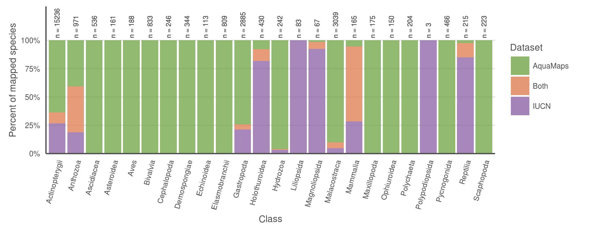
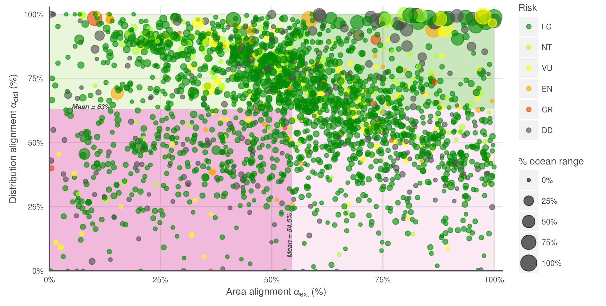
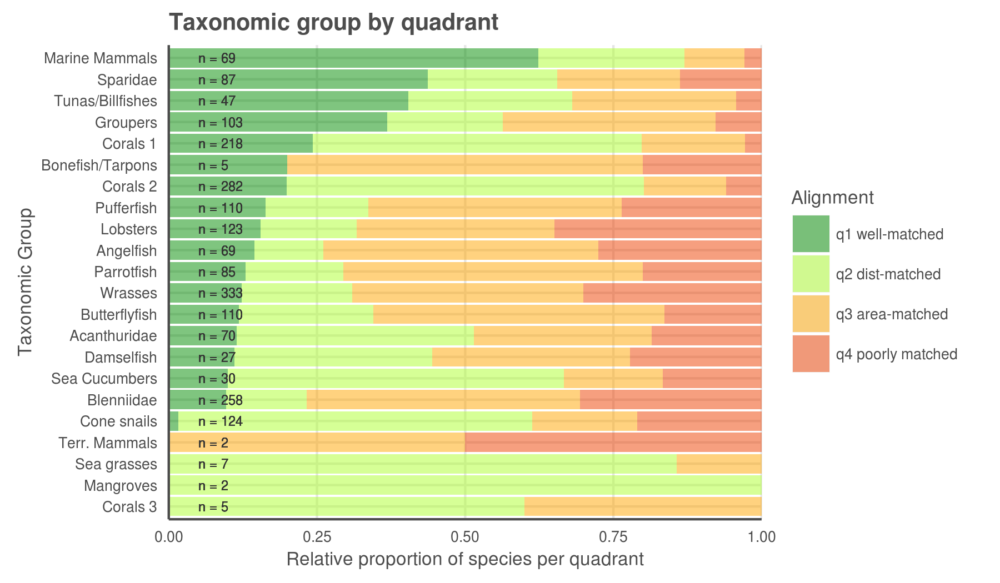
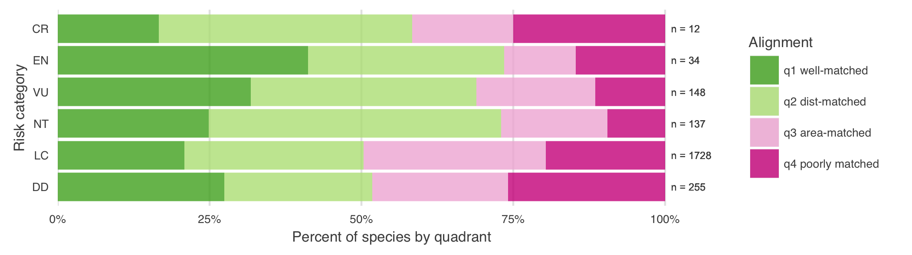

```{r setup, echo = FALSE, warning = FALSE, message = FALSE}

# Libraries and Paths

library(ggplot2)
library(maps)
library(readr)
library(data.table)
library(raster)
library(tidyr)
library(dplyr)
library(stringr)

dir_M             <- c('Windows' = '//mazu.nceas.ucsb.edu/ohi',
                       'Darwin'  = '/Volumes/ohi',    ### connect (cmd-K) to smb://mazu/ohi
                       'Linux'   = '/home/shares/ohi')[[ Sys.info()[['sysname']] ]]


dir_git <- '~/github/IUCN-AquaMaps'
  
dir_anx <- file.path(dir_N, 'git-annex/globalprep/SPP_ICO')
dir_fig <- file.path(dir_git, 'figures')
dir_data <- file.path(dir_git, 'data')

if(basename(getwd()) != 'data_explore') setwd('data_explore')
source('data_explore_fxns.R')
### When knitting this, it automatically sets WD to be this directory...
### the 'setwd()' is there for running by chunk
```


```{r get_spp_list, echo = FALSE, warning = FALSE, message = FALSE, eval = TRUE}
### this file created in data_prep
spp_list <- read_csv(file.path(dir_data, 'spp_list_w_area_trimmed.csv'))

```


# Figures 1 a b c


``` {r load data, echo = FALSE, warning = FALSE, message = FALSE}
### use data_prep.Rmd to create this file, if it does not yet exist.

data_file <- file.path(dir_data, 'spp_list_w_area_trimmed.csv')
spp_map_pairs <- read.csv(data_file, stringsAsFactors = FALSE) %>%
  filter(!is.na(popn_category)) %>% ### filter out unassessed species
  filter(!is.na(sm_perc))           ### filter out NA maps

### generate other lists

spp_all_file <- file.path(dir_data, 'spp_all.csv')
spp_all <- read_csv(spp_all_file) 

iucn_file <- file.path(dir_data, 'spp_iucn.csv')
spp_iucn <- read.csv(iucn_file, stringsAsFactors = FALSE) 

message('Getting IUCN maps list')
iucn_maps_file <- file.path(dir_data, 'spp_iucn_maps.csv')
spp_iucn_maps <- read.csv(iucn_maps_file, stringsAsFactors = FALSE) %>%
  filter(spp_group != 'hagfishes') %>%           ### not from IUCN...
  filter(sciname %in% spp_iucn$sciname)   ### ditch freshwater spp

spp_am_file <- file.path(dir_data, 'spp_am.csv')
spp_am <- read_csv(spp_am_file)

```

``` {r breakdown by taxa, echo = FALSE, message = FALSE, warning = FALSE, eval = TRUE}

sciname_lookup <- read.csv(file.path(dir_data, 'sciname_lookups/spp_iucn_scinames.csv'), stringsAsFactors = FALSE)

spp_am <- spp_am %>%
  left_join(read_csv(file.path(dir_N, 'git-annex/globalprep/_raw_data/aquamaps/v2015/csv/speciesoccursum.csv')) %>% 
              dplyr::select(am_sid = speciesid, class) %>%
              unique(), 
            by = 'am_sid')

iucn_maps_class <- spp_iucn_maps %>% 
  left_join(sciname_lookup %>% 
              dplyr::select(sciname, class) %>%
              unique(), 
            by = 'sciname')

taxa_iucn_all <- iucn_maps_class[!duplicated(iucn_maps_class$sciname), ] %>%
  filter(!is.na(class)) %>% ### don't count the unknowns
  mutate(class = str_to_title(class),
         n_iucn_tot = n()) %>%        ### length of whole maps list
  group_by(class) %>%
  summarize(n_iucn_class_all  = n(),
            p_iucn_class_all  = round((n_iucn_class_all/first(n_iucn_tot) * 100), 2))

taxa_iucn_solo <- iucn_maps_class[!duplicated(iucn_maps_class$sciname), ] %>%
  filter(!is.na(class)) %>% ### don't count the unknowns
  filter(!sciname %in% spp_am$sciname) %>%  ### filter list to IUCN only
  mutate(class = str_to_title(class),
         n_iucn_solo = n()) %>%       ### length of IUCN only list
  group_by(class) %>%
  summarize(n_iucn_class_solo = n(),
            p_iucn_class_solo = round((n_iucn_class_solo/first(n_iucn_solo) * 100), 2))

taxa_am_all <- spp_am %>%
  filter(!class %in% c('Not assigned', 'null') & !is.na(class)) %>%
  mutate(class = str_to_title(class),
         n_am_tot = n()) %>%        ### length of whole AM maps list
  group_by(class) %>%
  summarize(n_am_class_all  = n(),
            p_am_class_all  = round((n_am_class_all/first(n_am_tot) * 100), 2))

taxa_am_solo <- spp_am %>%
  filter(!class %in% c('Not assigned', 'null') & !is.na(class)) %>%
  filter(!sciname %in% iucn_maps_class$sciname) %>%  ### filter list to AM only
  mutate(class = str_to_title(class),
         n_am_solo = n()) %>%       ### length of AM only list
  group_by(class) %>%
  summarize(n_am_class_solo = n(),
            p_am_class_solo = round((n_am_class_solo/first(n_am_solo) * 100), 2))

taxa_both <- spp_am %>%
  filter(sciname %in% spp_iucn_maps$sciname) %>%
  filter(!class %in% c('Not assigned', 'null')) %>%
  mutate(class = str_to_title(class),
         n_both_tot = n()) %>%
  group_by(class) %>%
  summarize(n_class_both = n(),
            p_class_both = round(n_class_both/first(n_both_tot) * 100, 2))

taxa_am_all_assessed <- spp_am %>%
  filter(!class %in% c('Not assigned', 'null') & !is.na(class)) %>%
  filter(sciname %in% spp_iucn$sciname) %>%
  mutate(class = str_to_title(class),
         n_am_tot = n()) %>%        ### length of whole AM maps list
  group_by(class) %>%
  summarize(n_am_class_ass  = n(),
            p_am_class_ass  = round((n_am_class_ass/first(n_am_tot) * 100), 2))

taxa_am_solo_assessed <- spp_am %>%
  filter(!class %in% c('Not assigned', 'null') & !is.na(class)) %>%
  filter(sciname %in% spp_iucn$sciname) %>%
  filter(!sciname %in% iucn_maps_class$sciname) %>%  ### filter list to AM only
  mutate(class = str_to_title(class),
         n_am_solo = n()) %>%       ### length of AM only list
  group_by(class) %>%
  summarize(n_am_class_solo_ass = n(),
            p_am_class_solo_ass = round((n_am_class_solo_ass/first(n_am_solo) * 100), 2))

taxa_df <- taxa_am_all %>%
  full_join(taxa_am_solo,   by = 'class') %>%
  full_join(taxa_am_all_assessed,  by = 'class') %>%
  full_join(taxa_am_solo_assessed, by = 'class') %>%
  full_join(taxa_iucn_all,  by = 'class') %>%
  full_join(taxa_iucn_solo, by = 'class') %>%
  full_join(taxa_both,      by = 'class') %>%
  filter(!(is.na(n_iucn_class_all) & p_am_class_all < 0.5))

# knitr::kable(taxa_df %>%
#                dplyr::select(class, 
#                              AquaMaps = n_am_class_all, 
#                              IUCN = n_iucn_class_all, 
#                              Both = n_class_both))
```

``` {r plot bar charts by taxa, echo = FALSE, message = FALSE, warning = FALSE, eval = TRUE}
### bar charts comparing number of species in each class for each data set

# taxa_df_long1 <- taxa_df %>%
#   dplyr::select(class, AquaMaps = n_am_class_all, IUCN = n_iucn_class_all, Both = n_class_both) %>%
#   gather(dataset, n_spp, AquaMaps:Both)
# bar_taxa1 <- ggplot(taxa_df_long1, aes(x = class, y = n_spp)) +
#   ggtheme_plot + 
#   geom_bar(stat = 'identity') +
#   facet_grid(dataset ~ ., scales = 'free_y') +
#   theme(axis.text.x = element_text(angle = 75, hjust = 1))
# print(bar_taxa1)

#library(colorspace)
#hclvec <- heat_hcl(3); colvec <- c('AquaMaps' = hclvec[1], 'Both' = hclvec[2], 'IUCN' = hclvec[3])
#colvec <- c('AquaMaps' = '#1b9e77', 'Both' = '#565080', 'IUCN' = '#d95f02')
colvec <- c('AquaMaps' = '#76A94C', 'Both' = '#e18258', 'IUCN' = '#9168a9')

taxa_df_long2 <- taxa_df %>%
  dplyr::select(class, AquaMaps = n_am_class_solo, IUCN = n_iucn_class_solo, Both = n_class_both) %>%
  gather(dataset, n_spp, AquaMaps:Both) %>%
  group_by(class) %>%
  mutate(n_total = sum(n_spp, na.rm = TRUE),
         percent = n_spp/n_total * 100,
         dataset = factor(dataset, levels = c('AquaMaps', 'Both', 'IUCN'), ordered = TRUE)) %>%
  arrange(desc(dataset))

bar_taxa2 <- ggplot(taxa_df_long2, aes(x = class, y = percent, fill = dataset)) +
  ggtheme_plot + 
  theme(panel.grid.major.x = element_blank()) +
  geom_bar(stat = 'identity', alpha = .8) +
  scale_fill_manual(values = colvec) +
  geom_text(aes(label = sprintf('n = %s', n_total), y = 102), 
            size = 2, 
            angle = 90, hjust = 0, color = 'grey30') +
  theme(axis.text.x = element_text(angle = 75, hjust = 1)) + 
  scale_y_continuous(expand = c(0, 0), 
                     limits = c(0, 130),
                     breaks = c(0, 25, 50, 75, 100),
                     labels = c('0%', '25%', '50%', '75%', '100%')) + 
  labs(# title = 'Species maps by taxonomic class',
       x = 'Class', 
       y = 'Percent of mapped species',
       fill = 'Dataset')

print(bar_taxa2)
ggsave(filename = file.path(dir_fig, 'bar_by_taxa_all.png'), 
       width = 17.8, height = 7, units = 'cm', dpi = 600)

# taxa_df_long3 <- taxa_df %>%
#   dplyr::select(class, AquaMaps = n_am_class_solo_ass, IUCN = n_iucn_class_solo, Both = n_class_both) %>%
#   gather(dataset, n_spp, AquaMaps:Both) %>%
#   group_by(class) %>%
#   mutate(n_total = sum(n_spp, na.rm = TRUE),
#          percent = n_spp/n_total * 100)
#
# bar_taxa3 <- ggplot(taxa_df_long3, aes(x = class, y = percent, fill = dataset)) +
#   ggtheme_plot + 
#   geom_bar(stat = 'identity', alpha = .5) +
#   scale_fill_manual(values = c('AquaMaps' = 'red', 'Both' = 'mediumorchid', 'IUCN' = 'blue')) +
#   geom_text(aes(label = sprintf('n = %s', n_total), y = 3), 
#             #size = 3, 
#             angle = 90, hjust = 0, color = 'grey30') +
#   theme(axis.text.x = element_text(angle = 75, hjust = 1)) + 
#   scale_y_continuous(expand = c(0, 0), limits = c(0, 100)) +
#   labs(# title = 'Species maps by taxonomic class, Red List-assessed only',
#        x = 'Class', 
#        y = 'Percent of assessed mapped species')
# print(bar_taxa3)
# ggsave(filename = file.path(dir_fig, 'si_bar_by_taxa_assessed.tif'), device = 'tiff', 
#        width = 17.8, height = 6, units = 'cm', dpi = 600)

```



``` {r, child = 'data_explore_global_maps.Rmd', echo = FALSE, message = FALSE, eval = TRUE}
```

# Figure 2a b

## Quadrant map

``` {r pct_overlap_vs_ratio_of_area, echo = FALSE, warning = FALSE, message = FALSE, eval = TRUE}

### define 25%, 50%, and 75% quartiles for both x and y axes
area_align_mean <- mean(spp_list$area_ratio, na.rm = TRUE)
dist_align_mean <- mean(spp_list$sm_perc, na.rm = TRUE)

### mongo plot time
scatter_quadplot <- ggplot(spp_list %>% 
                             transform(popn_category = reorder(popn_category, category_score)),
                           aes(x = area_ratio, 
                               y = sm_perc)) + #, 
 #                               size = lg_area_pct,
 #                              color = popn_category)) + 
  ggtheme_plot + 
  ### color the quadrant backgrounds:
    annotate("rect", xmin = area_align_mean, xmax = 100, 
                     ymin = dist_align_mean, ymax = 100, 
             alpha = .3, 
             fill= "#4dac26")  + 
    annotate("rect", xmax = area_align_mean, xmin =   0, 
                     ymin = dist_align_mean, ymax = 100, 
             alpha = .3, 
             fill= "#b8e186") + 
    annotate("rect", xmin = area_align_mean, xmax = 100, 
                     ymax = dist_align_mean, ymin =   0, 
             alpha = .3, 
             fill= "#f1b6da") + 
    annotate("rect", xmax = area_align_mean, xmin =   0, 
                     ymax = dist_align_mean, ymin =   0, 
             alpha = .3, 
             fill= "#d01c8b") + 
  geom_point(color = 'grey40', alpha = .6)

### Manage scales for color and size 
scatter_quadplot <- scatter_quadplot +
#   scale_colour_manual(values = c('LC' = 'green4', 
#                                  'NT' = 'greenyellow', 
#                                  'VU' = 'yellow', 
#                                  'EN' = 'orange', 
#                                  'CR' = 'orangered2',
#                                  'DD' = 'grey30')) + 
#   scale_size_continuous(limits = c(0, 100),
#                         breaks = c( 0,    25,    50,    75,    100), 
#                         labels = c('0%', '25%', '50%', '75%', '100%')) + 
  scale_x_continuous(expand = c(0, 0), 
                     limits = c(0, 102),
                     breaks = c(seq(0, 100, 25)),
                     labels = c('0%', '25%', '50%', '75%', '100%')) +
  scale_y_continuous(expand = c(0, 0),
                     limits = c(0, 103),
                     breaks = c(seq(0, 100, 25)),
                     labels = c('0%', '25%', '50%', '75%', '100%'))

  
### here are mean labels:
scatter_quadplot <- scatter_quadplot +
  annotate(geom = 'text',
           x = area_align_mean, y = 5,
           hjust = 0, vjust = 0,
           color = 'grey30', 
           size = 2,
           fontface = 'bold.italic', angle = 90,
           label = sprintf('Mean = %s%%', round(area_align_mean, 1))) +
  annotate(geom = 'text',
           x = 5, y = dist_align_mean,
           hjust = 0, vjust = 0,
           color = 'grey30', 
           size = 2,
           fontface = 'bold.italic', angle = 0,
           label = sprintf('Mean = %s%%', round(dist_align_mean, 1)))
  

scatter_quadplot <- scatter_quadplot +
  labs(x = bquote('Area ratio '*alpha['ext']*' (%)'), 
       y = bquote('Distribution alignment '*alpha['dist']*' (%)')) #, 
#       title = 'Distribution alignment vs Extent alignment',
#       size = '% ocean range',
 #      color = 'Extinction\nRisk') 

# print(scatter_quadplot)

ggsave(file.path(dir_fig, 'scatter_quadmap_norisk.png'),
       width = 17.8, height = 9, units = 'cm', dpi = 600)

```



## Break down quads by species group

``` {r examine_spp_gp_quartiles, echo = FALSE, eval = TRUE}

spp_list1 <- spp_list %>%
  group_by(spp_group_text) %>%
  mutate(n_spp = n()) %>%
  ungroup()

### Create species lists by quadrant
spp_list_q1 <- spp_list1 %>%
  filter(area_ratio >= mean(area_ratio) & sm_perc >= mean(sm_perc))
spp_list_q2 <- spp_list1 %>%
  filter(area_ratio < mean(area_ratio) & sm_perc >= mean(sm_perc))
spp_list_q3 <- spp_list1 %>%
  filter(area_ratio >= mean(area_ratio) & sm_perc < mean(sm_perc))
spp_list_q4 <- spp_list1 %>%
  filter(area_ratio < mean(area_ratio) & sm_perc < mean(sm_perc))

spp_list_quads <- spp_list1 %>%
  mutate(quad = NA,
         quad = ifelse(is.na(quad) & sciname %in% spp_list_q1$sciname, 'q1', quad),
         quad = ifelse(is.na(quad) & sciname %in% spp_list_q2$sciname, 'q2', quad),
         quad = ifelse(is.na(quad) & sciname %in% spp_list_q3$sciname, 'q3', quad),
         quad = ifelse(is.na(quad) & sciname %in% spp_list_q4$sciname, 'q4', quad))
write_csv(spp_list_quads, file.path(dir_data, 'spp_list_quads.csv'))

### Summarize quadrant species list by species group (e.g. CORALS1)
spp_gp_q1 <- spp_list_q1 %>%
  group_by(spp_group_text) %>%
  summarize(n_spp = first(n_spp), n_spp_q1 = n())
spp_gp_q2 <- spp_list_q2 %>%
  group_by(spp_group_text) %>%
  summarize(n_spp = first(n_spp), n_spp_q2 = n())
spp_gp_q3 <- spp_list_q3 %>%
  group_by(spp_group_text) %>%
  summarize(n_spp = first(n_spp), n_spp_q3 = n())
spp_gp_q4 <- spp_list_q4 %>%
  group_by(spp_group_text) %>%
  summarize(n_spp = first(n_spp), n_spp_q4 = n())

### Join species group by quadrant into a single dataframe
spp_gp_quadrants <- spp_gp_q1 %>%
  full_join(spp_gp_q2, by = c('spp_group_text', 'n_spp')) %>%
  full_join(spp_gp_q3, by = c('spp_group_text', 'n_spp')) %>%
  full_join(spp_gp_q4, by = c('spp_group_text', 'n_spp')) %>%
  gather(quad, n_quad, n_spp_q1, n_spp_q2, n_spp_q3, n_spp_q4) %>% 
  mutate(quad = str_replace(quad, 'n_spp_', ''),
         pct_quad = n_quad/n_spp,
         n_quad   = ifelse(is.na(n_quad),   0, n_quad),
         pct_quad = ifelse(is.na(pct_quad), 0, pct_quad))


spp_gp_quadrants <- spp_gp_quadrants %>%
  left_join(spp_gp_quadrants %>% 
              filter(quad == 'q1') %>%
              dplyr::select(spp_group_text, pct_q1 = pct_quad),
            by = 'spp_group_text') %>%
  mutate(quad = str_replace(quad, 'q1', 'q1 well-matched'),
         quad = str_replace(quad, 'q2', 'q2 dist-matched'),
         quad = str_replace(quad, 'q3', 'q3 area-matched'),
         quad = str_replace(quad, 'q4', 'q4 poorly matched'))

### Plot the bar chart
barchart_spp_gp_quads <- ggplot(spp_gp_quadrants %>% 
                                  transform(spp_group_text = reorder(spp_group_text, pct_q1)), 
                                aes(x = spp_group_text, fill = quad, weight = pct_quad)) +
  ggtheme_plot + 
  theme(panel.grid.major.y = element_blank()) +
  geom_bar(stat = 'count', alpha = .8) +
  scale_fill_manual(values = c('q1 well-matched'   = '#4dac26', 
                               'q2 dist-matched'   = '#b8e186', 
                               'q3 area-matched'   = '#f1b6da', 
                               'q4 poorly matched' = '#d01c8b')) +
#   scale_fill_manual(values = c('q1 well-matched'   = 'green4', 
#                                'q2 dist-matched'   = 'greenyellow', 
#                                'q3 area-matched'   = 'orange', 
#                                'q4 poorly matched' = 'orangered2')) +
  scale_y_continuous(expand = c(0, 0), 
                     limits = c(0, 1.1),
                     breaks = c(0, .25, .5, .75, 1.0),
                     labels = c('0%', '25%', '50%', '75%', '100%')) +
  geom_text(aes(label = sprintf('n = %s', n_spp), y = 1.01), hjust = 0, 
            size = 2, 
            color = 'grey30') +
  coord_flip() +
  labs(x = 'Taxonomic Group', 
       y = 'Percent of species by quadrant', 
#       title = 'Taxonomic group by quadrant',
       fill = 'Alignment')

# print(barchart_spp_gp_quads)
ggsave(plot = barchart_spp_gp_quads,
       filename = file.path(dir_fig, 'barchart_spp_gp_quads.png'),
       width = 17.8, height = 7, units = 'cm', dpi = 600)

write_csv(spp_gp_quadrants, file.path(dir_data, 'spp_gp_quads.csv'))

```



# Plots for SI

## Break down quadrants by risk category

``` {r examine_risk_quartiles, echo = FALSE, eval = TRUE}

### Summarize quadrant species list by species group (e.g. CORALS1)
spp_risk_q1 <- spp_list_q1 %>%
  group_by(popn_category) %>%
  summarize(n_spp_q1 = n())
spp_risk_q2 <- spp_list_q2 %>%
  group_by(popn_category) %>%
  summarize(n_spp_q2 = n())
spp_risk_q3 <- spp_list_q3 %>%
  group_by(popn_category) %>%
  summarize(n_spp_q3 = n())
spp_risk_q4 <- spp_list_q4 %>%
  group_by(popn_category) %>%
  summarize(n_spp_q4 = n())

### Join species group by quadrant into a single dataframe
spp_risk_quadrants <- spp_risk_q1 %>%
  full_join(spp_risk_q2, by = c('popn_category')) %>%
  full_join(spp_risk_q3, by = c('popn_category')) %>%
  full_join(spp_risk_q4, by = c('popn_category')) %>%
  gather(quad, n_spp_quad, n_spp_q1, n_spp_q2, n_spp_q3, n_spp_q4) %>% 
  group_by(popn_category) %>%
  mutate(n_tot_cat = sum(n_spp_quad)) %>%
  ungroup() %>%
  mutate(quad = str_replace(quad, 'n_spp_', ''),
         pct_quad   = n_spp_quad/n_tot_cat,
         pct_quad   = ifelse(is.na(pct_quad),   0, pct_quad))


spp_risk_quadrants1 <- spp_risk_quadrants %>%
  left_join(spp_risk_quadrants %>% 
              filter(quad == 'q1') %>%
              dplyr::select(popn_category, pct_q1 = pct_quad),
            by = 'popn_category') %>%
  mutate(quad = str_replace(quad, 'q1', 'q1 well-matched'),
         quad = str_replace(quad, 'q2', 'q2 dist-matched'),
         quad = str_replace(quad, 'q3', 'q3 area-matched'),
         quad = str_replace(quad, 'q4', 'q4 poorly matched')) %>%
  left_join(spp_list %>%
              dplyr::select(popn_category, cat_rank = category_score) %>%
              unique() %>%
              mutate(cat_rank = ifelse(popn_category %in% c('DD', 'NE'), -1, cat_rank)),
            by = 'popn_category')

### Plot the bar chart
barchart_spp_risk_quads <- ggplot(spp_risk_quadrants1 %>% 
                                  transform(popn_category = reorder(popn_category, cat_rank)), 
                                aes(x = popn_category, fill = quad, weight = pct_quad)) +
  ggtheme_plot + 
  theme(panel.grid.major.y = element_blank()) +
  geom_bar(stat = 'count', alpha = .8) +
  scale_fill_manual(values = c('q1 well-matched'   = '#4dac26', 
                               'q2 dist-matched'   = '#b8e186', 
                               'q3 area-matched'   = '#f1b6da', 
                               'q4 poorly matched' = '#d01c8b')) +
  scale_y_continuous(expand = c(0, 0), 
                     limits = c(0, 1.1),
                     breaks = c(0, .25, .5, .75, 1.0),
                     labels = c('0%', '25%', '50%', '75%', '100%')) +
  geom_text(aes(label = sprintf('n = %s', n_tot_cat), y = 1.01), hjust = 0, 
            size = 2, 
            color = 'grey30') +
  coord_flip() +
  labs(x = 'Risk category', 
       y = 'Percent of species by quadrant', 
#       title = 'Risk category by quadrant',
       fill = 'Alignment')

# print(barchart_spp_risk_quads)
ggsave(plot = barchart_spp_risk_quads,
       filename = file.path(dir_fig, 'si_barchart_spp_risk_quads.tif'), device = 'tiff',
       width = 17.8, height = 4.5, units = 'cm', dpi = 600)
ggsave(plot = barchart_spp_risk_quads,
       filename = file.path(dir_fig, 'si_barchart_spp_risk_quads.png'),
       width = 17.8, height = 4.5, units = 'cm', dpi = 600)

```



``` {r risk quads linear model}

spp_risk_df <- spp_list_quads %>%
  select(iucn_sid, spp_group = spp_group_text, popn_category, category_score, quad) %>%
  mutate(quad_good = ifelse(quad == 'q1', 1, 0))

risk_mdl1 <- glm(as.factor(quad_good) ~ category_score + spp_group, 
                 family = binomial,
                 data = spp_risk_df)

risk_mdl2 <- glm(as.factor(quad_good) ~ category_score, 
                 family = binomial,
                 data = spp_risk_df)

risk_mdl3 <- glm(as.factor(quad_good) ~ spp_group, 
                 family = binomial,
                 data = spp_risk_df)

BIC(risk_mdl1, risk_mdl2, risk_mdl3)
summary(risk_mdl1)
summary(risk_mdl2)
summary(risk_mdl1)

binomial logistic regression model 

# hist(spp_risk_df$category_score[spp_risk_df$quad == 'q1'])
# hist(spp_risk_df$category_score[spp_risk_df$quad == 'q2'])
# hist(spp_risk_df$category_score[spp_risk_df$quad == 'q3'])
# hist(spp_risk_df$category_score[spp_risk_df$quad == 'q4'])

```

-----

## AquaMaps threshold exploration

``` {r, child = 'data_explore_am_thresh.Rmd', echo = FALSE, message = FALSE, eval = TRUE}
```

-----

## Count species occurrences as proxy for data poverty

``` {r count_occurrences_by_quad, echo = FALSE, warning = FALSE}

gbif_occur <- read_csv(file.path(dir_data, 'gbif_occurrence.csv'))
obis_occur <- read_csv(file.path(dir_data, 'obis_occurrence.csv'))

totes_occur <- obis_occur %>%
  left_join(gbif_occur) %>%
  rowwise() %>%
  mutate(mean_occ = mean(c(gbif_occ, obis_occ), na.rm = TRUE)) %>%
  group_by(iucn_sid) %>%
  summarize(mean_occ = mean(mean_occ, na.rm = TRUE),
            tots_occ = sum(mean_occ, na.rm = TRUE))

spp_quads_occ <- spp_list_quads %>%
  left_join(totes_occur %>%
              dplyr::select(iucn_sid, mean_occ),
            by = 'iucn_sid')

write_csv(spp_quads_occ, file.path(dir_data, 'spp_quads_occ.csv'))


```
  
-----

# Obsolete plots; not evaluated

* bar chart: number of spp per group
* scatter plot: area compare IUCN vs AM, including log plot and plot by species group
* rangemap: Chromis alpha

``` {r child = 'data_explore_pt1.Rmd', eval = FALSE}
```

-----

* percent overlap vs total area exploration

``` {r, child = 'data_explore_pt2.Rmd', eval = FALSE}
```

-----

* Multiple species maps per quadrant

``` {r child = 'data_explore_pt3.Rmd', eval = FALSE}
```

-----

