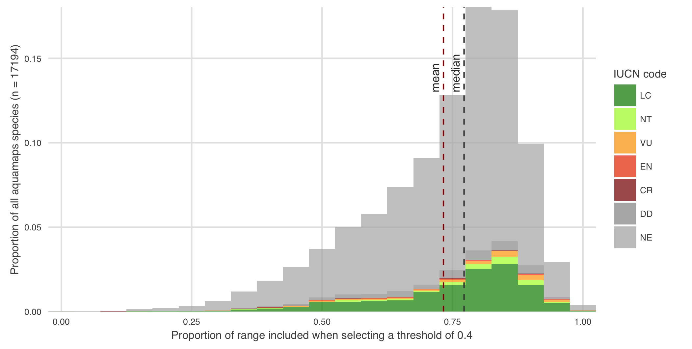
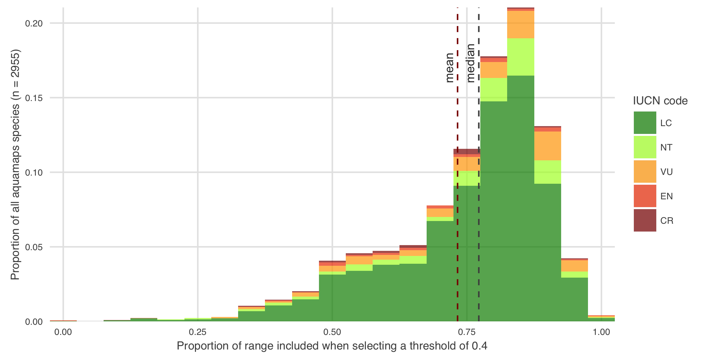
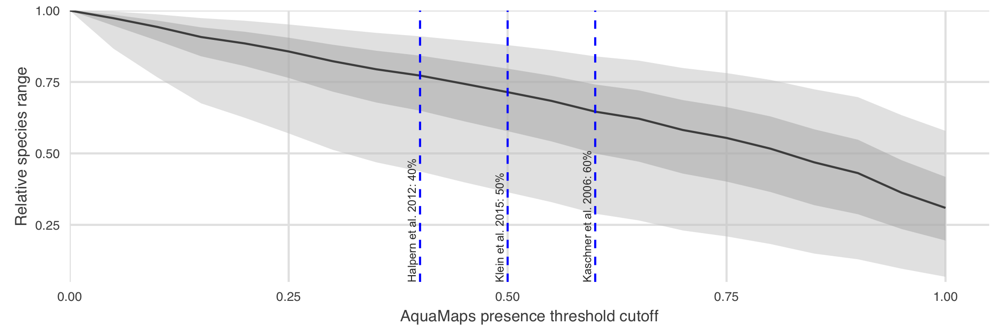

###(6) Looking at how many and what type (threat category) of species we are losing by setting a threshold of 0.4 on the aquamaps species

This looks at the full 2014 Aquamaps dataset... should it be limited to species with valid categories?

```{r aquamaps_load_data, warning = FALSE, message = FALSE, echo = FALSE, include = FALSE, eval = TRUE}

# get spp_cells raw data for aquamaps
dir_aquamaps <- file.path(dir_N, 'git-annex/globalprep/SPP_ICO/raw/aquamaps_2014')

spp_cells <- read_csv(file.path(dir_aquamaps, 'tables/ohi_hcaf_species_native.csv'), 
                      col_types = '_ccd__', progress = TRUE)

setnames(spp_cells, c('SpeciesID', 'CsquareCode', 'probability'), c('species_id', 'csquare_code', 'probability'))

spp_cells <- as.data.frame(spp_cells)

spp <- fread(input = file.path(dir_aquamaps, 'tables/ohi_speciesoccursum.csv'), 
             verbose = FALSE, header = TRUE) %>%
  mutate(sciname = paste(Genus, Species, sep = ' '),
         iucn_code = str_replace(toupper(iucn_code), 'LR/', ''),
         iucn_code = str_replace(iucn_code, 'N.E.', 'NE'))
spp <- as.data.frame(spp)

```

```{r hist_lost_area_w_threshold, warning = FALSE, message = FALSE, echo = FALSE, eval = TRUE}

spp_df3 <- spp_cells %>%
  group_by(species_id) %>%
  summarize(cells_0.4 = sum(probability >= 0.4),
            cells_t = sum(probability >= 0)) %>%
  left_join(spp, by = c('species_id' = 'SPECIESID')) %>%
  mutate(prop = cells_0.4 / cells_t,
         iucn_code = ifelse(is.na(iucn_code), 'NE', iucn_code)) %>%
  filter(toupper(iucn_code) %in% c('LC', 'NT', 'VU', 'EN', 'CR', 'EX', 'DD', 'NE')) %>%
  # filter(toupper(iucn_code) %in% c('LC', 'NT', 'VU', 'EN', 'CR', 'EX')) %>%
  select(sciname, species_id, cells_0.4, cells_t, prop, iucn_code)

iucn_levels = c('LC', 'NT', 'VU', 'EN', 'CR', 'EX', 'DD', 'NE')
spp_df3 <- spp_df3 %>% 
  transform(iucn_code = factor(iucn_code, levels = iucn_levels))

spp_df3_mean <- mean(spp_df3$prop, na.rm = TRUE)
spp_df3_med <- median(spp_df3$prop, na.rm = TRUE)

hist_area_vs_threshold <- ggplot(spp_df3, aes(prop, fill = iucn_code)) + 
  ggtheme_plot + 
  geom_histogram(aes(y = ..count../sum(..count..)), binwidth = 0.05, alpha = .7) + 
  geom_vline(xintercept = spp_df3_mean, color = 'darkred', linetype = 'dashed') + 
  annotate('text', x = spp_df3_mean, y = .13, hjust = 0, vjust = -.5,
           angle = 90, 
           size = 3, 
           color = 'grey20',
           label = 'mean') + 
  geom_vline(xintercept = spp_df3_med, color = 'grey30', linetype = 'dashed') + 
  annotate('text', x = spp_df3_med, y = .13, hjust = 0, vjust = -.5,
           angle = 90, 
           size = 3, 
           color = 'grey20',
           label = 'median') + 
  scale_fill_manual(values = c('LC' = 'green4', 
                               'NT' = 'greenyellow', 
                               'VU' = 'orange', 
                               'EN' = 'orangered2', 
                               'CR' = 'red4',
                               'DD' = 'grey60',
                               'NE' = 'grey70')) +
  scale_x_continuous(expand = c(0, 0), limits = c(0, 1.02)) +
  scale_y_continuous(expand = c(0, 0)) +
  labs(x = 'Proportion of range included when selecting a threshold of 40%', 
       y = sprintf('Proportion of all aquamaps species (n = %s)', nrow(spp_df3)),
       fill = 'IUCN code')

# print(hist_area_vs_threshold)

ggsave(file.path(dir_fig, 'am_threshold.png'), 
       width = 17.8, height = 9, units = 'cm')
```



```{r hist_lost_area_w_threshold_ne_dd_removed, warning = FALSE, message = FALSE, echo = FALSE, eval = TRUE}

spp_df3a <- spp_df3 %>% 
  filter(!iucn_code %in% c('DD', 'NE'))

spp_df3a_mean <- mean(spp_df3$prop, na.rm = TRUE)
spp_df3a_med <- median(spp_df3$prop, na.rm = TRUE)

hist_area_vs_threshold2 <- ggplot(spp_df3a, aes(prop, fill = iucn_code)) + 
  ggtheme_plot + 
  geom_histogram(aes(y = ..count../sum(..count..)), binwidth = 0.05, alpha = .7) + 
  geom_vline(xintercept = spp_df3a_mean, color = 'darkred', linetype = 'dashed') + 
  annotate('text', x = spp_df3a_mean, y = .16, hjust = 0, vjust = -.5,
           angle = 90, 
           size = 3, 
           color = 'grey20',
           label = 'mean') + 
  geom_vline(xintercept = spp_df3a_med, color = 'grey30', linetype = 'dashed') + 
  annotate('text', x = spp_df3a_med, y = .16, hjust = 0, vjust = -.5,
           angle = 90, 
           size = 3, 
           color = 'grey20',
           label = 'median') + 
  scale_fill_manual(values = c('LC' = 'green4', 
                               'NT' = 'greenyellow', 
                               'VU' = 'orange', 
                               'EN' = 'orangered2', 
                               'CR' = 'red4',
                               'DD' = 'grey60',
                               'NE' = 'grey70')) +
  scale_x_continuous(expand = c(0, 0), limits = c(0, 1.02)) +
  scale_y_continuous(expand = c(0, 0)) +
  labs(x = 'Proportion of range included when selecting a threshold of 40%', 
       y = sprintf('Proportion of all aquamaps species (n = %s)', nrow(spp_df3a)),
       fill = 'IUCN code')

ggsave(file.path(dir_fig, 'am_threshold2.png'), 
       width = 17.8, height = 9, units = 'cm')

```




```{r df_lost_area_w_threshold, warning = FALSE, message = FALSE, echo = FALSE, eval = TRUE}
### create dataframe that gives me all species, their total number of cells, 
### total number of cells >= 0.4 prob, difference between the two and threat

threshold_df <- data.frame()
for (i in seq(0, 1, .05)) { # i = .05
  temp_df <- spp_cells %>%
    group_by(species_id) %>%
    summarize(thresh       = i,
              cells_thresh = sum(probability >= thresh),
              cells_total  = sum(probability >= 0),
              proportion   = cells_thresh/cells_total) %>%
    left_join(spp %>%
#              filter(toupper(iucn_code) %in% c('LC', 'NT', 'VU', 'EN', 'CR', 'EX', 'DD', 'NE')), 
              filter(toupper(iucn_code) %in% c('LC', 'NT', 'VU', 'EN', 'CR', 'EX')), 
            by = c('species_id' = 'SPECIESID')) %>%
    select(sciname, species_id, thresh, cells_thresh, cells_total, proportion, iucn_code)
  
  threshold_df <- threshold_df %>%
    bind_rows(temp_df)
}

thresh_df_summary <- threshold_df %>%
  group_by(thresh) %>%
  summarize(mean_prop   = mean(proportion, na.rm = TRUE),
            median_prop = median(proportion, na.rm = TRUE),
            quant05 = quantile(proportion, .05),
            quant25 = quantile(proportion, .25),
            quant75 = quantile(proportion, .75),
            quant95 = quantile(proportion, .95))
            
```


```{r ribbon_lost_area_w_threshold, warning = FALSE, message = FALSE, echo = FALSE, eval = TRUE}

ribbon_area_vs_threshold <- ggplot(thresh_df_summary, aes(x = thresh, y = median_prop)) + 
  ggtheme_plot + 
#  geom_point(position = position_jitter(w = .1), aes(color = scenario), alpha = .5) +

  geom_ribbon(aes(ymax = quant95, ymin = quant05), alpha = .5, color = NA, fill = 'grey80') +
  geom_ribbon(aes(ymax = quant75, ymin = quant25), alpha = .5, color = NA, fill = 'grey70') +
  geom_line(color = 'grey30') + 
  # geom_line(aes(y = mean_prop), color = 'darkgreen') + 
  # geom_abline(intercept = area_mean_model[['coefficients']][1],
  #             slope     = area_mean_model[['coefficients']][2],
  #             color = 'red') + 
  geom_vline(xintercept = 0.40, color = 'blue', linetype = 'dashed') +
  geom_vline(xintercept = 0.50, color = 'blue', linetype = 'dashed') +
  geom_vline(xintercept = 0.60, color = 'blue', linetype = 'dashed') +
  annotate('text', x = .39, y = .03, hjust = 0, vjust = 0,
           angle = 90, 
           size = 3, 
           color = 'grey20',
           label = 'Halpern et al. 2012') + 
  annotate('text', x = .49, y = .03, hjust = 0, vjust = 0,
           angle = 90, 
           size = 3, 
           color = 'grey20',
           label = 'Klein et al. 2015') + 
  annotate('text', x = .59, y = .03, hjust = 0, vjust = 0,
           angle = 90, 
           size = 3, 
           color = 'grey20',
           label = 'Kaschner et al. 2006') + 
  # annotate('text', x = .75, y = .85,
  #          #size = 3, 
  #          color = 'grey20',
  #          label = 'R^2^ = .995') + 
  scale_x_continuous(expand = c(0, 0), 
                     breaks = c(  .2,    .4,    .5,    .6,    .8,   1.0),
                     labels = c('20%', '40%', '50%', '60%', '80%', '100%'),
                     limits = c(0, 1.02)) +
  scale_y_continuous(expand = c(0, 0),
                     limits = c(0, 1.01)) +
  labs(# title = 'Relative species range after presence threshold',
       x = 'AquaMaps presence threshold cutoff', 
       y = 'Relative species range')

print(ribbon_area_vs_threshold)

ggsave(file.path(dir_fig, 'ribbon_am_threshold.png'), 
       width = 17.8, height = 7, units = 'cm')

```



