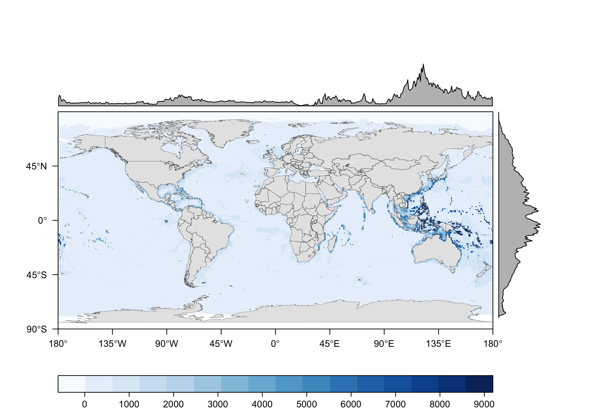
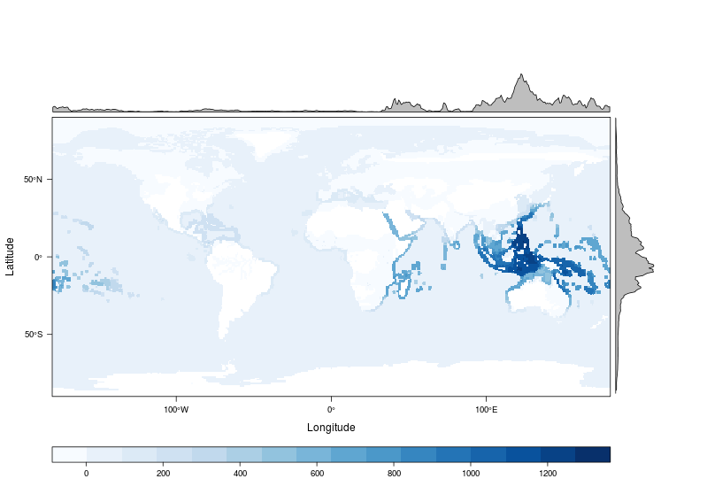

###Global representation of species

```{r setup_from_data_explore, echo = FALSE, warning = FALSE, message = FALSE, eval = FALSE}

# Libraries and Paths

library(ggplot2)
library(maps)
library(readr)
library(data.table)
library(raster)
library(tidyr)
library(dplyr)
library(stringr)

dir_M             <- c('Windows' = '//mazu.nceas.ucsb.edu/ohi',
                       'Darwin'  = '/Volumes/ohi',    ### connect (cmd-K) to smb://mazu/ohi
                       'Linux'   = '/home/shares/ohi')[[ Sys.info()[['sysname']] ]]


dir_git <- '~/github/IUCN-AquaMaps'
  
dir_anx <- file.path(dir_N, 'git-annex/globalprep/SPP_ICO')
dir_fig <- file.path(dir_git, 'figures')
dir_data <- file.path(dir_git, 'data')

if(basename(getwd()) != 'data_explore') setwd('data_explore')
source('data_explore_fxns.R')
### When knitting this, it automatically sets WD to be this directory...
### the 'setwd()' is there for running by chunk
```

By counting the number of unique species are found in each of the half degree cells we can then create a single global raster of number of species.

### All AquaMaps species count by cell

```{r all_am_map, echo = FALSE, warning = FALSE, message = FALSE, eval = TRUE}

library(rasterVis)
myTheme <- rasterTheme(region = brewer.pal('Blues', n = 9))

all_am_rast_file   <- file.path(dir_data, 'rasters/am_all_rast.tif')
dir_am_data <- file.path(dir_N, 'git-annex/globalprep/_raw_data/aquamaps/v2015/csv')

if(!file.exists(all_am_rast_file)) {
  loiczid_raster_file  <- file.path(dir_git, 'shiny/data/loiczid_raster.grd')
  loiczid_raster       <- raster(loiczid_raster_file)
  names(loiczid_raster) <- 'loiczid'

  am_spp_cells_big <- fread(file.path(dir_am_data, 'hcaf_sp_native_trunc.csv')) %>%
    as.data.frame(stringsAsFactors = FALSE)
  
  all_am <- am_spp_cells_big %>%
    group_by(loiczid) %>%
    summarize(all_count = n()) %>%
    as.data.frame()
  
  all_am_map <- subs(loiczid_raster, all_am[ , c('loiczid', 'all_count')], 
                     by = 'loiczid', 
                     which = 'all_count', 
                     subsWithNA = TRUE)
  
  writeRaster(all_am_map, filename = all_am_rast_file, overwrite = TRUE)

} else {
  all_am_map   <- raster(all_am_rast_file)
}

### set up boundaries - from http://oscarperpinan.github.io/rastervis/FAQ.html#sec-7
ext <- as.vector(extent(all_am_map))

boundaries <- maps::map('world', fill=TRUE,
    xlim=ext[1:2], ylim=ext[3:4],
    plot=FALSE)

## read the map2SpatialPolygons help page for details
IDs <- sapply(strsplit(boundaries$names, ":"), function(x) x[1])
bPols <- maptools::map2SpatialPolygons(boundaries, IDs = IDs,
                              proj4string = CRS(projection(all_am_map)))

### create plot, add boundary polygons
am_levelplot1 <- levelplot(all_am_map, 
                           scales = list(at = seq(-180, 180, 45)),
                           xlab = NULL, ylab = NULL,
                           par.settings = myTheme) + 
  layer(sp.polygons(bPols, fill = 'grey90', col = 'grey30', lwd = .25))

png(file.path(dir_fig, 'all_aquamaps_map.png'),
    width = 8.7, height = 6, units = 'in', res = 300)
print(am_levelplot1)
dev.off()

```



### All IUCN species count by cell

```{r all_iucn, eval = TRUE, echo = FALSE}

all_iucn_rast_file   <- file.path(dir_data, 'rasters/iucn_all_rast.tif')
dir_data_iucn <- file.path(dir_N, 'git-annex/globalprep/_raw_data/iucn_spp')

if(!file.exists(all_iucn_rast_file)) {
  loiczid_raster_file  <- file.path(dir_git, 'shiny/data/loiczid_raster.grd')
  loiczid_raster       <- raster(loiczid_raster_file)
  names(loiczid_raster) <- 'loiczid'

  iucn_cells_file    <- file.path(dir_data_iucn, 'iucn_cells_2015.csv')
  iucn_spp_cells_all <- fread(iucn_cells_file) %>%
        as.data.frame(stringsAsFactors = FALSE)
  
  all_iucn <- iucn_spp_cells_all %>%
    group_by(loiczid) %>%
    summarize(all_count = n()) %>%
    as.data.frame()
  
  all_iucn_map <- subs(loiczid_raster, all_iucn[ , c('loiczid', 'all_count')], 
                     by = 'loiczid', 
                     which = 'all_count', 
                     subsWithNA = TRUE)
  
  writeRaster(all_iucn_map, filename = all_iucn_rast_file, overwrite = TRUE)

} else {
  all_iucn_map   <- raster(all_iucn_rast_file)
}

iucn_levelplot1 <- levelplot(all_iucn_map, 
                             scales = list(at = seq(-180, 180, 45)),
                             xlab = NULL, ylab = NULL,
                             par.settings = myTheme) + 
  layer(sp.polygons(bPols, fill = 'grey90', col = 'grey30', lwd = .25))

png(file.path(dir_fig, 'all_iucn_map.png'),
    width = 8.7, height = 6, units = 'in', res = 300)
print(iucn_levelplot1)
dev.off()

```



