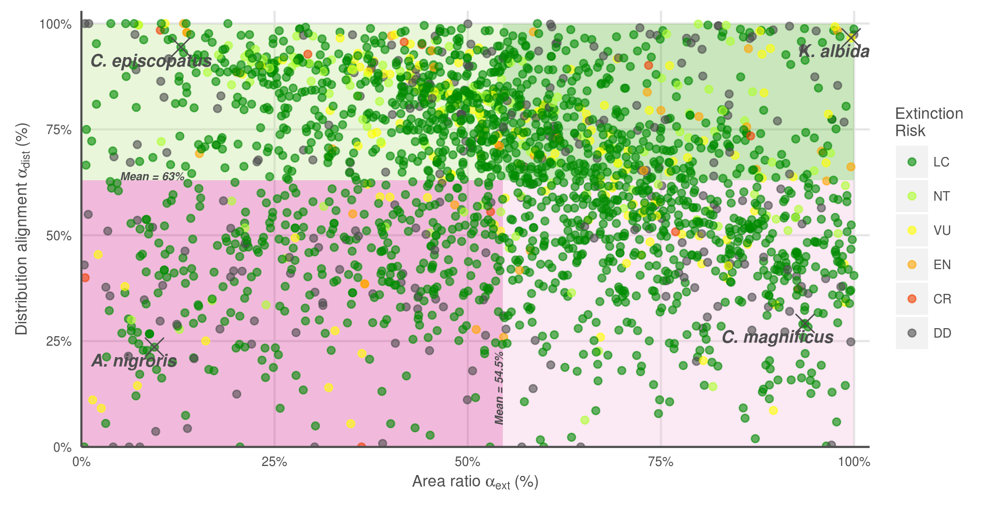

```{r setup, echo = FALSE, warning = FALSE, message = FALSE}

# Libraries and Paths

library(ggplot2)
library(maps)
library(readr)
library(data.table)
library(raster)
library(tidyr)
library(dplyr)
library(stringr)

dir_N <- c('Windows' = '//neptune.nceas.ucsb.edu/data_edit',
           'Darwin'  = '/Volumes/data_edit',
           'Linux'   = '/var/data/ohi')[[ Sys.info()[['sysname']] ]]

dir_git <- '~/github/IUCN-AquaMaps'
  
dir_anx <- file.path(dir_N, 'git-annex/globalprep/SPP_ICO')
dir_fig <- file.path(dir_git, 'figures')
dir_data <- file.path(dir_git, 'data')

if(basename(getwd()) != 'data_explore') setwd('data_explore')
source('data_explore_fxns.R')
### When knitting this, it automatically sets WD to be this directory...
### the 'setwd()' is there for running by chunk
```

```{r read_am_and_iucn_data, echo = FALSE, warning = FALSE, message = FALSE, results = 'hide'}

# Data files
#iucn spp cells WITHOUT extinct locations of IUCN subpopulations
iucn_spp_cells <- read_csv(file.path(dir_anx, 'explore_am_v_iucn/iucn_spp_cells_2015.csv'), 
                           col_types = 'cddddc', progress = TRUE) %>%
  as.data.frame() %>%
  filter(presence != 5) ### removes extinct subpopulations

am_spp_cells   <- read_csv(file.path(dir_anx, 'explore_am_v_iucn/am_spp_cells_2015.csv'), progress = TRUE)


### LOICZID cell ID numbers - used in plotting rasters
loiczid_raster_file  <- file.path(dir_git, 'shiny/data/loiczid_raster.grd')
loiczid_raster       <- raster(loiczid_raster_file)
names(loiczid_raster) <- 'loiczid'
```


Quadrant map and quad breakdown by taxa and risk


``` {r pct_overlap_vs_ratio_of_area, echo = FALSE, warning = FALSE, message = FALSE, eval = TRUE}

spp_list <- read.csv(file.path(dir_data, 'spp_list_w_area_trimmed.csv'), stringsAsFactors = FALSE)

spp_list <- spp_list %>% 
  mutate(popn_category = ifelse(popn_category == 'LC', 'Least concern', popn_category),
         popn_category = ifelse(popn_category == 'NT', 'Near threatened', popn_category),
         popn_category = ifelse(popn_category == 'VU', 'Vulnerable', popn_category),
         popn_category = ifelse(popn_category == 'EN', 'Endangered', popn_category),
         popn_category = ifelse(popn_category == 'CR', 'Critically endangered', popn_category),
         popn_category = ifelse(popn_category == 'DD', 'Data deficient', popn_category)) %>%
  transform(popn_category = reorder(popn_category, category_score))
         
### define 25%, 50%, and 75% quartiles for both x and y axes
area_align_mean <- mean(spp_list$area_ratio, na.rm = TRUE)
dist_align_mean <- mean(spp_list$sm_perc, na.rm = TRUE)

### define representative species from each quadrant, for over-plotting
spp_quads <- c('q1' = 'Kajikia albida', 
               'q2' = 'Conus episcopatus', 
               'q4' = 'Acanthurus nigroris', 
               'q3' = 'Conus magnificus')

### truncate the species names for the representative species
spp_list_label <- spp_list %>%
  filter(sciname %in% spp_quads) %>%
  separate(sciname, c('g', 's'), sep = ' ', remove = FALSE) %>%
  mutate(sciname_label = paste(str_sub(g, 1, 1), '. ', s, sep = '')) %>%
  dplyr::select(-g, -s)

### mongo plot time
scatter_quadplot <- ggplot(spp_list,
                           aes(x = area_ratio, 
                               y = sm_perc, 
                               color = popn_category)) + 
  ggtheme_plot + 
  ### color the quadrant backgrounds:
    annotate("rect", xmin = area_align_mean, xmax = 100, 
                     ymin = dist_align_mean, ymax = 100, 
             alpha = .3, 
             fill= "#4dac26")  + 
    annotate("rect", xmax = area_align_mean, xmin =   0, 
                     ymin = dist_align_mean, ymax = 100, 
             alpha = .3, 
             fill= "#b8e186") + 
    annotate("rect", xmin = area_align_mean, xmax = 100, 
                     ymax = dist_align_mean, ymin =   0, 
             alpha = .3, 
             fill= "#f1b6da") + 
    annotate("rect", xmax = area_align_mean, xmin =   0, 
                     ymax = dist_align_mean, ymin =   0, 
             alpha = .3, 
             fill= "#d01c8b") + 
  geom_point(alpha = .5)

### Manage scales for color and size 
scatter_quadplot <- scatter_quadplot +
  scale_colour_manual(values = c('Least concern' = 'green4', 
                                 'Near threatened' = 'greenyellow', 
                                 'Vulnerable' = 'yellow', 
                                 'Endangered' = 'orange', 
                                 'Critically endangered' = 'orangered2',
                                 'Data deficient' = 'grey30')) + 
  scale_x_continuous(expand = c(0, 0), 
                     limits = c(0, 102),
                     breaks = c(seq(0, 100, 25)),
                     labels = c('0%', '25%', '50%', '75%', '100%')) +
  scale_y_continuous(expand = c(0, 0),
                     limits = c(0, 103),
                     breaks = c(seq(0, 100, 25)),
                     labels = c('0%', '25%', '50%', '75%', '100%'))

  
### here are mean labels:
scatter_quadplot <- scatter_quadplot +
  annotate(geom = 'text',
           x = area_align_mean, y = 5,
           hjust = 0, vjust = 0,
           color = 'grey30', 
           size = 2,
           fontface = 'bold.italic', angle = 90,
           label = sprintf('Mean = %s%%', round(area_align_mean, 1))) +
  annotate(geom = 'text',
           x = 5, y = dist_align_mean,
           hjust = 0, vjust = 0,
           color = 'grey30', 
           size = 2,
           fontface = 'bold.italic', angle = 0,
           label = sprintf('Mean = %s%%', round(dist_align_mean, 1)))
  
### here are individual species, identified and namean on the plot:
scatter_quadplot <- scatter_quadplot +
  geom_point(data = spp_list_label, shape = 4, color = 'grey30', size = 4) + 
  geom_text(data = spp_list_label, 
            aes(label = sciname_label), 
            color = 'grey30',
            fontface = 'bold.italic',
            size = 2.5,
            hjust = .75,
            vjust = 1.5)

scatter_quadplot <- scatter_quadplot +
  labs(x = bquote('Area ratio '*alpha['ext']*' (%)'), 
       y = bquote('Distribution alignment '*alpha['dist']*' (%)'), 
       color = 'Extinction Risk') 

# print(scatter_quadplot)

ggsave(file.path(dir_fig, 'si_scatter_quadmap_spp.png'),
       width = 17.8, height = 9, units = 'cm')

```




``` {r plot_spp_from_quadrants, echo = FALSE, warning = FALSE, message = FALSE, eval = TRUE}
### define representative species from each quadrant, for over-plotting
spp_quads <- c('q1' = 'Kajikia albida', 
               'q2' = 'Conus episcopatus',
               'q3' = 'Conus magnificus', 
               'q4' = 'Acanthurus nigroris')
am_thresh <- 0

for (i in 1:length(spp_quads)) { # i = 1
  spp <- spp_list %>% filter(sciname == spp_quads[i])
  spp_quad <- names(spp_quads)[i]
  
  spp_plot <- plot_rangemap(spp)
  spp_plot <- spp_plot + 
    labs(title = element_blank()) +
    theme(legend.position = 'none')

  print(spp_plot)
  plotfile <- file.path(dir_fig, 'spp_maps', 
                        sprintf('%s_%s.png', 
                                spp_quad, 
                                tolower(str_replace(spp_quads[i], ' ', '_'))))
  ggsave(plotfile, height = 4.5, width = 8.7, units = 'cm')
  }

```


``` {r examine_spp_gp_quartiles, echo = FALSE, eval = FALSE}

spp_list1 <- spp_list %>%
  group_by(spp_group_text) %>%
  mutate(n_spp = n()) %>%
  ungroup()

### Create species lists by quadrant
spp_list_q1 <- spp_list1 %>%
  filter(area_ratio >= median(area_ratio) & sm_perc >= median(sm_perc))
spp_list_q2 <- spp_list1 %>%
  filter(area_ratio < median(area_ratio) & sm_perc >= median(sm_perc))
spp_list_q3 <- spp_list1 %>%
  filter(area_ratio >= median(area_ratio) & sm_perc < median(sm_perc))
spp_list_q4 <- spp_list1 %>%
  filter(area_ratio < median(area_ratio) & sm_perc < median(sm_perc))

spp_list_quads <- spp_list1 %>%
  mutate(quad = NA,
         quad = ifelse(is.na(quad) & sciname %in% spp_list_q1$sciname, 'q1', quad),
         quad = ifelse(is.na(quad) & sciname %in% spp_list_q2$sciname, 'q2', quad),
         quad = ifelse(is.na(quad) & sciname %in% spp_list_q3$sciname, 'q3', quad),
         quad = ifelse(is.na(quad) & sciname %in% spp_list_q4$sciname, 'q4', quad))
write.csv(spp_list_quads, file.path(dir_data, 'spp_list_quads.csv'), row.names = FALSE)

### Summarize quadrant species list by species group (e.g. CORALS1)
spp_gp_q1 <- spp_list_q1 %>%
  group_by(spp_group_text) %>%
  summarize(n_spp = first(n_spp), n_spp_q1 = n())
spp_gp_q2 <- spp_list_q2 %>%
  group_by(spp_group_text) %>%
  summarize(n_spp = first(n_spp), n_spp_q2 = n())
spp_gp_q3 <- spp_list_q3 %>%
  group_by(spp_group_text) %>%
  summarize(n_spp = first(n_spp), n_spp_q3 = n())
spp_gp_q4 <- spp_list_q4 %>%
  group_by(spp_group_text) %>%
  summarize(n_spp = first(n_spp), n_spp_q4 = n())

### Join species group by quadrant into a single dataframe
spp_gp_quadrants <- spp_gp_q1 %>%
  full_join(spp_gp_q2, by = c('spp_group_text', 'n_spp')) %>%
  full_join(spp_gp_q3, by = c('spp_group_text', 'n_spp')) %>%
  full_join(spp_gp_q4, by = c('spp_group_text', 'n_spp')) %>%
  gather(quad, n_quad, n_spp_q1, n_spp_q2, n_spp_q3, n_spp_q4) %>% 
  mutate(quad = str_replace(quad, 'n_spp_', ''),
         pct_quad = n_quad/n_spp,
         n_quad   = ifelse(is.na(n_quad),   0, n_quad),
         pct_quad = ifelse(is.na(pct_quad), 0, pct_quad))


spp_gp_quadrants <- spp_gp_quadrants %>%
  left_join(spp_gp_quadrants %>% 
              filter(quad == 'q1') %>%
              dplyr::select(spp_group_text, pct_q1 = pct_quad),
            by = 'spp_group_text') %>%
  mutate(quad = str_replace(quad, 'q1', 'q1 well-matched'),
         quad = str_replace(quad, 'q2', 'q2 dist-matched'),
         quad = str_replace(quad, 'q3', 'q3 area-matched'),
         quad = str_replace(quad, 'q4', 'q4 poorly matched'))

```


<!-- # Multiple species maps per quadrant -->
``` {r child = 'data_explore_pt3.Rmd', eval = FALSE}
```


