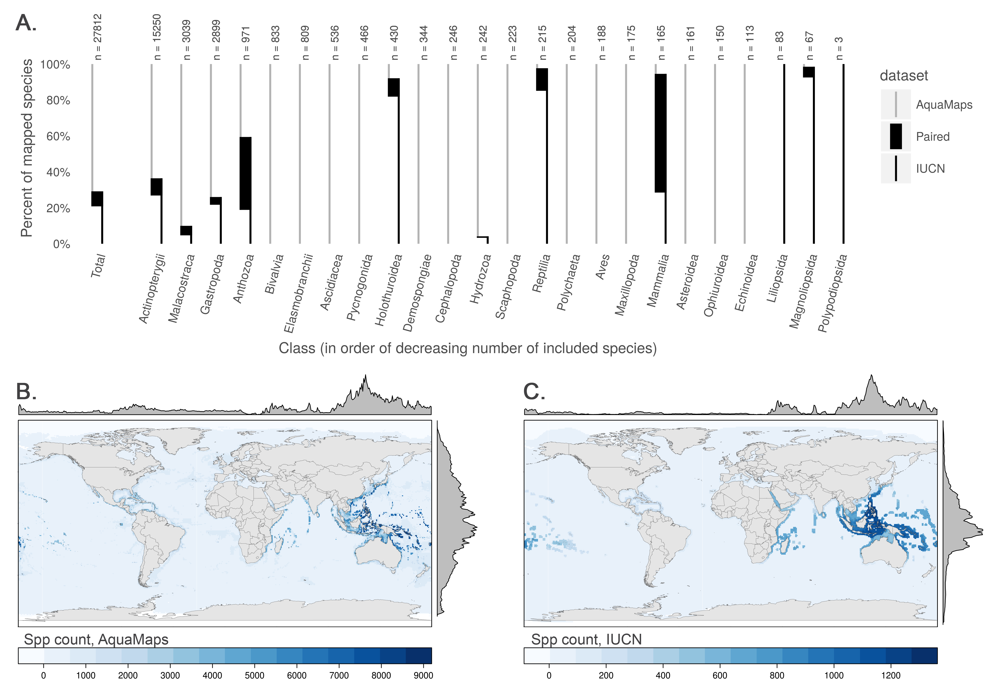
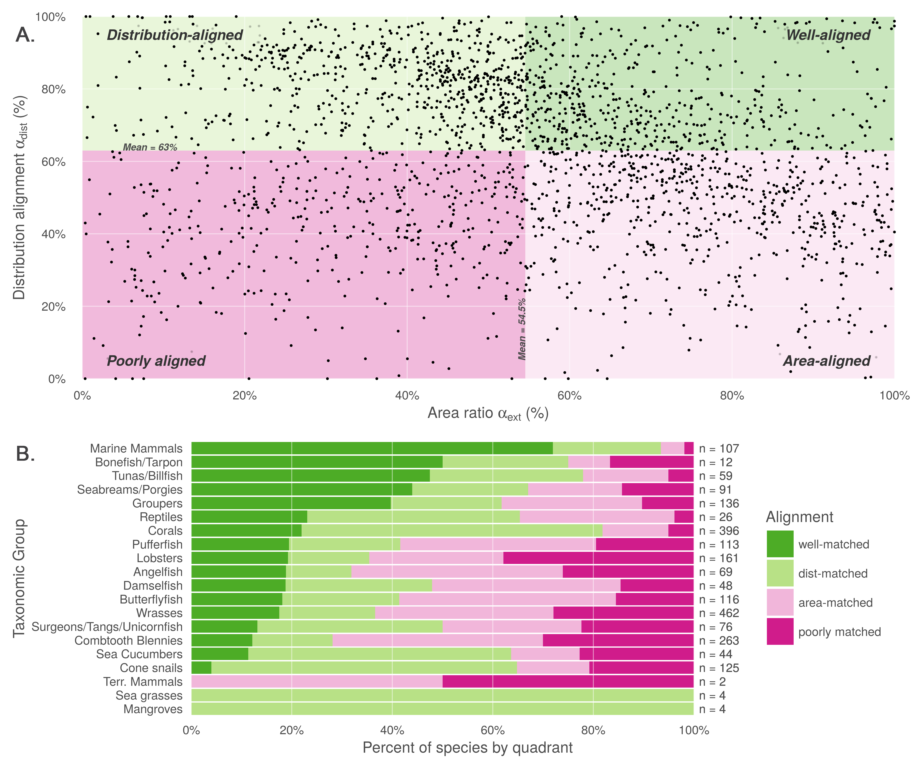
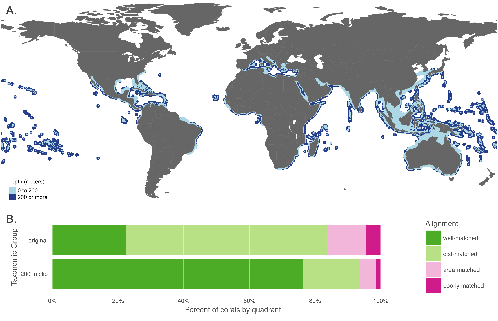
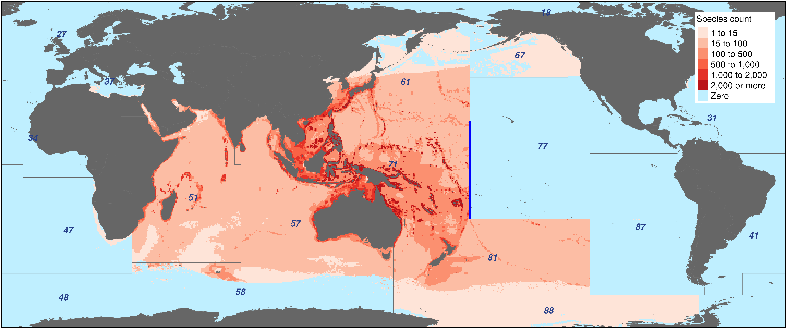
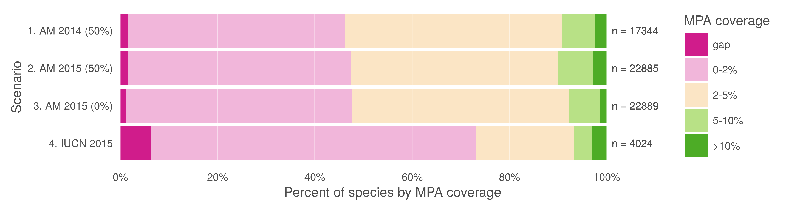

<!--
Results, Discussion, Conclusions

These sections may all be separate, or may be combined to create a mixed Results/Discussion section (commonly labeled “Results and Discussion”) or a mixed Discussion/Conclusions section (commonly labeled “Discussion”). These sections may be further divided into subsections, each with a concise subheading, as appropriate. These sections have no word limit, but the language should be clear and concise.

Together, these sections should describe the results of the experiments, the interpretation of these results, and the conclusions that can be drawn.

Authors should explain how the results relate to the hypothesis presented as the basis of the study and provide a succinct explanation of the implications of the findings, particularly in relation to previous related studies and potential future directions for research.

PLOS ONE editorial decisions do not rely on perceived significance or impact, so authors should avoid overstating their conclusions. See the PLOS ONE Criteria for Publication for more information.
-->

# Results and Discussion

In comparing the IUCN and AquaMaps datasets, it is again important to emphasize that the two differ in both methodology and intent.  As area of occupancy is generally defined as a subset of a species' extent of occurrence, AquaMaps ranges (effectively area of occupancy) should generally fall within the bounds of IUCN ranges (effectively extent of occurrence), capturing a smaller total area.  However, AquaMaps range maps are created independently from IUCN data and therefore exceptions are certain to arise.  Here we are looking for systematic deviations from our expectations that might highlight implications of data use decisions.

## Taxonomic and geographic coverage

The two datasets have notably different taxonomic (Fig 1A) and regional (Figs 1B, 1C) coverage.  AquaMaps encompasses a broader range of taxa than IUCN, as IUCN spatial data are only available for select taxonomic groups that have been comprehensively assessed. Of the `r format(n_spp_all, big.mark = ',')` species mapped within these datasets, only `r format(n_spp_both, big.mark = ',')` (`r p_both_all`%) are mapped within both, with many taxa completely unrepresented in one dataset or the other.  While species numbers in both datasets peak in tropical latitudes near the equator, species counts for IUCN maps drop quickly beyond 30°N and 30°S, while AquaMaps includes distribution of species well into temperate latitudes.  Together, the limitations of spatial and taxonomic coverage are likely to drive a researcher's choice of dataset far more strongly than the quality, format, or intended purpose of the dataset.

> __Fig 1.__ (A) Number and proportion of species by taxa included in each dataset.  Overlapping species are dominated by bony fishes (`r format(n_bonyfish, big.mark = ',')` species, primarily tropical taxa) and corals (`r format(n_corals, big.mark = ',')` species).  (B, C) Global marine species count per 0.5° cell according to (B) AquaMaps and (C) IUCN.  The margin frequency plots show relative species count per cell at each latitude and longitude. 

## Distribution and range size alignment

Comparing distribution alignment and area ratio for the `r format(n_spp_both, big.mark = ',')` paired map species (Fig 2A), a weak negative linear pattern appears to emerge, suggesting that increasing similarity in range area correlates very slightly with decreasing distribution alignment (R^2^ = .016).  The pattern itself is not particularly important, and emerges simply due to the nature of the analysis and the datasets.  In particular, the AquaMaps model tends to extrapolate species ranges into suitable areas beyond known occurrences more frequently than IUCN maps, such that each additional unit of range predicted by AquaMaps will fall in different locations than an additional unit of range predicted using IUCN methodology. For species with dissimilar range areas, predicted distribution for the smaller range can more easily fall within the generous bounds of the larger range. For species with increasingly similar range areas, differences in methodology become more difficult to "hide," and the distribution alignment generally becomes slightly poorer.
 
The mean distribution alignment for species included in both datasets was `r dist_align_mean`%; the mean area alignment was `r area_align_mean`%. By dividing the paired map species into quadrants based on these means, we highlight categories of relationships to identify patterns in alignment differences.  Representative maps from each category are provided in the supporting materials (Fig S3).

> __Fig 2.__ (A) Distribution alignment (overlap of smaller range within larger) versus area ratio (the ratio of smaller range area to the larger range area) for `r format(n_spp_both, big.mark = ',')` species included in both IUCN and AquaMaps datasets.  The upper right quadrant (quadrant 1) comprises species whose maps largely agree in both spatial distribution and the extent of described ranges (n = `r n_q1`; `r round(n_q1/nrow(spp_list_quads) * 100, 1)` %).
The upper left quadrant (quadrant 2) comprises species whose maps agree well in distribution, but disagree in area
(n = `r n_q2`; `r round(n_q2/nrow(spp_list_quads) * 100, 1)` %).
The lower right quadrant (quadrant 3) includes species for which the paired maps generally agree in range area, but disagree on where those ranges occur
(n = `r n_q3`; `r round(n_q3/nrow(spp_list_quads) * 100, 1)` %).
The lower left quadrant (quadrant 4) indicates species for which the map pairs agree poorly in both area and distribution
(n = `r n_q4`; `r round(n_q4/nrow(spp_list_quads) * 100, 1)` %).
(B) Alignment quadrant breakdown of species by taxonomic group.
 
The upper right quadrant includes the species (n = `r n_q1`) whose described ranges are above average in alignment of both spatial distribution and area. These species tend to be well-studied and include wide-ranging pelagic organisms such as marine mammals, tunas, and billfishes (Fig 2B). This result is not surprising, as species with very large ranges are likely to be more aligned regardless of methodology simply because their extent of occurrence and area of occupancy both span nearly the entire map.

The area-mismatched ranges contained in the upper left quadrant (n = `r n_q2`) include many species whose spatial distribution is similar, but where one range is notably larger than the other.  For `r round(n_q2_iucn_larger/n_q2 * 100, 1)`% of the species in this quadrant, the IUCN range is larger than the AquaMaps range, as expected when comparing an extent of occurrence to an area of occupancy map.  However, the low area ratio suggests a high rate of commission and/or omission errors by one or both datasets.  Below we explore one underlying source of commission errors.

Species found in the lower right quadrant (n = `r n_q3`) represent cases of "two wrongs make a right."  For these species, IUCN and AquaMaps both predict ranges extending far beyond the overlapping region, but the methodological differences result in very different extrapolations.   Consequently, area ratios are high, though the poor distribution alignment indicates that one or both datasets are introducing significant errors.  In this quadrant, the IUCN range is the larger for only 56.5% of species, defying our expectations based on definitions of area of occupancy and extent of occurrence.

<!--
   quad am_sm iucn_sm tot_n
  <chr> <int>   <int> <int>
1    q1   422     105   527
2    q2   624      85   709
3    q3   359     276   635
4    q4   109     334   443
-->

The lower left quadrant includes species (n = `r n_q4`) where alignment is poor in both dimensions.  In this quadrant, the IUCN range is larger for only 24.6% of species; this again defies our expectations for extent of occurrence and area of occupancy range predictions.  Data-poor species are more common in this quadrant; indeed, the median number of species occurrence records (averaging occurrences from the Ocean Biogeographic Information System (OBIS) [@obis_data_2016] and the Global Biodiversity Information Facility (GBIF) [@gbif_global_2010]) for this quadrant is `r med_occ_q4` records, compared to a median of `r med_occ_q123` records for species across the other three quadrants.  The AquaMaps dataset offers its own quality metric based on the number of unique 0.5° cells containing valid occurrences; for this quadrant, the median "occurcells" is 11 compared to a median of 40 across the other three quadrants.  Care should be taken when using distribution and range maps based upon fewer observations, as they clearly bear greater uncertainty; AquaMaps explicitly warns against using any of its maps generated with an "occurcells" count fewer than 10 [@kaschner_aquamaps:_2015].

## Coral depth exploration

Because corals dominate the upper-left "distribution-aligned" quadrant of Fig 2A (n = `r n_q2_corals`; `r round(n_q2_corals/n_q2 * 100, 1)`% of all species in this quadrant), we explored implications of explicitly restricting IUCN ranges to depths based on species' life histories.  This adjustment was not necessary for AquaMaps data because models explicitly include ocean depth preference as a parameter.  While depth is recommended by the IUCN as a criterion for providers of range maps ("The limits of distribution can be determined by using known occurrences of the species, along with the knowledge of habitat preferences, remaining suitable habitat, elevation limited, and other expert knowledge of the species and its range." [@iucn_iucn_2015, from website:  http://www.iucnredlist.org/technical-documents/red-list-training/iucnspatialresources]), it is not presented as a requirement, so we cannot take its inclusion for granted.

Fig 3A shows aggregated ranges of the 463 coral species mapped in the IUCN dataset, with their ranges broken into proportional area deeper and shallower than 200 m.  According to IUCN descriptions, none of these species is indicated to occur deeper than 200 m, and 94% are confined to waters shallower than 50 m; seven of the mapped species had no reported depth information.  Clipping coral ranges to shallower than 200 m eliminated an average of 47.6% of the total predicted area while still allowing for a generous estimate of suitable habitat.

> __Fig 3.__ (A) Aggregate map combining ranges of the 463 coral species mapped in the IUCN dataset, showing raw ranges and ranges clipped to 200 m depth. (B) Alignment quadrant breakdown of paired map coral species using original data from IUCN and AquaMaps (as in Fig 2B) and the same species with IUCN ranges clipped to 200 m depth.

In constraining coral ranges to appropriate depths, we see a strong increase in the apparent alignment of species maps between IUCN and AquaMaps (Fig 3B).  Membership in the "well-aligned" quadrant jumped from 22.4% to 76.2%, with a corresponding decrease in all other quadrants.  By excluding the unsuitable areas from IUCN's extent of occurrence, we eliminate preventable commission errors and more closely approximate the area of occupancy described by AquaMaps.  See Fig S4 to examine the shifts of individual species among the quadrants.

The true distribution of each of these corals remains imperfectly known.  Certainly some commission errors result from extent of occurrence boundaries including areas where species do not actually exist (as recognized by the definition of this method), and others may be due to experts taking a precautionary (i.e., generous) approach to likely occurrence.  Yet a simple and sensible shift in method drastically decreases the likelihood of introducing commission errors, with little chance of introducing omission errors, greatly improving our confidence in the remaining reported distributions for most purposes.  This change applies just as readily to the IUCN coral maps that are not included in the paired map analysis, and likely to other reef-associated flora and fauna.  While species depth preferences are an easy and consistent means of constraining range predictions, other conditions such as salinity and temperature could be cautiously used to refine the results of expert opinions.

## Georegional constraint exploration

From the entirety of the AquaMaps dataset, we identified 3,208 Indo-Pacific species whose equatorial distributions (between 25° S and 20° N) encounter an eastern range limit at 175° W.  A clear discontinuity in species distributions of these species (Figs 4A, 4B) matches perfectly with FAO region 77 [@fao_fisheries_and_aquaculture_department_cwp_2015]; other discontinuities are apparent at other FAO boundaries, despite these boundaries not being actively studied in the analysis.

> __Fig 4.__ (A) AquaMaps species distribution of _Hoplichthys regani_, the ghost flathead, with known occurrence records.  (B) Aggregated AquaMaps predicted ranges for 3,208 species whose equatorial distribution encounters an eastern discontinuity exactly at 175° W, the boundary between FAO Major Fishing Areas 71 and 77 (shown in blue).  Other FAO area boundaries create additional clear discontinuities.

FAO Major Fishing Area boundaries provide a readily available method to roughly constrain AquaMaps predictions to appropriate ocean basins, thus eliminating a large source of potential commission errors and enabling rapid modeling of thousands of species ranges.  However, these boundaries are defined for statistical purposes based on economic and political considerations rather than ecological considerations, and can result in odd discontinuities in species range predictions where otherwise suitable habitat is excluded.  While such a discontinuous boundary would likely be obvious when inspecting the distribution of an individual species, the distinction is likely to be obscured when aggregating many species ranges as is typical for biodiversity or conservation studies.  

The ratio of the total predicted range for a species to the number of "occurcells" used to generate the map provides a measure of the degree to which AquaMaps extrapolates range area from limited data.  For example, AquaMaps predicts a total range of 5.4 million km^2^ for both the round ray _Rajella fyllae_ and the brittle star _Ophiothrix plana_; but the map for _R. fyllae_ is generated using 116 "occurcells" (for a data extrapolation rate of 46,800 km^2^ per cell) while the map for _O. plana_ is generated using only four (for an extrapolation rate of 1,360,000 km^2^ per cell).

By this measure, the 3,208 species range maps included in Fig 4 tend to extrapolate farther based on limited data: a median predicted range of 452,000 km^2^ per "occurcell" compared to a median predicted range of 158,000 km^2^ per "occurcell" for the overall AquaMaps dataset.  This suggests that the FAO boundaries may not be sufficient to adequately constrain computer-generated ranges.  To reduce the incidence of commission errors due to aggressive extrapolation, it may be desirable to fine-tune the computer model output with additional filters, including ecosystem-based constraints such as Marine Ecoregions of the World [@spalding_marine_2007] or methods such as inverse distance weighting to enforce proximity to known observations.  Expert review, though time-consuming, is the most certain route to boosting confidence in these predicted distributions.

## Case Study: MPA Gap Analysis

Klein et al. [-@klein_shortfalls_2015] compare the global distribution of species to the global distribution of marine protected areas to assess how well current MPAs overlap with species ranges and identify which species fall through gaps in protection.  The study relied on the 2014 version of the AquaMaps database, using a probability of occurrence threshold of 50% or greater, to determine species presence, and the World Database of Protected Areas to define zones of marine protection.  They found that the global MPA network leaves 90.5% of marine species with less than 5% of their overall range represented within MPAs, and 1.4% of species have no protection at all (i.e., "gap" species).

We recalculated the amount of under-protected and gap species using all available IUCN species ranges, as well as the 2015 AquaMaps data at a 50% threshold to replicate the original methods and a 0% threshold to more closely approximate the extent of occurrence represented by IUCN data (Fig 5).  Comparing the IUCN results to the AquaMaps 2015 results (at 0% threshold) we found a five-fold increase in the proportion of gap species (6.4% of species vs. 1.2%) and dramatically larger proportion of species with less than 2% of their range protected (73.2% of species vs. 47.7%).  However, this comparison also indicates a larger proportion of well-protected species with greater than 10% of range protected (2.9% of species vs. 1.5%).

> __Fig 5.__  Percent of species range covered by MPAs based upon methods in Klein et al. (2015).  Scenario 1 replicates the original results, measuring protected range of species in AquaMaps 2014 dataset, with a 50% presence threshold, against the 2014 World Database of Protected Areas, filtered for IUCN categories I-IV that overlap marine areas.  Scenario 2 updates the results using AquaMaps 2015, showing very small changes despite the inclusion of an additional 5,545 species.  Scenario 3, using 2015 AquaMaps data, drops the presence threshold to zero, showing an expected decrease in gap species, but also a decrease in species with 5% or greater protected range.  Scenario 4 examines species MPA coverage using only the IUCN dataset.

To achieve more comprehensive taxonomic coverage of species ranges it may be desirable to use these two datasets together.  The Ocean Health Index (OHI) is one analysis that uses both IUCN and AquaMaps spatial data, in conjunction with extinction risk categories from the IUCN Red List of Threatened Species, to calculate area-weighted extinction risks for the Species component of the index.  To combine these data sets, OHI uses all available IUCN range maps, and then supplements with AquaMaps data (with "presence" determined by 40% or greater probability of occurrence) for species whose ranges are not represented within IUCN; species without valid Red List extinction risk categories are excluded from analysis [@halpern_index_2012; @halpern_patterns_2015].  Such a combination of two inherently different datasets increases the number of species represented within the analysis, but the differences in range representations between the datasets is likely to distort the results.  

While it may be unrealistic to "fix" one data set to match the other, we may be able to reduce the impact of the tradeoffs inherent in each.  Trimming unsuitable habitat from the IUCN's extent of occurrence maps, for example by explicitly clipping them to appropriate depths for corals and reef-associated species, would result in maps that more closely approximate areas of occupancy.  Conversely, including all AquaMaps cells with a non-zero "probability of occurrence" (rather than using a probability threshold to determine presence, e.g. greater than 40% for the Ocean Health Index [@halpern_index_2012; @halpern_patterns_2015] or 50% for the MPA gap analysis [@klein_shortfalls_2015]) would allow for the most generous inclusion of species range, resulting in maps that more closely, though still imperfectly, approach the IUCN's extents of occurrence.

# Conclusions

No dataset can ever claim to know the "truth" of the location and extent of marine biodiversity.  AquaMaps and IUCN range maps show strong agreement for many well-studied species, but for many others, substantial differences arise from differences in methodology and intent of each dataset.  While the decision of which dataset to use should ideally be driven by the intended purpose for which it was created, the fact is that geographic and taxonomic coverage will likely be a more important factor in determining which dataset is used.  Recognizing and acknowledging the advantages and differences of the range maps presented by these datasets will increase their utility for research and conservation actions.  Conclusions drawn from each of these datasets could paint dramatically different pictures of global marine biodiversity or the effectiveness of conservation management decisions.  By highlighting the distinctions between these two important and fundamentally different marine species range datasets, we improve our ability to inform strategic and effective conservation policy that supports a resilient ocean ecosystem.
