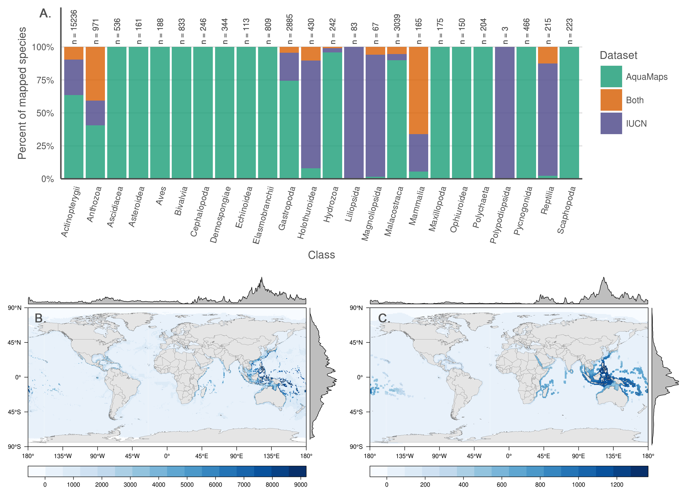
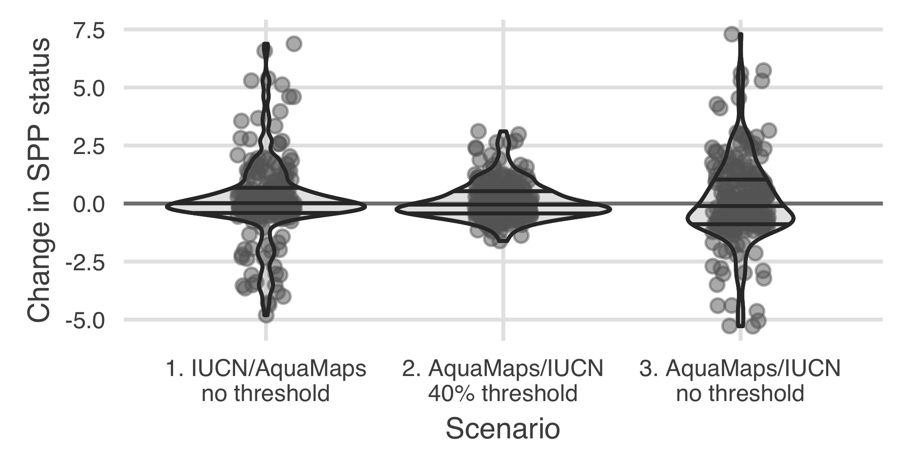

# Figures and captions

<!--

Figures: Calculated at 180 characters per cm in height for one column and 360 characters per cm in height for two columns; a figure wider than 8.7 cm is two columns wide.

From PNAS http://www.pnas.org/site/authors/preparation.xhtml:

Only TIFF, EPS, and high-resolution PDF for Mac or PC are allowed for figures that will appear in the main text. Authors may submit PRC or U3D files for 3D images; these must be accompanied by 2D representations in TIFF, EPS, or high-resolution PDF format. (See SI below for supplementary material.) Color images must be in RGB (red, green, blue) mode. Include the font files for any text. Images must be final size, preferably one column width (8.7 cm). Figures wider than one column should be sized to 11.4 cm or 17.8 cm wide. Numbers, letters, and symbols should be no smaller than 6 points (2 mm) and no larger than 12 points (6 mm) after reduction and must be consistent. Composite figures must be preassembled. Figures must be submitted as separate files, not embedded in manuscript text. See the Digital Art Guidelines.

See also: http://www.pnas.org/site/misc/digitalart.pdf

Label like so: 
Fig. 2.
Diffraction patterns at three different angles and time-dependent structural changes of JDF-L1. (A–C) Diffraction images observed at different zone axes before time 0; n is the electron direction. (D) Femtosecond intensity changes of (200) and (201) spots with time. Two different types of dynamics were observed: a decay with a femtosecond time constant (see main text) and another without a decay.


___consider using HCL or HSV values for colors on plots?___ or ask Mel re: good color choices.  Make sure that colors have good contrast to show up on a black-and-white print...  Should the quad plot background be colored?  How else to quickly code the four quadrants relative to the quadrant-breakdown-by-taxa plot?

**`hcl {grDevices}`**: Create a vector of colors from vectors specifying hue, chroma and luminance.

*Usage* `hcl(h = 0, c = 35, l = 85, alpha, fixup = TRUE)`
Arguments

*arguments*
- `h`: The hue of the color specified as an angle in the range [0,360]. 0 yields red, 120 yields green 240 yields blue, etc.
- `c`: The chroma of the color. The upper bound for chroma depends on hue and luminance.
- `l`: A value in the range [0,100] giving the luminance of the colour. For a given combination of hue and chroma, only a subset of this range is possible.
- `alpha`: numeric vector of values in the range [0,1] for alpha transparency channel (0 means transparent and 1 means opaque).
- `fixup`: a logical value which indicates whether the resulting RGB values should be corrected to ensure that a real color results. if fixup is FALSE RGB components lying outside the range [0,1] will result in an NA value.

**`hsv {grDevices}`**: Create a vector of colors from vectors specifying hue, saturation and value.

*usage* `hsv(h = 1, s = 1, v = 1, alpha)`

*arguments*

- `h`, `s`,`v`: numeric vectors of values in the range [0, 1] for ‘hue’, ‘saturation’ and ‘value’ to be combined to form a vector of colors. Values in shorter arguments are recycled.
- `alpha`: numeric vector of values in the range [0, 1] for alpha transparency channel (0 means transparent and 1 means opaque).

-->

-----

### Fig. 1
<a id = 'fig1'></a>



``` {r barchart_by_taxa, echo = FALSE}
n_spp <- spp_map_pairs %>%
  mutate(spp_group = ifelse(str_detect(spp_group, 'CORAL'), 'CORAL', spp_group)) %>%
  group_by(spp_group) %>%
  summarize(n_spp = n()) %>%
  arrange(desc(n_spp))

n_corals   <- nrow(spp_map_pairs %>% 
                     filter(str_detect(spp_group, 'CORAL')))
n_bonyfish <- nrow(spp_map_pairs %>% 
                     filter(spp_group %in% c('WRASSES', 'BUTTERFLYFISH', 'PARROTFISH',
                                             'COMBTOOTHBLENNIES', 'SEABREAMS_PORGIES', 
                                             'PUFFERFISH', 'GROUPERS', 'TUNAS_BILLFISHES', 
                                             'SURGEONFISH_TANGS_UNICORNFISH', 'ANGELFISH', 
                                             'DAMSELFISH', 'BONEFISH_TARPONS')))
```


>  __Fig. 1.__ (A) Number and proportion of species by taxa included in each dataset.  Overlapping species are dominated by bony fishes (`r format(n_bonyfish, big.mark = ',')` species, primarily tropical taxa) and corals (`r format(n_corals, big.mark = ',')` species).  (B, C) Number of global marine species according to (A) AquaMaps and (B) IUCN.  The margin frequency plots show relative species count per cell at each latitude and longitude. 

### Fig. 2
<a id = 'fig2'></a>


``` {r tally_quad_counts, echo = FALSE}
dist_median <- round(median(spp_map_pairs$sm_perc,    na.rm = TRUE), 1)
area_median <- round(median(spp_map_pairs$area_ratio, na.rm = TRUE), 1)
q1_count <- sum(spp_map_pairs$sm_perc >= dist_median & spp_map_pairs$area_ratio >= area_median)
q2_count <- sum(spp_map_pairs$sm_perc <  dist_median & spp_map_pairs$area_ratio >= area_median)
q3_count <- sum(spp_map_pairs$sm_perc >= dist_median & spp_map_pairs$area_ratio <  area_median)
q4_count <- sum(spp_map_pairs$sm_perc <  dist_median & spp_map_pairs$area_ratio <  area_median)
```

> __Fig. 2.__ (A) Distribution alignment (overlap of smaller range within larger) versus extent ratio (the ratio of smaller range area to the larger range area) for `r format(n_spp_both, big.mark = ',')` species included in both IUCN and AquaMaps datasets.  The upper right quadrant (quadrant 1) comprises species whose maps largely agree (better than median value) in both spatial distribution and the extent of described ranges
(n = `r q1_count`; `r round(q1_count/nrow(spp_map_pairs) * 100, 1)` %).
> The upper left quadrant (quadrant 2) comprises species whose maps agree well in distribution, but disagree in extent
(n = `r q2_count`; `r round(q2_count/nrow(spp_map_pairs) * 100, 1)` %).
> The lower right quadrant (quadrant 3) includes species for which the paired maps generally agree in range extent, but disagree on where those ranges occur
(n = `r q3_count`; `r round(q3_count/nrow(spp_map_pairs) * 100, 1)` %).
> The lower left quadrant (quadrant 4) indicates species for which the map pairs agree poorly in both area and distribution
(n = `r q4_count`; `r round(q4_count/nrow(spp_map_pairs) * 100, 1)` %).  
(B) Alignment quadrant breakdown of paired-map species by taxonomic group.


### Figure 3

<a id = 'fig4'></a>



> __Fig. 3.__ Change in status score for the Species Subgoal within the global Ocean Health Index under three different scenarios.
> Scenario 1 shows the effect of reducing the probability threshold to 0% for AquaMaps presence to more accurately track the definition of IUCN “limits of distribution."  
> Scenario 2 shows the effect of prioritizing AquaMaps data over IUCN, while maintaining the 40% presence threshold.  In general, AquaMaps ranges are smaller than IUCN ranges, so most overlapping species will see a decrease in represented range.  
> Scenario 3 shows the effect of prioritizing AquaMaps data over IUCN, and simultaneously eliminating the presence threshold.  The zero threshold in scenario 3 drives a decrease in scores relative to scenario 2.  


### Figure 4

<a id = 'fig4'></a>


> __Fig. 4.__  Percent of species range covered by MPAs based upon methods in Klein et al. (2015).  Scenario 1 replicates the original results, measuring protected range of species in AquaMaps 2014 dataset, with a 50% presence threshold, against the 2014 World Database of Protected Areas, filtered for IUCN categories I-IV that overlap marine areas.  Scenario 2 updates the results using AquaMaps 2015, showing very small changes despite the inclusion of an additional 5,545 species.  Scenario 3, using 2015 AquaMaps data, drops the presence threshold to zero, showing an expected decrease in gap species, but also a decrease in species with 5% or greater protected range.  Scenario 4 adds an additional 1745 species unique to IUCN, resulting in increases in gap species and species with less than 2% coverage.  Scenario 5 examines species MPA coverage using only the IUCN dataset.


<!-- `r knitr::kable(read_csv(file.path(dir_data, 'mpa_all_runs_summary.csv')))` -->
