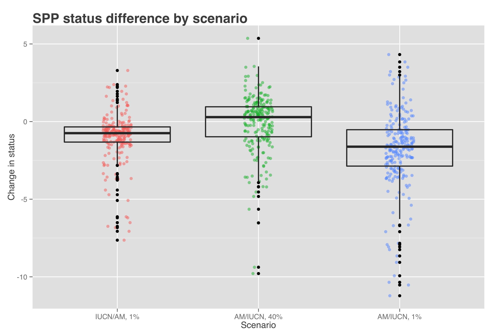

# Figures

Keep figures in the text while working, for easier editing and captioning.  
Put figures here once the manuscript is done

### Figure 4

Figure [X] shows the change in status score for the Species Subgoal within the global Ocean Health Index under three different scenarios. 

| Scenario              | Priority data source | AquaMaps presence threshold |
| --------------------- | :------------------: | :-------------------------: |
| Scenario 0 (current)  | IUCN                 |  >= 40%                     |
| Scenario 1            | IUCN                 |   > 0%                      |
| Scenario 2            | AquaMaps             |  >= 40%                     |
| Scenario 3            | AquaMaps             |   > 0%                      |

* Scenario 1 shows the effect of reducing the presence threshold for AquaMaps presence.  Reducing the threshold will always increase the apparent range of a species, therefore the slight decrease in average score suggests increased spatial representation of threatened species.

* Scenario 2 shows the effect of preferring AquaMaps data over IUCN, while maintaining the same presence threshold.  This will have different effects depending on the species; in general, AquaMaps ranges are smaller than IUCN ranges, so many but not all overlapping species will see a decrease in represented range.  The slight bump in mean score may indicate a small increase in spatial representation of low-risk species, a small decrease in spatial representation of high-risk species, or more likely a combination of both.

* Scenario 3 shows the effect of preferring AquaMaps data over IUCN, while eliminating the presence threshold.  Just as a presence threshold of zero in scenario 1 drives a decrease in average score relative to the baseline, the zero threshold in scenario 3 drives a decrease in scores relative to scenario 2.  The large decrease seems to indicate that within the set of paired-map species, a zero threshold greatly increases the spatial representation of high-risk species relative to low-risk species.

