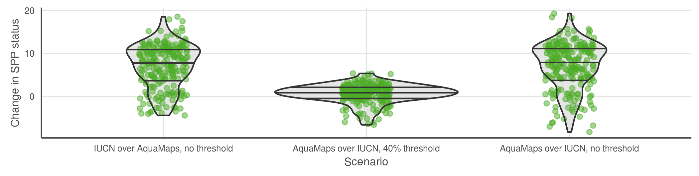

# Figures

___consider using HCL or HSV values for colors on plots?___ or ask Mel re: good color choices.  Make sure that colors have good contrast to show up on a black-and-white print...  Should the quad plot background be colored?  How else to quickly code the four quadrants relative to the quadrant-breakdown-by-taxa plot?

**`hcl {grDevices}`**: Create a vector of colors from vectors specifying hue, chroma and luminance.

*Usage* `hcl(h = 0, c = 35, l = 85, alpha, fixup = TRUE)`
Arguments

*arguments*
- `h`: The hue of the color specified as an angle in the range [0,360]. 0 yields red, 120 yields green 240 yields blue, etc.
- `c`: The chroma of the color. The upper bound for chroma depends on hue and luminance.
- `l`: A value in the range [0,100] giving the luminance of the colour. For a given combination of hue and chroma, only a subset of this range is possible.
- `alpha`: numeric vector of values in the range [0,1] for alpha transparency channel (0 means transparent and 1 means opaque).
- `fixup`: a logical value which indicates whether the resulting RGB values should be corrected to ensure that a real color results. if fixup is FALSE RGB components lying outside the range [0,1] will result in an NA value.

**`hsv {grDevices}`**: Create a vector of colors from vectors specifying hue, saturation and value.

*usage* `hsv(h = 1, s = 1, v = 1, alpha)`

*arguments*

- `h`, `s`,`v`: numeric vectors of values in the range [0, 1] for ‘hue’, ‘saturation’ and ‘value’ to be combined to form a vector of colors. Values in shorter arguments are recycled.
- `alpha`: numeric vector of values in the range [0, 1] for alpha transparency channel (0 means transparent and 1 means opaque).

-----

### Figure 1

<a id = 'fig1'></a>


``` {r barchart_by_taxa, echo = FALSE}
n_spp <- spp_map_pairs %>%
  mutate(spp_group = ifelse(str_detect(spp_group, 'CORAL'), 'CORAL', spp_group)) %>%
  group_by(spp_group) %>%
  summarize(n_spp = n()) %>%
  arrange(desc(n_spp))

n_corals   <- nrow(spp_map_pairs %>% 
                     filter(str_detect(spp_group, 'CORAL')))
n_bonyfish <- nrow(spp_map_pairs %>% 
                     filter(spp_group %in% c('WRASSES', 'COMBTOOTHBLENNIES', 'BUTTERFLYFISH', 
                                             'PUFFERFISH', 'GROUPERS', 'SEABREAMS_PORGIES', 'PARROTFISH', 
                                             'SURGEONFISH_TANGS_UNICORNFISH', 'ANGELFISH', 'TUNAS_BILLFISHES', 
                                             'DAMSELFISH', 'BONEFISH_TARPONS')))
```


>  __Figure 1(a):__ Number and proportion of species, listed by taxa, included in each dataset: IUCN, AquaMaps, or both.  AquaMaps encompasses a broader range of taxa than IUCN, while IUCN focuses on comprehensively assessing select taxonomic groups, typically at the level of order or family. Overlapping species are dominated by bony fishes (`r n_bonyfish` species, primarily tropical taxa) and corals (`r n_corals` species).

> __Figure 1 (b, c):__ Global marine species richness according to (b) AquaMaps dataset and (c) IUCN dataset.  The frequency plot to the right of each map shows relative species count per cell at each latitude; while both datasets peak in tropical latitudes near the equator, the frequency for IUCN maps drops quickly beyond 30°N and 30°S, while the frequency for AquaMaps remains robust well into temperate latitudes.  The frequency plot above each map shows relative species count at each longitude, showing a slight bias in the IUCN dataset away from the Atlantic and eastern Pacific compared to AquaMaps. 

### Figure 2

<a id = 'fig2'></a>


> __Figure 2 (a):__ For each paired-map species, we calculated two dimensions of spatial alignment: _distribution alignment_, which we defined as the proportion of the smaller predicted range intersecting the larger predicted range (where on the map); and _extent alignment_, which we defined as the ratio of the smaller range area to the larger range area (how much of the map).  For a species whose distribution is well understood and described in both datasets, we would expect to see a value near 100% for each dimension of alignment.  

``` {r tally_quad_counts, echo = FALSE}
dist_median <- round(median(spp_map_pairs$sm_perc,    na.rm = TRUE), 1)
area_median <- round(median(spp_map_pairs$area_ratio, na.rm = TRUE), 1)
q1_count <- sum(spp_map_pairs$sm_perc >= dist_median & spp_map_pairs$area_ratio >= area_median)
q2_count <- sum(spp_map_pairs$sm_perc <  dist_median & spp_map_pairs$area_ratio >= area_median)
q3_count <- sum(spp_map_pairs$sm_perc >= dist_median & spp_map_pairs$area_ratio <  area_median)
q4_count <- sum(spp_map_pairs$sm_perc <  dist_median & spp_map_pairs$area_ratio <  area_median)
```

> The upper right quadrant (quadrant 1) comprises species whose maps largely agree (better than median value) in both spatial distribution and the extent of described ranges
(n = `r q1_count`; `r round(q1_count/nrow(spp_map_pairs) * 100, 1)` %).
> The upper left quadrant (quadrant 2) comprises species whose maps agree well in distribution, but disagree in extent
(n = `r q2_count`; `r round(q2_count/nrow(spp_map_pairs) * 100, 1)` %).
> The lower right quadrant (quadrant 3) includes species for which the paired maps generally agree in range extent, but disagree on where those ranges occur
(n = `r q3_count`; `r round(q3_count/nrow(spp_map_pairs) * 100, 1)` %).
> The lower left quadrant (quadrant 4) indicates species for which the map pairs agree poorly in both area and distribution
(n = `r q4_count`; `r round(q4_count/nrow(spp_map_pairs) * 100, 1)` %).


> __Figure 2 (b):__ Spatial alignment of paired-map species by taxonomic group. ___REDO with all corals grouped together!___  _Also - is it distracting to use order names for some groups and not others?  Some of the groups had pretty long names ("acanthuridae" is way shorter than "surgeonfish, tangs, and unicornfish")_

<!--AquaMaps accounts for seafloor depth as a limiting factor, highly constraining the predicted habitat for photosynthesizing corals, while IUCN maps for coral species often include wide buffers that would extend far beyond appropriate depth for coral habitat, thus likely overestimating the actual species range (see SOM).  A similar mechanism may also drive poor extent alignment of other demersal and reef-associated organisms.-->


### Figure 3

<a id = 'fig3'></a>



___NOTE: These figures still need to be recreated using the latest and greatest data!___ _currently they use data generated in November or so, in ohiprep._

> __Figure 3:__ Change in status score for the Species Subgoal within the global Ocean Health Index under three different scenarios. 

| Scenario              | Priority data source | AquaMaps presence threshold |
| --------------------- | :------------------: | :-------------------------: |
| Scenario 0 (current)  | IUCN                 |  >= 40%                     |
| Scenario 1            | IUCN                 |   > 0%                      |
| Scenario 2            | AquaMaps             |  >= 40%                     |
| Scenario 3            | AquaMaps             |   > 0%                      |

> * Scenario 1 shows the effect of reducing the presence threshold for AquaMaps presence.  Reducing the threshold will always increase the apparent range of a species, therefore the slight decrease in average score suggests increased spatial representation of threatened species.
> * Scenario 2 shows the effect of preferring AquaMaps data over IUCN, while maintaining the same presence threshold.  This will have different effects depending on the species; in general, AquaMaps ranges are smaller than IUCN ranges, so many but not all overlapping species will see a decrease in represented range.  The slight bump in mean score may indicate a small increase in spatial representation of low-risk species, a small decrease in spatial representation of high-risk species, or more likely a combination of both.
> * Scenario 3 shows the effect of preferring AquaMaps data over IUCN, while eliminating the presence threshold.  Just as a presence threshold of zero in scenario 1 drives a decrease in average score relative to the baseline, the zero threshold in scenario 3 drives a decrease in scores relative to scenario 2.  The large decrease seems to indicate that within the set of paired-map species, a zero threshold greatly increases the spatial representation of high-risk species relative to low-risk species.

