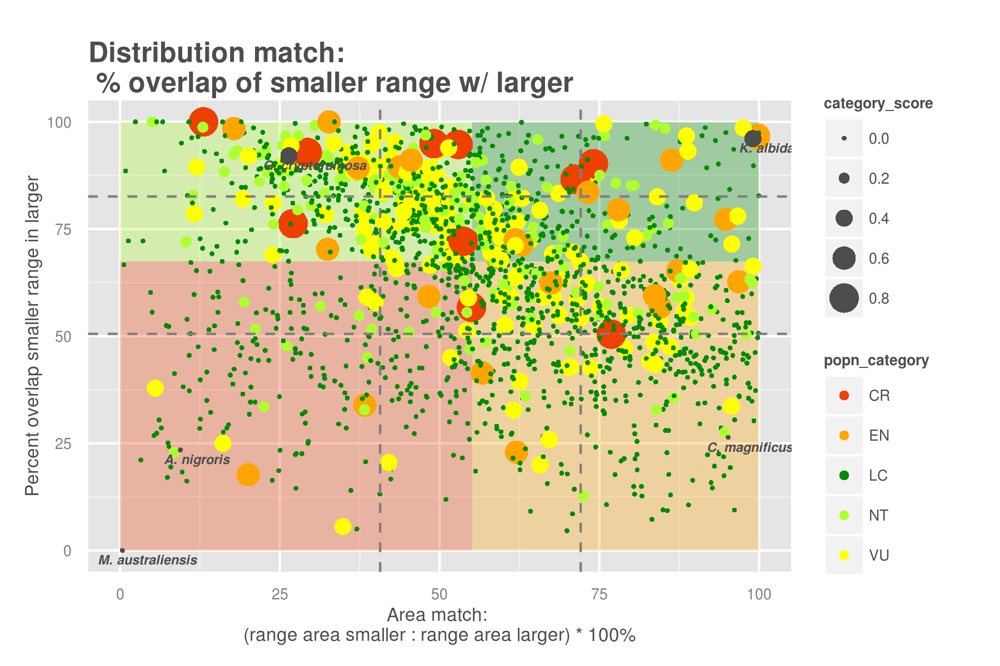
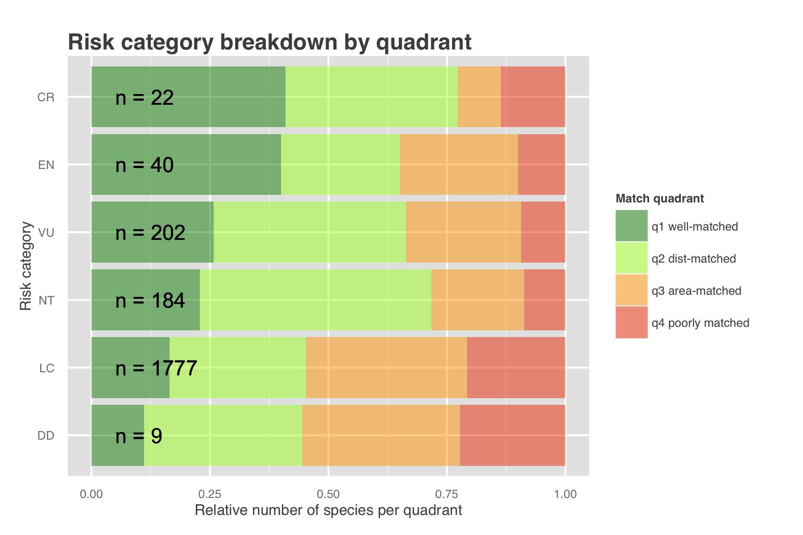
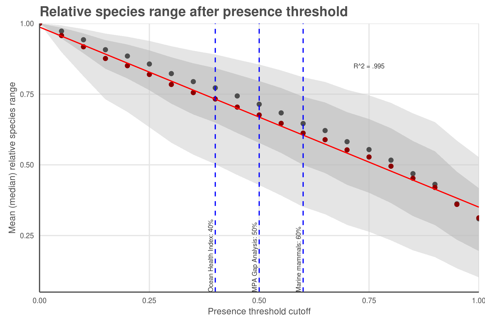

# Figures

### Figure 1 (a, b):


### Figure 2 (a, b):


### Figure 3:



___Figure XXX: Distribution alignment vs area alignment for `r nrow(spp_map_pairs)` species mapped in both Aquamaps and IUCN species distribution maps.___
``` {r tally_quad_counts, echo = FALSE}
dist_median <- round(median(spp_map_pairs$sm_perc,    na.rm = TRUE), 1)
area_median <- round(median(spp_map_pairs$area_ratio, na.rm = TRUE), 1)
q1_count <- sum(spp_map_pairs$sm_perc >= dist_median & spp_map_pairs$area_ratio >= area_median)
q2_count <- sum(spp_map_pairs$sm_perc <  dist_median & spp_map_pairs$area_ratio >= area_median)
q3_count <- sum(spp_map_pairs$sm_perc >= dist_median & spp_map_pairs$area_ratio <  area_median)
q4_count <- sum(spp_map_pairs$sm_perc <  dist_median & spp_map_pairs$area_ratio <  area_median)
```

* The upper right quadrant (quadrant 1) comprises species whose maps largely agree (better than median value) in both spatial distribution and the area of described ranges.  For these species, the expert-drawn range map and the bioclimatic envelope model produce similar predictions of species distribution.  
(n = `r q1_count`; `r round(q1_count/nrow(spp_map_pairs) * 100, 1)` %)
* Species map pairs that fall within the upper left quadrant (quadrant 2: well-aligned in distribution but poorly-matched in area) indicate species in which the range of the smaller map falls generally within the larger map, but the larger map may include more generous buffers or may include areas unrepresented in the smaller map.
(n = `r q2_count`; `r round(q2_count/nrow(spp_map_pairs) * 100, 1)` %)
* The lower right quadrant (quadrant 3: well-aligned in area but poorly matched in distribution) includes species for which the paired maps generally agree in range area, but disagree in locations of those ranges.  Disagreement in distribution seems to indicate a greater issue than disagreement in area extent, so we categorized map pairs in this quadrant as being lower quality alignment than map pairs in either of the upper quadrants. 
(n = `r q3_count`; `r round(q3_count/nrow(spp_map_pairs) * 100, 1)` %)
* The lower left quadrant (quadrant 4: poorly matched in both dimensions) indicates species for which the map pairs fail to agree in both area and distribution. 
(n = `r q4_count`; `r round(q4_count/nrow(spp_map_pairs) * 100, 1)` %)

### Figure 4 (a, b):




### Figure 5 (a, b):

 



### Figure 6


Figure [X] shows the change in status score for the Species Subgoal within the global Ocean Health Index under three different scenarios. 

| Scenario              | Priority data source | AquaMaps presence threshold |
| --------------------- | :------------------: | :-------------------------: |
| Scenario 0 (current)  | IUCN                 |  >= 40%                     |
| Scenario 1            | IUCN                 |   > 0%                      |
| Scenario 2            | AquaMaps             |  >= 40%                     |
| Scenario 3            | AquaMaps             |   > 0%                      |

