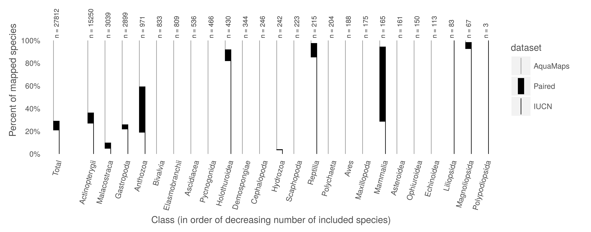
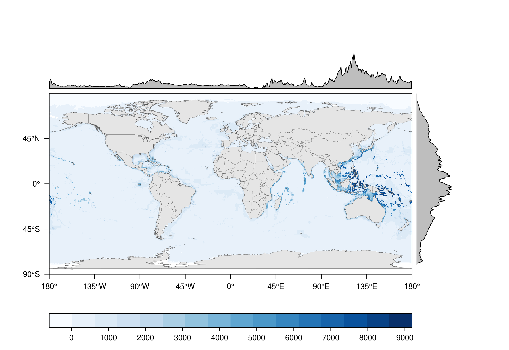
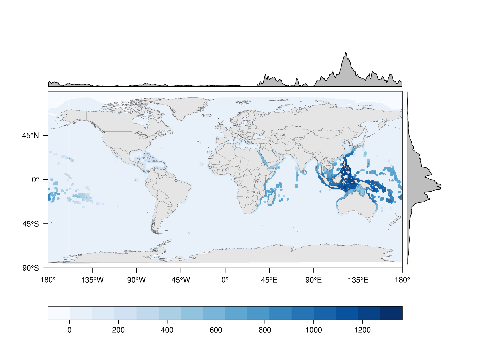
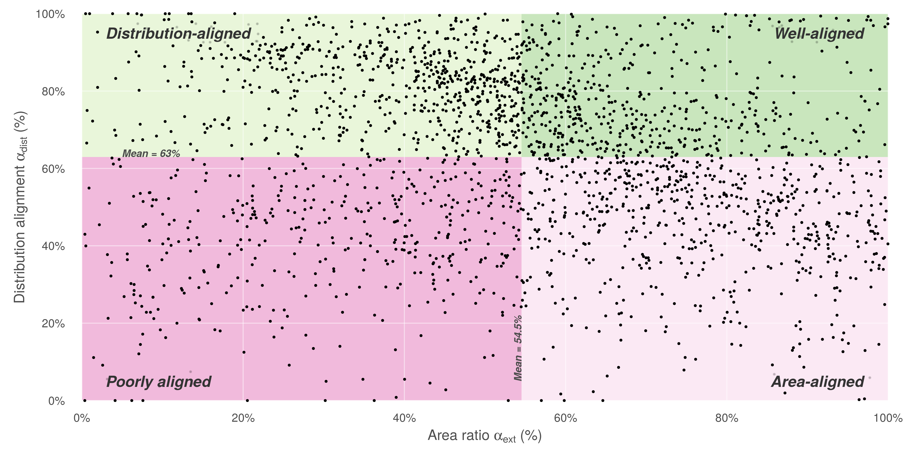
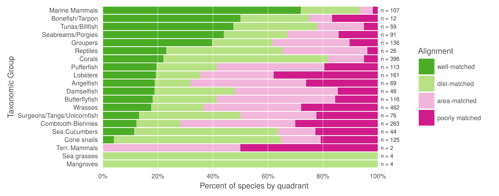
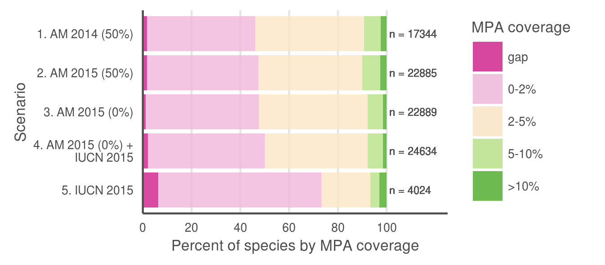
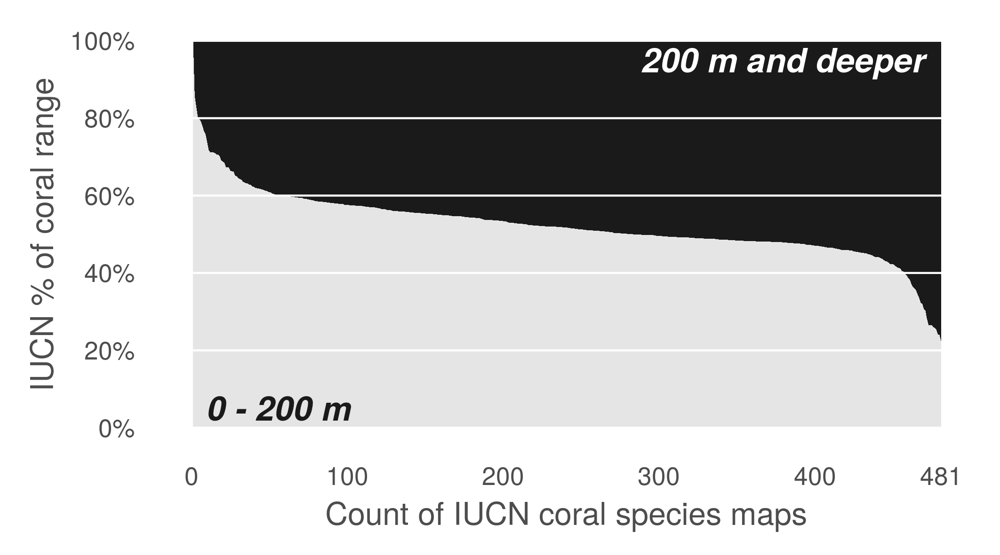
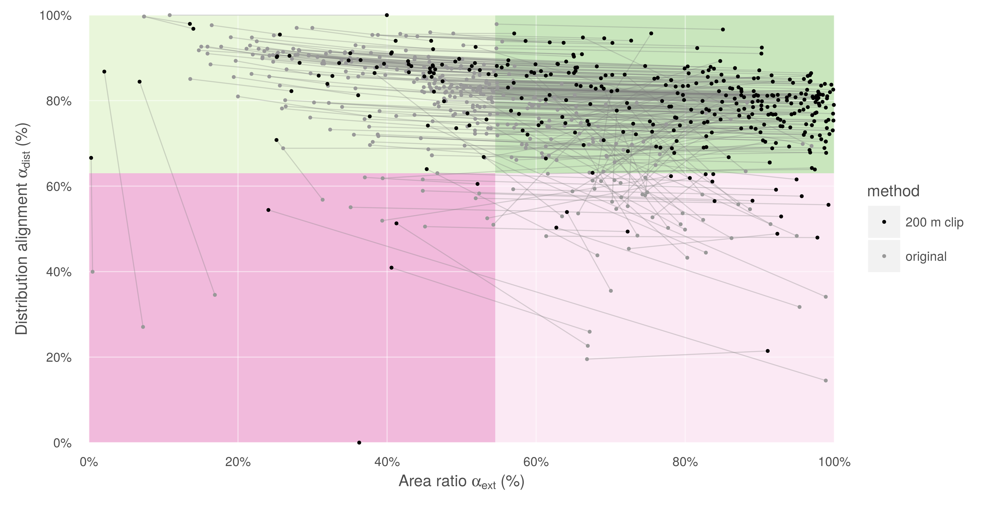

``` {r setup, echo = FALSE, message = FALSE, warning = FALSE}
knitr::opts_chunk$set(fig.width = 6, fig.height = 4, fig.path = 'Figs/',
                      echo = FALSE, message = FALSE, warning = FALSE)

# library(ggplot2)
# library(maps)


# library(raster)
# library(data.table)
library(tidyr)
library(dplyr)
library(stringr)
library(readr)

# dir_N <- c('Windows' = '//neptune.nceas.ucsb.edu/data_edit',
#            'Darwin'  = '/Volumes/data_edit',
#            'Linux'   = '/var/data/ohi')[[ Sys.info()[['sysname']] ]]

# dir_anx  <- file.path(dir_N, 'git-annex/globalprep/SPP_ICO')

if(basename(getwd()) != 'IUCN-AquaMaps') setwd('~/github/IUCN-AquaMaps')

dir_data <- 'data'
dir_fig  <- 'figures'

```

``` {r load data, echo = FALSE, warning = FALSE, message = FALSE}
### use data_explore.Rmd to create this file, if it does not yet exist.  This
### filters out presence = Extinct from IUCN cells.

data_file <- 'data/spp_list_w_area_trimmed.csv'
spp_map_pairs <- read_csv(data_file)
### NOTE: as of Jan 31, includes all map pairs, even ones where IUCN area == 0

### generate other lists
spp_all_file <- 'data/spp_all.csv'
spp_all <- read_csv(spp_all_file) ### NOTE: contains duped scinames

# iucn_marine_file <- 'data/spp_iucn_marine.csv'
# spp_iucn_marine <- read_csv(iucn_marine_file) 

iucn_maps_file <- 'data/spp_iucn_maps.csv'
spp_iucn_maps <- read_csv(iucn_maps_file) %>%
  filter(!duplicated(iucn_sid))

spp_am_file <- 'data/spp_am.csv'
spp_am <- read_csv(spp_am_file)

```

``` {r calc species numbers, echo = FALSE}
n_spp_am     <- nrow(spp_am)
n_spp_am_rev <- nrow(spp_am %>% filter(reviewed == 1))
n_spp_iucn   <- length(unique(spp_iucn_maps$iucn_sid))
n_spp_both   <- length(unique(spp_map_pairs$iucn_sid))
n_spp_all    <- n_spp_am + n_spp_iucn - n_spp_both

p_spp_am     <- round(n_spp_am/n_spp_all * 100, 1)
p_spp_iucn   <- round(n_spp_iucn/n_spp_all * 100, 1)
p_both_am    <- round(n_spp_both/n_spp_am   * 100, 1)
p_both_iucn  <- round(n_spp_both/n_spp_iucn * 100, 1)
p_both_all   <- round(n_spp_both/n_spp_all  * 100, 1)

spp_list <- read_csv(file.path(dir_data, 'spp_list_w_area_trimmed.csv'))
area_align_mean <- round(mean(spp_list$area_ratio, na.rm = TRUE), 1)
dist_align_mean <- round(mean(spp_list$sm_perc, na.rm = TRUE), 1)

```

<!--

Figures: Calculated at 180 characters per cm in height for one column and 360 characters per cm in height for two columns; a figure wider than 8.7 cm is two columns wide.

From PNAS http://www.pnas.org/site/authors/preparation.xhtml:

Only TIFF, EPS, and high-resolution PDF for Mac or PC are allowed for figures that will appear in the main text. Authors may submit PRC or U3D files for 3D images; these must be accompanied by 2D representations in TIFF, EPS, or high-resolution PDF format. (See SI below for supplementary material.) Color images must be in RGB (red, green, blue) mode. Include the font files for any text. Images must be final size, preferably one column width (8.7 cm). Figures wider than one column should be sized to 11.4 cm or 17.8 cm wide. Numbers, letters, and symbols should be no smaller than 6 points (2 mm) and no larger than 12 points (6 mm) after reduction and must be consistent. Composite figures must be preassembled. Figures must be submitted as separate files, not embedded in manuscript text. See the Digital Art Guidelines.

See also: http://www.pnas.org/site/misc/digitalart.pdf

Label like so: 
Fig. 2.
Diffraction patterns at three different angles and time-dependent structural changes of JDF-L1. (A–C) Diffraction images observed at different zone axes before time 0; n is the electron direction. (D) Femtosecond intensity changes of (200) and (201) spots with time. Two different types of dynamics were observed: a decay with a femtosecond time constant (see main text) and another without a decay.


___consider using HCL or HSV values for colors on plots?___ or ask Mel re: good color choices.  Make sure that colors have good contrast to show up on a black-and-white print...  Should the quad plot background be colored?  How else to quickly code the four quadrants relative to the quadrant-breakdown-by-taxa plot?

**`hcl {grDevices}`**: Create a vector of colors from vectors specifying hue, chroma and luminance.

*Usage* `hcl(h = 0, c = 35, l = 85, alpha, fixup = TRUE)`
Arguments

*arguments*
- `h`: The hue of the color specified as an angle in the range [0,360]. 0 yields red, 120 yields green 240 yields blue, etc.
- `c`: The chroma of the color. The upper bound for chroma depends on hue and luminance.
- `l`: A value in the range [0,100] giving the luminance of the colour. For a given combination of hue and chroma, only a subset of this range is possible.
- `alpha`: numeric vector of values in the range [0,1] for alpha transparency channel (0 means transparent and 1 means opaque).
- `fixup`: a logical value which indicates whether the resulting RGB values should be corrected to ensure that a real color results. if fixup is FALSE RGB components lying outside the range [0,1] will result in an NA value.

**`hsv {grDevices}`**: Create a vector of colors from vectors specifying hue, saturation and value.

*usage* `hsv(h = 1, s = 1, v = 1, alpha)`

*arguments*

- `h`, `s`,`v`: numeric vectors of values in the range [0, 1] for ‘hue’, ‘saturation’ and ‘value’ to be combined to form a vector of colors. Values in shorter arguments are recycled.
- `alpha`: numeric vector of values in the range [0, 1] for alpha transparency channel (0 means transparent and 1 means opaque).

-->

# Figures


### Fig. 1
<a id = 'fig1'></a>





-----

### Fig. 2
<a id = 'fig2'></a>




-----

### Figure 3

<a id = 'fig3'></a>


why is the global one not showing up?:


-----

### Figure 4

<a id = 'fig4'></a>



### New figures - corals





-----

``` {r figure_legends, child = 'ms_5_fig_legends.Rmd'}
```

