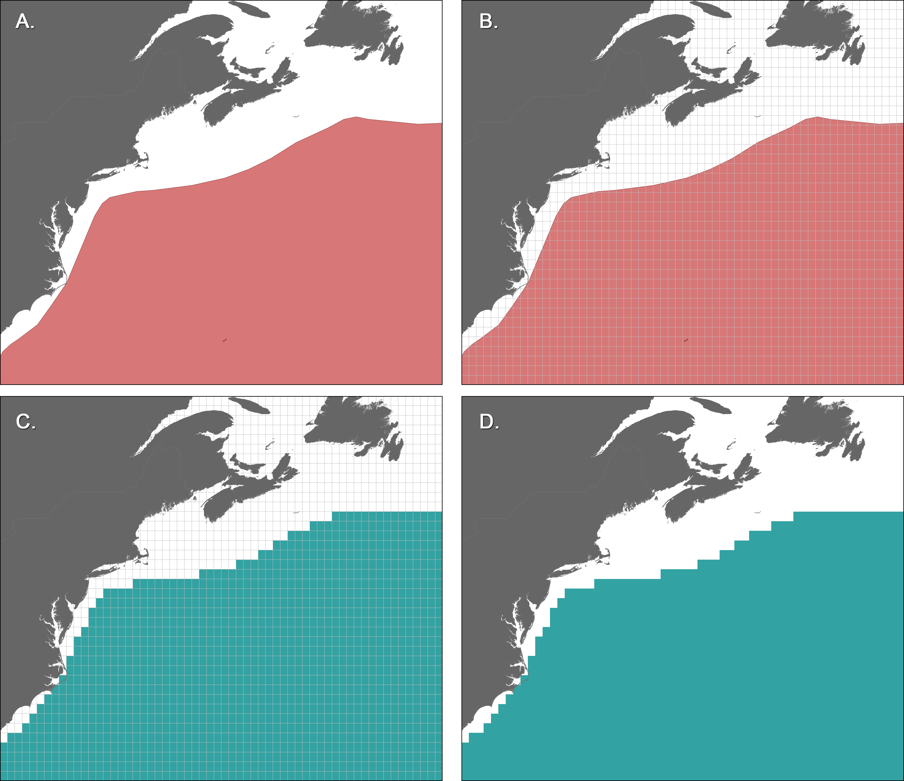
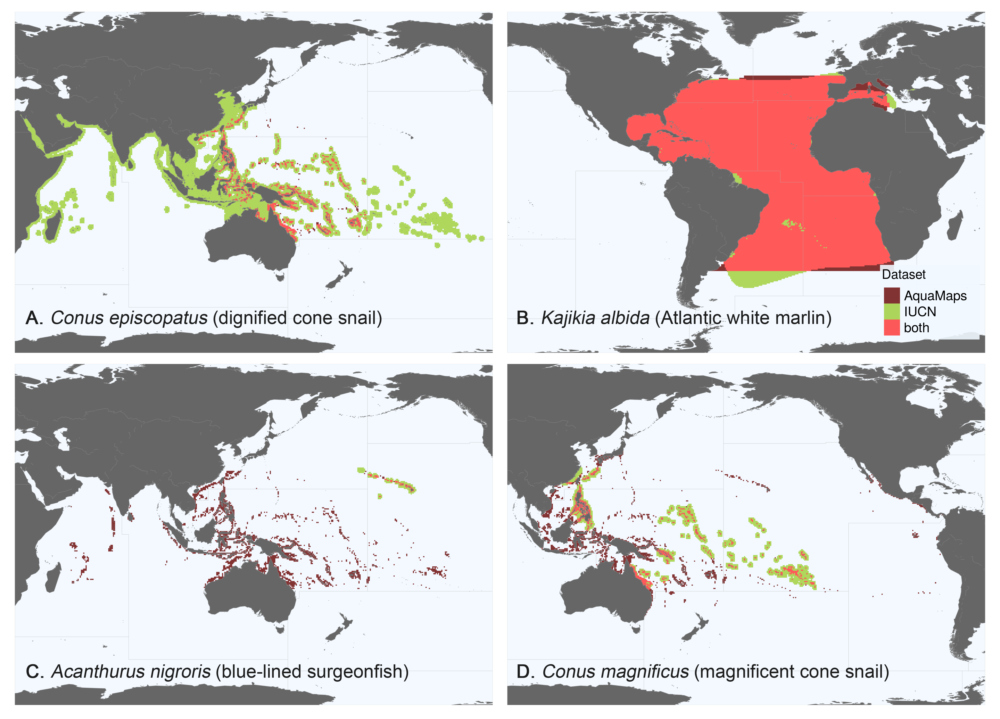

<!--

-->

<!-- methods: -->
<!-- IUCN raw -> grid -> raster -> final -->
<!-- AM raw -> presence -->

<!-- results/discussion: -->
<!-- quad plot with risk and four species (?) -->
<!-- four representative maps -->

<!-- coral quadrant shifts -->

<!-- AM thresholds? not mentioned in body of paper as of yet -->

## Preparing AquaMaps and IUCN data layers

> __Fig S1.  Examples of AquaMaps and IUCN raw species range data.__ (A, B) AquaMaps distribution of _Thunnus alalunga_ (Albacore Tuna) (AquaMaps 2013e) showing (A) global range with varying probabilities of occurrence assigned to 0.5° grid cells and (B) presence within 0.5° grid cells. (C, D) IUCN distribution of _T. alalunga_ (IUCN 2011b) represented as (C) extent of occurrence polygons and (D) presence within 0.5° grid cells.

<!-- Fis-22832, Thunnus alalunga, 21856 -->

> __Fig S2.  Rasterizing shapefiles provided by IUCN.__ A portion of the _T. alalunga_ range map is used to exemplify the rasterization process.  To enable direct comparison of IUCN species ranges to AquaMaps species ranges, the raw IUCN polygon (A) is overlaid with a 0.5° degree grid matching the AquaMaps grid (B).  Each cell is assigned a value of "present" if the cell overlaps any portion of the polygon (C).  The resulting raster (D).

## Representative maps from each quadrant

> __Fig S3.  Representative species maps to illustrate each quadrant from Fig 2A.__ (AquaMaps 2013abcd; Conch 2013ab; IUCN 2011a; IUCN 2012) Each map is positioned to match its quadrant in Fig 2A.  FAO Major Fishing Area boundaries [@fao_fisheries_and_aquaculture_department_cwp_2015] are outlined in light grey.
(A) Distribution-matched: _Conus episcopatus_, the dignified cone snail.  Distributions show excellent overlap in the western Pacific, though IUCN range extends well beyond the bounds of the AquaMaps range.
(B) Well-matched: _Kajikia albida_, the Atlantic white marlin.  Distributions from each data set show nearly complete overlap, and very similar range size.
(C) Poorly-matched: _Acanthurus nigroris_, the blue-lined surgeonfish.  IUCN predicts species distribution only near the Hawaiian islands; AquaMaps predicts extensive distribution throughout the central and western Pacific Ocean.  The datasets align in neither distribution nor range size.
(D) Area-matched: _Conus magnificus_, the magnificent cone snail.  Distributions overlap in the southern Pacific, but align poorly elsewhere.  The range sizes are similar.

<!--
W-Msc-215455, Conus episcopatus, 192664
W-Msc-215551, Conus magnificus, 192573
Fis-31079, Acanthurus nigroris, 177999
Fis-164253, Kajikia albida, 170322
-->

## Shifts in coral species range map alignment due to depth clipping

> __Fig. S4.  Shift in alignment of paired-map coral species due to clipping IUCN ranges to areas shallower than 200 m.__  The grey lines represent the change in apparent alignment for a single species.  Most coral species shift rightward from the upper left quadrant to the upper right, with little if any loss in distribution alignment, since in general, only unsuitable habitat has been removed.  Leftward shifts can be seen in species whose larger original range is represented in AquaMaps; by trimming IUCN ranges, the area ratio becomes smaller.

## References for supplemental figures

Conch Books, Hackenheim, Germany 2013. Conus episcopatus. The IUCN Red List of Threatened Species. Version 2016-2

Conch Books, Hackenheim, Germany 2013. Conus magnificus. The IUCN Red List of Threatened Species. Version 2016-2

International Union for Conservation of Nature (IUCN) 2011. Kajikia albida. The IUCN Red List of Threatened Species. Version 2016-2

International Union for Conservation of Nature (IUCN) 2011. Thunnus alalunga. The IUCN Red List of Threatened Species. Version 2016-2

International Union for Conservation of Nature (IUCN) 2012. Acanthurus nigroris. The IUCN Red List of Threatened Species. Version 2016-2

www.aquamaps.org, version of Aug. 2013. Computer generated distribution maps for Conus episcopatus, with modelled year 2100 native range map based on IPCC A2 emissions scenario. Web. Accessed 11 Sep. 2016.

www.aquamaps.org, version of Aug. 2013. Computer generated distribution maps for Conus magnificus, with modelled year 2100 native range map based on IPCC A2 emissions scenario. Web. Accessed 11 Sep. 2016.

www.aquamaps.org, version of Aug. 2013. Computer generated distribution maps for Kajikia albida (Atlantic white marlin), with modelled year 2100 native range map based on IPCC A2 emissions scenario. Web. Accessed 11 Sep. 2016.

www.aquamaps.org, version of Aug. 2013. Reviewed distribution maps for Acanthurus nigroris (Bluelined surgeonfish), with modelled year 2100 native range map based on IPCC A2 emissions scenario. Web. Accessed 11 Sep. 2016.

www.aquamaps.org, version of Aug. 2013. Reviewed distribution maps for Thunnus alalunga (Albacore), with modelled year 2100 native range map based on IPCC A2 emissions scenario. Web. Accessed 11 Sep. 2016.

