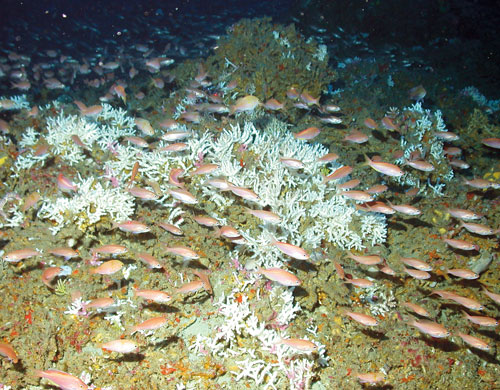
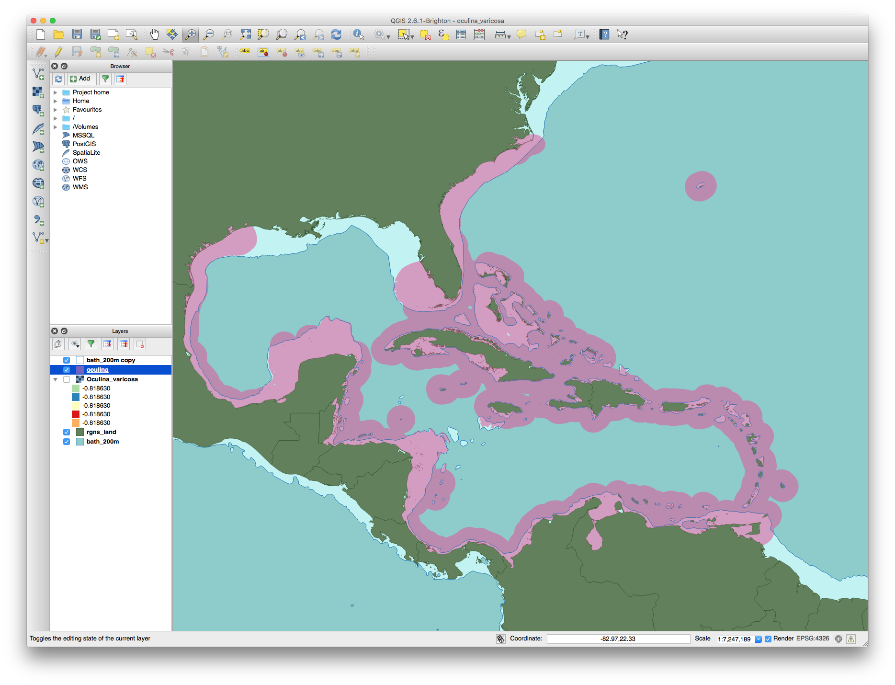
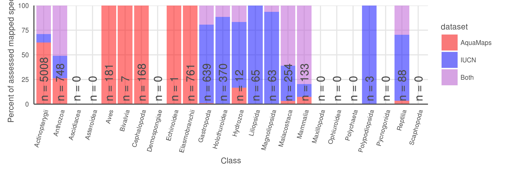

# Supplemental Information

<!--

from PNAS http://www.pnas.org/site/authors/preparation.xhtml:

The main text of the paper must stand on its own without the SI. Refer to SI in the manuscript at an appropriate point in the text. Number supporting figures and tables starting with S1, S2, etc. Authors are limited to no more than 10 SI files, not including movie files.

Authors who place detailed materials and methods in SI must provide sufficient detail in the main text methods to enable a reader to follow the logic of the procedures and results and also must reference the online methods. If a paper is fundamentally a study of a new method or technique, then the methods must be described completely in the main text.

Because PNAS edits SI and composes it into a single PDF, authors must provide the following file formats only:

Text: Supply Word, RTF, or LaTeX files (LaTeX files must be accompanied by a PDF with the same file name for visual reference).
Figures: Provide a brief legend for each supporting figure after the supporting text. Provide figure images in TIFF, EPS, high-resolution PDF, JPEG, or GIF format; figures may not be embedded in manuscript text. When saving TIFF files, use only LZW compression; do not use JPEG compression. Do not save figure numbers, legends, or author names as part of the image. Composite figures must be preassembled.
3D figures: Supply a composable U3D or PRC file so that it may be edited and composed. Authors may submit a PDF file but please note it will be published in raw format and will not be edited or composed.
Tables: Supply Word, RTF, or LaTeX files (LaTeX files must be accompanied by a PDF with the same file name for visual reference); include only one table per file. Do not use tabs or spaces to separate columns in Word tables.
Datasets: Supply Excel (.xls), RTF, or PDF files. This file type will be published in raw format and will not be edited or composed.
Movies: Supply Audio Video Interleave (avi), Quicktime (mov), Windows Media (wmv), animated GIF (gif), or MPEG files and submit a brief legend for each movie in a Word or RTF file. All movies should be submitted at the desired reproduction size and length. Movies should be no more than 10 MB in size.
Still images: Authors must provide a still image from each video file. Supply TIFF, EPS, high-resolution PDF, JPEG, or GIF files.
Appendices: PNAS prefers that authors submit individual source files to ensure readability. If this is not possible, supply a single PDF file that contains all of the SI associated with the paper. This file type will be published in raw format and will not be edited or composed.

-->

#Outline

## Data processing - should this go in methods???

All code is publicly available and freely downloadable [here on GitHub](link to github).

### AquaMaps

AquaMaps data was provided by AquaMaps directly via ftp. Three SQL files were sent that contained (1) list of all `r nrow(spp_am)` species and their taxonomic information, (2) information for all (259,200?) half degree cells used for range mapping and (3) the probability of occurrence per cell for all `r nrow(spp_am)` species. These were extracted into .csv form using R Statistical Software. 

### IUCN

As of December 2015, IUCN had published species distribution maps for `r nrow(spp_iucn_maps)` marine species across 24 taxonomic groups.  For this analysis, we did not consider IUCN range maps for bird species, as those data are hosted separately by BirdLife International.

Each shapefile contains polygon limits of distribution indicating regions of presence/absence, additional attributes provide information on extant/extinct ranges, native/introduced ranges, and seasonality.

* which data sets are included?
* raster::extract() to convert polys to csvs
* which columns are included?

## S1: sample maps from each quadrant

## S2: risk by quadrant

* Breaking down the quadrants by IUCN extinction risk categories (Fig. S2), we found little support for our hypothesis that maps for species with higher extinction risk tend to be better aligned between the two datasets, perhaps correlated to increased expert scrutiny.  Does higher perceived risk lead to increased attention, and thus better understanding of species distribution? Or conversely, does increased attention to species distribution reveal more species at risk?  Likely both mechanisms are at play on a case-by-case basis, depending on the species' taxon and region. _does this argument bear up to closer scrutiny? CR isn't dominated by Q1 any more_

## S3: coral depth map

Oculina varicosa - Ivory tree coral 

* from IUCN: Colonies are found to depths of 152 m depth on limestone rubble, low-relief limestone outcrops, high-relief, steeply sloping prominences, and soft-bottom sloping habitats. Colonies are semi-isolated, patchy and low-growing in shallow water, or they form larger, massive coalescing aggregates (thickets or coppices) with substantial topographic relief in 50-100 m depth. In shallow waters (2-30m) the form is zooxanthellate, inhabiting limestone ledges. In deeper waters, an azooxanthellate form is known from the shelf edge off eastern Florida, USA from Ft. Pierce to Daytona (Reed 1980, 1983, 2002; Brooke and Young 2003).

plotted against a 200 m bathymetry line: 

## S4: AquaMaps threshold examination

For our comparisons of global distribution of represented biodiversity and spatial alignment between datasets, we considered "present" to be any cell with a non-zero probability of occurrence, to best approximate the "limits of distribution" as indicated by IUCN maps.  To examine the effect of different presence threshold selections on the represented range of a species, we varied the threshold from 0% to 100% and calculated the average species range relative to a zero threshold.

S4a:

 

S4b:

>AquaMaps distribution map extent remaining after applying a presence threshold.  (a) A 40% threshold applied to all species in the AquaMaps dataset shows a mean loss of XXX, with a wide distribution in which some species lose nearly all of their apparent range.  (b) Mean (median) remaining extent at increments of presence threshold. Dark grey ribbon includes 25% to 75% quantiles, while light grey ribbon includes 5% to 95% quantiles.

AquaMaps distribution maps indicate "probability of occurrence" within each 0.5° cell, with values ranging from zero to one, rather than a simple present/absent value as indicated by IUCN maps.  Many studies convert this AquaMaps probability to a simple presence value by assigning a threshold value (REF references here).  A higher threshold constrains an analysis to cells with near certainty of occurrence, while a low threshold captures larger areas of increasingly marginal suitability.

At a presence threshold of 40%, as used in the Ocean Health Index Species subgoal, the bulk of AquaMaps species suffer a significant decrease in represented range, and some species lose nearly their entire range.  Incrementing the presence threshold from 0.00 to 1.00 for the entire AquaMaps dataset, the shallow downward trend indicates a low but consistent sensitivity to threshold choice, with no surprising tradeoffs that could suggest an "optimal" threshold.

## MPA gap analysis - explanation
 
___why so many gaps and 10+ species show up with IUCN.  I will write up a paragraph once I've had a little more time to examine maps___

- check which species are gap species; check maps
- check which species are 10%+ species and check maps
- where do these species fall georegionally? is there anything odd about their ranges? any reason why IUCN would be 
- hypothesis to explain more gap species: Aquamaps more diffuse than IUCN, catching individual cells that could be suitable; a single cell (even low probability) moves a species from "gap" to non-gap status.  IUCN more clustered by polygon boundaries; so no scattered cells to accidentally fall into an MPA. 
    - introducing errors: AM = likely commission (overestimates species with tiny bits of range in MPAs) vs IUCN = possible omission (misses possible real habitat that falls within MPAs)
- hypothesis to explain more 10%+ species - ten random samples most have IUCN polygons just east of Australia where a large MPA is indicated - Great Barrier Reef I assume - a single large poly falling in GBR gets a high score, while for the same species, many of the AM ranges (also in same area) scatter suitable area over larger extent, so lower percent of species range is protected
    - introducing errors: IUCN = likely omission (skipping possible real habitat outside of MPAs) and likely commission (possibly overcounting real habitat in MPAs e.g. GBR); AquaMaps = probably a little commission (possibly underestimating, if it overpredicts lots of range outside MPAs, thus reducing the proportion of protected range)
    
    
<!--
#### Caveats
For example, as of this writing, IUCN has released no spatial data for class Elasmobranchii (cartilaginous fishes including sharks and rays); and while IUCN offers a large number of maps within class Actinopterygii (ray-finned bony fishes), the available maps include only a few primarily tropical taxonomic sub-groups, such as wrasses, damselfish, butterflyfish, tunas, and billfishes, but are missing economically important subgroups including salmon, rockfish, and clupeids.  However, IUCN's criterion of comprehensive assessment greatly reduces the risk of sample bias within the bounds of the assessed taxonomic groups.
-->

<!--
___Red List inclusion:___

-->

<!--

a few codes to indicate likely problems?

- DC = depth clipping; IUCN extents go beyond reasonable depth for the species
- DX = data excluded; AM excludes some observations that appear to be used for IUCN
- DP = data poor (AquaMaps acknowledges data poor status? or use less than 10 data points as criteria)
- NX = needs evaluation by expert; AM model likely predicts areas where species is unlikely to be found based on observed occurrences - does AM model reflect same as AM suitable habitat?

Q2:

| species                | quad | group           | codes   | notes |
| -------                | ---- | -----           | -----   | ----- |
| Conus episcopatus      | q2   | cones           |  DP, DX | d-match around Coral Triangle, but IUCN shows much more around Indian Ocean and S Pacific; also IUCN extents
| Ctenochaetus binotatus | q2   |                 |         | IUCN extents beyond AM
| Naso vlamingii         | q2   | acanthuridae    |         | IUCN extents beyond AM
| Thalassoma purpureum   | q2   | wrasses         |         | IUCN extents beyond AM
| Porites nigrescens     | q2   | corals 2        | DP      | AM limited to CT; IUCN shows far greater dist, and extents
| Conus ammiralis        | q2   | cones           | DP      | AM  | limited to CT, IUCN shows in Madagascar; also extents
| Conus tessulatus       | q2   | cones           |         | extents
| Acropora sarmentosa    | q2   | corals 1        |         | extents; also AM shows HI but IUCN does not?
| Holothuria fuscogilva  | q2   | sea cucumbers   |         | extents; also AM shows Mex and Central Am west coast, but IUCN does not (not available online?)
| Oculina Varicosa       | q2   | corals 2        |         | lim to Caribbean; extents - this might be a good close-up map
| Acanthocybium solandri | q2   | tunas/billfish  |         | mostly tropical by IUCN; AM shows much farther N and S

Q3

| species                | quad | group           | codes   | notes |
| -------                | ---- | -----           | -----   | ----- |
| Conus magnificus       | q3   |  cones          |         | IUCN distribution is more limited than AM distribution)
| Abudefduf concolor     | q3   |  damselfish     |         | Baja for AM, southern Central Am for IUCN; maybe a good closeup map?  AM points from Baja to Peru incl Galapagos; some rejected pts from Caribbean and eastern Atlantic
| Centropyge aurantonotus | q3  |  angelfish      |         | AM shows Caribbean; IUCN shows northern South America, also maybe a good closeup map? AM points from FL to south Brazil, but no Gulf of Mexico.
| Chlorurus perspicillatus | q3 |  parrotfish     |         | IUCN shows only HI; AM shows dots all over S Pacific and near Marianas Islands
| Sarda orientalis        | q3  |  tunas/billfish |         | limited dists by IUCN
| Montastraea franksi     | q3  |  corals 2       | DP      | IUCN shows just in Caribbean; AM shows all up & down east coast of N America and S America

Q4

| species                  | quad | group   | codes   | notes |
| -------                  | ---- | -----   | -----   | ----- |
| Acanthurus nigroris      | q4   |         |         | IUCN dist limited to HI, while AM shows all over S Pacific and CT - AM observations all over S pacific...
| Praealticus tanegasimae  | q4   | blenny  |         | IUCN shows limited dist around Japan/Marianas; AM shows much broader through CT and W Pacific - good local map?
| Stethojulis marquesensis | q4   | wrasse  |         | IUCN shows only small cluster of islands (Marquesas?) while AM shows much broader across S Pacific
| Canthigaster leoparda    | q4   | puffer  |         | IUCN limited spots around a couple of islands; AM shows all throughout CT
| pentacheles snyderi      | q4   | lobster | DP      | AM shows all over - sim to depth profiles? while IUCN shows only a couple patches - HI? S Pacific, and S Indian oceans?  AM limits to specific FAO regions, which results in odd cutoffs; also shows some data points in N Atlantic which has an odd result.
| Nephropsis sulcata       | q4   | lobster |         | IUCN shows odd ranges, most of which don't overlap with AM

-->

<!--
___table to show data poor status and reviewed status for AquaMaps maps represented in the quadrant plot___ _- perhaps update the quadrant plot to reveal data-poor species (and reviewed species? little overlap of reviewed & data-poor) instead of, say, red-list category which doesn't get discussed in the body of the paper?  then this table can go in SOM if we like it_

| quadrant | n species | n data poor species | mean (median) data points | n reviewed species |
| :------: | :-------: | :-----------------: | :-----------------------: | :----------------: |
| all AM   |   22889   |        8749 (38.2%) |          57.1 (16)        |       1296  (5.7%) |
| AM&IUCN  |    2166   |         457 (21.1%) |          89.9 (33)        |        290 (13.4%) |
|   q1     |     401   |          33  (8.2%) |         233.0 (78)        |        100 (24.9%) |
|   q2     |     682   |         151 (22.1%) |          77.4 (39)        |        100 (14.7%) |
|   q3     |     682   |         114 (16.5%) |          52.4 (29)        |         65  (9.5%) |
|   q4     |     410   |         159 (39.7%) |          32.1 (13)        |         25  (6.2%) |

-->
