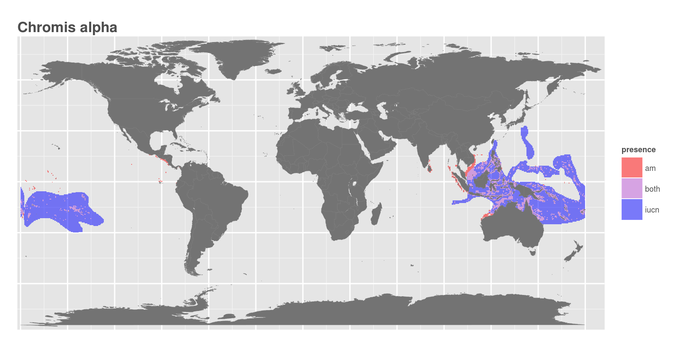
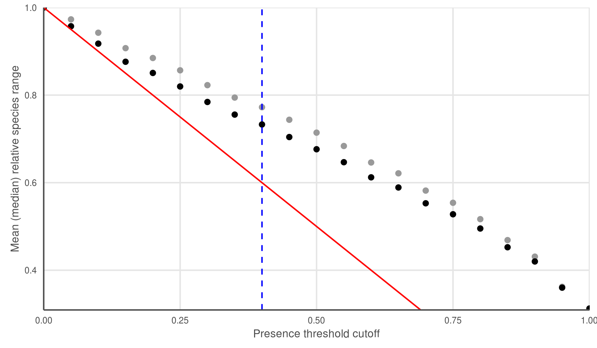

##Main message

Understanding the differences in marine species range maps from IUCN and AquaMaps, and the implications of using one or both.

##Working Abstract  

* Importance of understanding spatial distribution of species
    * help identify hotspots for global biodiversity 
    * priorities for conservation
    * marine spatial planning
    * assessing biodiversity 
    * monitor impacts (human, natural)
    * global-scale assessments
    * poor overlap of species lists between the two data sets - sometimes helpful to use both
* Challenges
    * difficulty of monitoring marine species in space
    * even more difficult to monitor over time
        * can Aquamaps, as a bioclimatic envelope model, be used to predict changes or used as proxy for species shifts if envelopes are known to have shifted? __can we use this as trend? or does all that count as pressures? seems like human factors can drastically change the trend that wouldn't be captured here__
        * Does that additional data in Aquamaps include predictions for 2050, 2100 (bioclimatic envelopes) - how is that reflected in the species distributions?
* IUCN vs Aquamaps
    * spatial distribution efforts range from modeled to expert input
    * distribution data for 1900+ species found in both data sets
    * differences in predictions of species presence in both distribution and area
        * Aquamaps validation and benefits from _Ready et al. 2010_:
          -  We present and evaluate AquaMaps, a presence-only species distribution modelling system that allows the incorporation of expert knowledge about habitat usage and was designed for maximum output of standardized species range maps at the global scale. In the marine environment there is a significant challenge to the production of range maps due to large biases in the amount and location of occurrence data for most species. AquaMaps is compared with traditional presence-only species distribution modelling methods to determine the quality of outputs under equivalently automated conditions.  _The effect of the inclusion of expert knowledge to AquaMaps is also investigated._ 
          - Model outputs were tested internally, through data partitioning, and externally against independent survey data to determine the ability of models to predict presence versus absence. Models were also tested externally by assessing correlation with independent survey estimates of relative species abundance. AquaMaps outputs compare well to the existing methods tested, and inclusion of expert knowledge results in a general improvement in model outputs. The transparency, speed and adaptability of the AquaMaps system, as well as the existing online framework which allows expert review to compensate for sampling biases and thus improve model predictions are proposed as additional benefits for public and research use alike.

* Implications
    * some species need more attention?
    * which data sets are more useful for which uses?
        * who uses IUCN? who uses AquaMaps?  Who uses both?
    * how can data decisions affect results of research or conservation efforts?
        * using OHI as an example

Species range maps are useful in conservation and management, as well as understanding the spatial distribution of movement and overlap of species in different habitats globally. Marine species prove more difficult to map based on their inherent nature of being difficult to observe and track. Two main sources for marine species are the IUCN and AquaMaps. These two datasets differ in methodology and final products, yet the differences between the two are not well documented *(though Aquamaps, and probably IUCN, each probably have some validation studies)*. AquaMaps uses a computer model based on preferential environmental parameters to predict species locations and probability of occurrence, while the IUCN uses expert insight to assign spatial boundaries around known locations of marine species. Approximately 1,900 species are found in both datasets and there are very large differences between these maps. Depending on data usage, choosing one of these datasets over the other can lead to potentially large differences in results as exemplified here by the Ocean Health Index as an example.

*** 

#Introduction

Mapping species abundances and distributions is a critical component to understanding global biodiversity and detecting patterns and trends through time. There have been multiple efforts to map terrestrial, freshwater and marine species from local to global scales. These pieces of information inform our understanding of taxonomic assemblages, biogeographical limits to species ranges, suitable habitat for species.

These two spatial datasets have been used to analyze species status globally (Halpern et al. 2012, Selig et al. 2013), global biodiversity patterns and trends, predicting range shifts (Molinos et al. 2015),and setting conservation priorities (Klein et al. 2015). Yet there have been no comprehensive comparisons of these two datasets to identify the differences and provide insight into how using one or the other can influence the outcome of an analysis. With impactful conclusions being drawn from these large-scale studies on global biodiversity and conservation, it's imperative that the data used in these analyses are appropriate and the data decisions are informed.

The IUCN Red List of Threatened Species has assessed **X** number of marine species, but only (**Y**) have associated spatial information. AquaMaps has developed range maps for over 22,800 species. There are only 2,100 species that have maps in both datasets. This gap in overlapping species between these two datasets further highlights the need for understanding each of these datasets. Both IUCN and AquaMaps have gaps in marine species information and a significant portion of available data may be overlooked if limited to just one of these datasets.

Species range maps provided by AquaMaps (Kaschner et al. 2013) are model-based, relying on environmental parameters in addition to known occurrences and expert input.  AquaMaps use information about individual species environmental tolerances for salinity, temperature, depth, productivity, and where applicable, sea ice and distance from land, to create a presence-only gridded range map at a resolution of 0.5 degree cells with cell values ranging from 0 to 1.00. These values represent the *relative environmental suitability* for the species, with 0 representing unsuitable habitat and 1.00 being the most suitable habitat. Once produced, each range map maintains a dynamic element that allows individuals to adjust parameters based on their expert knowledge to improve the model-generated map.

The maps provided by the IUCN for each assessed species are created by one or a few experts on that species. There are general guidelines to how the map should be created. Specifically, the final mapped polygons are meant to indicate that a species *probably only occurs within the polygon* but that the species *is not* evenly distributed everywhere within the polygon. The guidelines vary slightly for each type of species (terrestrial, freshwater, marine). These maps are dependent on records of observations from databases such as GBIF.

IUCN only publishes spatial distribution map sets for taxonomic groups in which at least 90% of the species within the taxon group have been evaluated.  While this helps prevent sampling bias within taxa, it also means that entire taxonomic groups remain unavailable until they have met this threshold of comprehensive assessment.  As of December 2015, IUCN species distribution maps were available for XXX marine species (habitat = "marine" on IUCN species information pages).

<!--
There have been multiple efforts to map marine species based on both observational data and known life history and habitat preferences. AquaMaps and IUCN are two of these efforts.
-->

#Section One: Understanding each dataset separately  

**Figure 1:** Species range map for *Chromis alpha* from the AquaMaps (orange) and IUCN (purple) datasets.
***Do we want to have this way up here?  needs explanation?***

###IUCN

The IUCN publishes species distribution maps for as collections of shapefiles for a range of taxonomic groups.  Species spatial distributions are determined by experts based upon <known occurrence, suitable habitat, and blah>.  The IUCN presents these maps as 'limits of distibution' with the caveat that the species 'probably occurs within this polygon, but it does not mean that it is distributed equally within that polygon or occurs everywhere within that polygon'.<cite?>  IUCN only publishes spatial distribution map sets for taxonomic groups in which at least 90% of the species within the taxon group have been evaluated.  While this helps prevent sampling bias within taxa, it also means that entire taxonomic groups remain unavailable until they have met this threshold of comprehensive assessment.  As of December 2015, IUCN species distribution maps were available for XXX marine species (habitat = "marine" on IUCN species information pages).

*something about format - polygons, fields, etc? presence/no presence*

*presence field, and seasonality info*

*terrestrial and marine both*
 
https://www.conservationtraining.org/course/view.php?id=217&lang=en

<!--
Spatial designation of the species distribution is left to the experts with strict guidance for how to assign the designation. Using known occurrence data, experts depict the species distribution by polygons using a systematic methodology laid out by the [IUCN](http://www.amphibians.org/wp-content/uploads/2013/09/Red-List-Mapping-standards-ARLA-Jan2014-web-version.pdf) (this needs a better source). 

**Data Type**  
Shapefiles for individual species. Spatial files include subpopulation information, presence (extinct/extant etc.) and seasonality information (breeding/migration/origin etc.).  
- ***Include other columns typically within each shapefile***

**Methods**  
From [IUCN site](http://www.iucnredlist.org/technical-documents/red-list-training/iucnspatialresources):  
    - The species distribution maps, sometimes referred to as 'limits of distribution' or 'field guide' maps, aim to provide the current known distribution of the species within its native range. The limits of distribution can be determined by using known occurrences of the species, along with the knowledge of habitat preferences, remaining suitable habitat, elevation limited, and other expert knowledge of the species and its range. In most cases the range is depicted as polygons. *A polygon displaying the limits of a species distribution is essentially meant to communicate that the species probably occurs within this polygon, but it does not mean that it is distributed equally within that polygon or occurs everywhere within that polygon*.  

- ***Spatial files for IUCN species groups attempt to include a broad sample across the group, to avoid sampling bias (maybe?)*** - but only some species groups have had spatial data released, so some taxa are not represented at all 
    - from http://www.iucnredlist.org/technical-documents/spatial-data: *"This spatial data provided below is for comprehensively assessed taxonomic groups."  "... the data is divided by taxonomic groups.  Groups that have been comprehensively assessed are those containing >90% species evaluated within the described taxon group."*
    -->

###AquaMaps 

[Site](http://www.aquamaps.org/)

AquaMaps (Kaschner et al. 2013) offers species range maps based on modeled relative environmental suitability.  For each assessed species, data from observations and expert knowledge are used to generate bioclimatic envelopes for sea surface temperature, salinity, depth, productivity, and where applicable, sea ice cover and/or distance to land.  The species' suite of bioclimatic envelopes is compared to a map of environmental attributes on a 0.5 degree global grid, creating a global map of ***probability of occurrence*** (or ***relative environmental suitability?*** (see Kaschner et al 2006 and 2011)), with cell values ranging from 0 (unsuitable) to 1.00 (highly suitable).  These maps can then be tweaked by experts altering the parameters and regenerating the modeled map. As of December 2015, ***22,000*** species have been mapped. ***Expert mode to further refine models?*** See (Kaschner et al. 2013) for more detailed methods.

- ***how is expert insight used? how frequently? new data set includes "reviewed" field*** expert insight seems to be used to generate the environmental suitability envelope for species, to provide sightings info that use used in training the model, and to exclude species from regions of known absence; but the model generates the maps. However, some species maps are reviewed by experts (approved? changed? what happens in the review)

### Comparison between AM and IUCN

- Problem of expert-defined range maps (over-predicting) vs sightings (under-predicting): 
from **Kaschner et al 2011**:  *Similar to the trade-offs of different habitat prediction modeling approaches [11], these two methods lie on ___opposite ends of a spectrum from potentially overpredicting expert-derived (range maps) to potentially underpredicting (empirical sighting surveys) range sizes___*
- are there other sources (non-IUCN and AM sources) that can back this up?

### Spatial resolution - not sure we need this, it is not really *resolution* but more about nuances of distribution... difference already explained above?

These two differ in spatial resolution - AquaMaps provides higher resolution information about where species do and do not occur globally whereas the IUCN range maps are unable to provide specific information about where within a polygon a species occurs.

### Poor overlap between assessed species

***  

# Section Two: In what ways do the two data sets differ

### Defining alignment between the two data sets

<!--
* Here we can discuss the idea of multiple "dimensions" of alignment - distributional and area alignment.  Well-aligned species will show high alignment in both dimensions.  
* Maybe a diagram here?
* What can alignment tell us about the individual species, the species groups, and the data sets?
* Note that alignment does not necessarily mean accuracy or precision - a poorly-understood species could appear to be well-aligned.  
-->

AquaMaps and IUCN marine species distribution maps ostensibly describe the same information, and while differences in methodology and input data will inevitably lead to differences, we would expect to see strong similarities between range maps for any given species.  

To facilitate our analysis, we selected the subset of marine species that have range maps in both IUCN and AquaMaps (n = ???), matched by Genus and species names, and then rasterized the IUCN shapefiles to match the Aquamaps half-cell raster.  We flattened each map by assigning to each cell a simple "presence/absence" value:

* For IUCN data, any cell with non-zero overlap with a range map polygon was considered "presence."  
* For AquaMaps data, any cell with non-zero probability (or RES) was considered "presence."  
* In both cases, these criteria for presence will maximize the number of cells included.  Using these criteria, we found that for 72% ??? of species, the IUCN distribution maps indicated a larger species range than the range indicated by AquaMaps.

Overlaying distribution maps from the two data sets for a given species, we calculated two dimensions of spatial alignment: distribution match, which we defined as the ratio of the smaller range that overlapped with the larger range; and area match, which we defined as the ratio of the smaller range to the larger range.

$$Match_{dist} = \frac{A_{overlap}}{A_{larger} * 100%$$

$$Match_{area} = \frac{A_{smaller}}{A_{larger} * 100%$$

For a species with well-matched distribution maps between the two data sets, we would expect to see a value near 100% for each dimension, indicating near-total inclusion of the smaller range within the larger (distribution alignment) and very similar extent of range (area alignment).

<!--
### Determining "presence" for each data set

To compare these two datasets for all species found in each (n = ***1920***?), we rasterized the IUCN polygons to the same cell resolution as AquaMaps: 0.5 degrees in both latitude and longitude. For every grid cell where the polygon overlapped ***the center point? or is it based on ANY overlap, e.g. using weights and including any non-zero weight?  This could boost IUCN presence***, a value of 1 was assigned. For the purposes of comparison, the probability of occurrence values in the AquaMaps data were ignored and all cells where there was a value greater than 0 were assigned a 1. This way we have comparable maps for total species range. 
- ***How do we justify a zero-threshold here?*** 
    - need to understand the "probability" - is it really ***relative environmental suitability***   From Kaschner et al 2011: "Patterns based on a presence threshold RES.0.6 (Fig. 1) were most strongly supported by empirical species richness data (see ‘Validation of species richness’, below)."
    - since IUCN "presence" seems to be pretty loose, set a wide tolerance on AM?
-->

### Differences in global distribution between data sets

Using predifined species groups by the IUCN, it is clear to see that tropical species - specifically wrasses, corals, blennies and groupers, make up the majority of species found in both. This is driven more by the IUCN dataset since the number of species with spatial data is directly attributed to the species that have assessments.

***Total species occurrences for each data set: all AM, all IUCN, and overlap (one? the other? occurrences of both?)***

***Relevance of this*** - unequal distribution of assessed species - strengths and weaknesses of each; benefits of using both maybe?

### Comparing alignment 

#### Comparing alignment by species

For each species range map, the total area was calculated for all cells that were included in either species distributions, regardless of source. The number of cells that were found in both *** <- this implies area may just be cell count?***

Figure 1 is an example of very large differences in a species range map from the IUCN and AquaMaps datasets. By considering the entire range of the species to be every cell that is in either dataset, only 3.14% of the map is in both. 3.18% is covered just by AquaMaps and 77.3% is covered just by IUCN. Figure 2
***focus on the percent overlap of small within large*** - describe this species in terms of alignment

*** Is the area calculated based on cell area, or just number of cells? ***

***Walk through the quadrant plot*** - describe meaning of each axis and each quadrant

#### Comparing alignment by species group

Which species groups are better aligned?  (save discussion until later?)

### Effect of changing threshold on area representation

***Where does the 40% threshold come from?  Is it commonly used?  Justification?*** Show effect of using a 40% threshold vs a 0% threshold.

Effect of selecting different thresholds on total "present" area - linearish, no big steps or drops to indicate sudden change in tradeoff.

***  

##Section Three: 

# Section Four: Implications

## Application to OHI

The global Ocean Health Index (Halpern et al. 2012), an index made up of 10 goals, utilizes both of these datasets to inform the  Biodiversity goal. The biodiversity goal is made up of two parts; Species and Habitats. The species subgoal uses the IUCN range map data and threat status to calculate average species status in global ocean regions around the world. Spatial range maps are developed by experts for species that are assessed. The assessment process happens in phases and only [X] number of marine species have been given spatial range maps. AquaMaps has spatial range maps for over 17,000 species. For those species that are missing spatial information from IUCN, AquaMaps data was used. If a species was assigned an IUCN threat status but did not have spatial range information in either dataset, it was excluded.

This decision to use IUCN data preferentially to AquaMaps data was made based on the fact that experts are developing the IUCN maps and AquaMaps data is based off a computer model, which in some cases is then consulted by an expert and appropriately altered.

Between the two databases, there are 1,923 species that have a range map in both. Figure [X] shows the change in status score for the Species Subgoal within the global Ocean Health Index under three different scenarios. 

<!--

-->

Scenario 1 shows change in score if IUCN maps were still preferentially used over AquaMaps, but the AquaMaps threshold was set to 1% rather than 40% probability of occurrence. Scenario 2 shows the change in score if we switched preferences for AquaMaps over IUCN data while keeping the 40% probability of occurrence threshold. The final Scenario is the same as scenario 2 but without a probability of occurrence threshold.

It is important to remember that although only ***[X (1,923/total number of species)]%*** of all species included in the species goal are found in both datasets, there are still significant differences when electing to choose one dataset over the other.

***  

##Section Four: Implications of data choices

***need more info on these options? they both sound interesting though***
- could talk about MPA gap analysis
- Highlight studies that have used one and not the other. Could this have changed the results?

***  

##References

**Key AquaMaps publications:**

Kaschner, K., D.P. Tittensor, J. Ready, T Gerrodette and B. Worm (2011). Current and Future Patterns of Global Marine Mammal Biodiversity. PLoS ONE 6(5): e19653. PDF

Ready, J., K. Kaschner, A.B. South, P.D Eastwood, T. Rees, J. Rius, E. Agbayani, S. Kullander and R. Froese (2010). Predicting the distributions of marine organisms at the global scale. Ecological Modelling 221(3): 467-478. PDF

**Papers based on AquaMaps:** ***Use these for section 4?***

Jones, M.C., S.R. Dyeb, J.K. Pinnegar and W.W.L. Cheung (2012). Modelling commercial fish distributions: Prediction and assessment using different approaches. Ecological Modelling 225(2012): 133-145. PDF

Coll, M., C. Piroddi, J. Steenbeek, K. Kaschner, F. Ben Rais Lasram et al. (2010). The biodiversity of the Mediterranean Sea: estimates, patterns, and threats. PLoS ONE 5(8): e11842. PDF

Martin C.S., Fletcher R., Jones M.C., Kaschner K., Sullivan E., Tittensor D.P., Mcowen C., Geffert J.L., van Bochove J.W., Thomas H., Blyth S., Ravillious C., Tolley M., Stanwell-Smith D. (2014). Manual of marine nd coastal datasets of biodiversity importance. May 2014 release. Cambridge (UK): UNEP World Conservation Monitoring Centre. 28 pp. (+ 4 annexes totalling 174 pp. and one e-supplement). PDF

#References

García Molinos, Jorge, Benjamin S. Halpern, David S. Schoeman, Christopher J. Brown, Wolfgang Kiessling, Pippa J. Moore, John M. Pandolfi, Elvira S. Poloczanska, Anthony J. Richardson, and Michael T. Burrows. “Climate Velocity and the Future Global Redistribution of Marine Biodiversity.” Nature Climate Change advance online publication (August 31, 2015). doi:10.1038/nclimate2769.

Halpern, Benjamin S., Catherine Longo, Darren Hardy, Karen L. McLeod, Jameal F. Samhouri, Steven K. Katona, Kristin Kleisner, et al. “An Index to Assess the Health and Benefits of the Global Ocean.” Nature 488, no. 7413 (August 30, 2012): 615–20. doi:10.1038/nature11397.

Halpin, P.N., A.J. Read, E. Fujioka, B.D. Best, B. Donnelly, L.J. Hazen, C. Kot, K. Urian, E. LaBrecque, A. Dimatteo, J. Cleary, C. Good, L.B. Crowder, and K.D. Hyrenbach. 2009. OBIS-SEAMAP: The world data center for marine mammal, sea bird, and sea turtle distributions. Oceanography 22(2):104-115

Klein, Carissa J., Christopher J. Brown, Benjamin S. Halpern, Daniel B. Segan, Jennifer McGowan, Maria Beger, and James E.M. Watson. “Shortfalls in the Global Protected Area Network at Representing Marine Biodiversity.” Scientific Reports 5 (December 3, 2015): 17539. doi:10.1038/srep17539.

Selig, Elizabeth R., Catherine Longo, Benjamin S. Halpern, Benjamin D. Best, Darren Hardy, Cristiane T. Elfes, Courtney Scarborough, Kristin M. Kleisner, and Steven K. Katona. “Assessing Global Marine Biodiversity Status within a Coupled Socio-Ecological Perspective.” PLoS ONE 8, no. 4 (April 11, 2013): e60284. doi:10.1371/journal.pone.0060284.
