##Main message (25 words or less):

With the increasing numbers of open datasets, it is important to understand the implications of using certain data over others. 

##Working Abstract  

##Section One: Understanding each dataset separately  

####**IUCN**  

**Data Type**  
Shapefiles for individual species. Spatial files include subpopulation information, presence (extinct/extant etc.) and seasonality information (breeding/migration/origin etc.).  

**INSERT MAP**  

**Methods**  
From [IUCN site](http://www.iucnredlist.org/technical-documents/red-list-training/iucnspatialresources):  

> The species distribution maps, sometimes referred to as 'limits of distribution' or 'field guide' maps, aim to provide the current known distribution of the species within its native range. The limits of distribution can be determined by using known occurrences of the species, along with the knowledge of habitat preferences, remaining suitable habitat, elevation limited, and other expert knowledge of the species and its range. In most cases the range is depicted as polygons. *A polygon displaying the limits of a species distribution is essentially meant to communicate that the species probably occurs within this polygon, but it does not mean that it is distributed equally within that polygon or occurs everywhere within that polygon*.  

####AquaMaps  

[Site](http://www.aquamaps.org/)

Over 17,000 species  

Computer model using 6 parameters (SST, salinity, temperature, depth, distance to land, sea ice cover)  

***  
##Section Two: Comparison of IUCN and AquaMaps

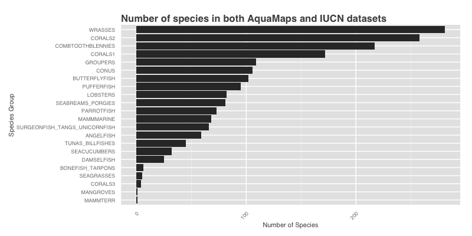
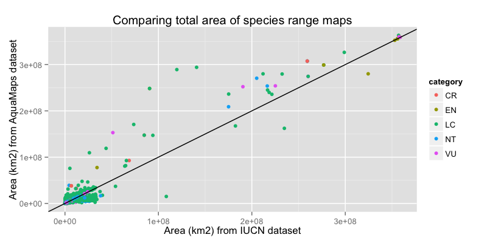
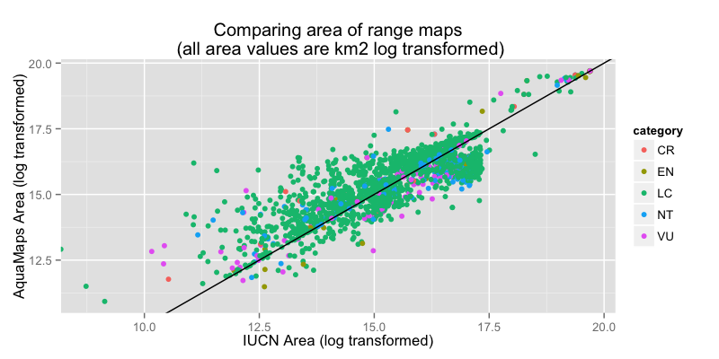
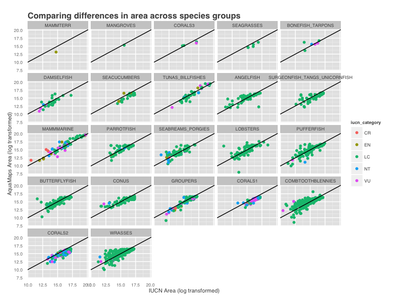
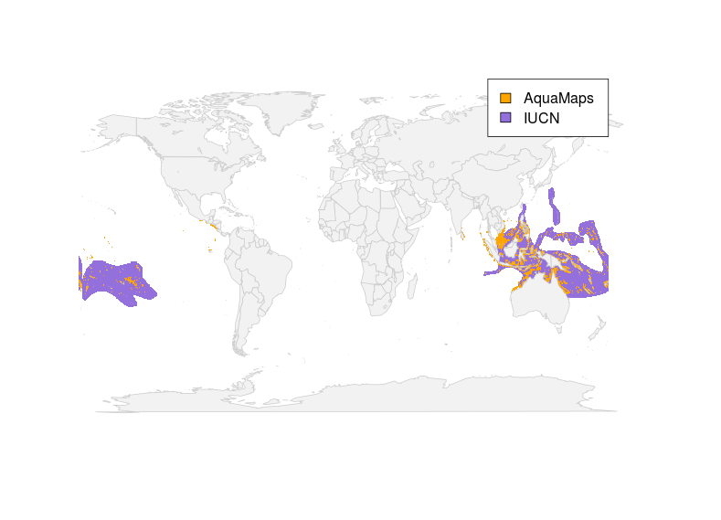
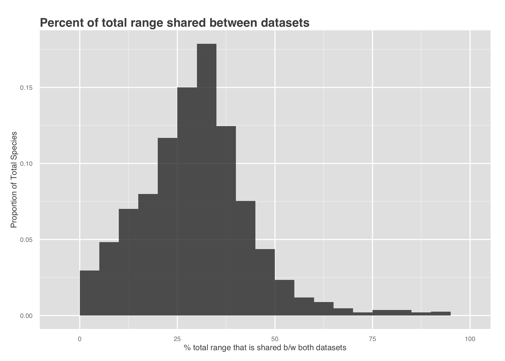
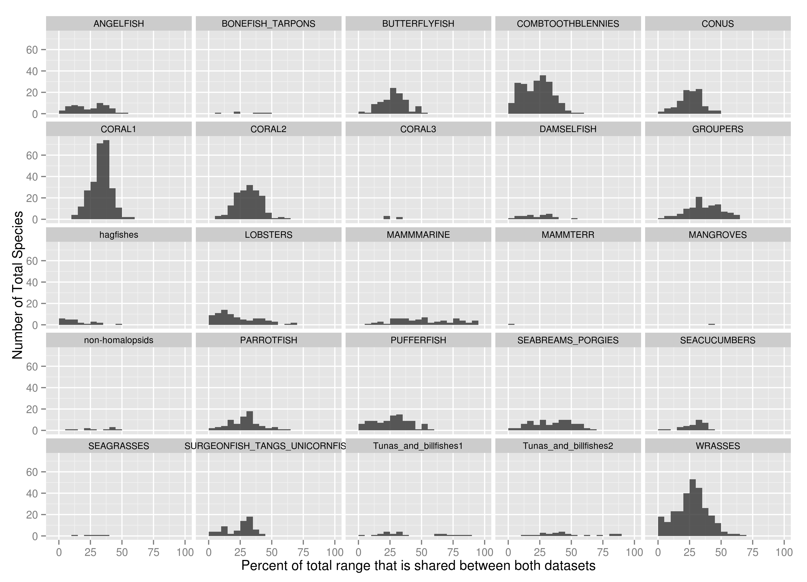
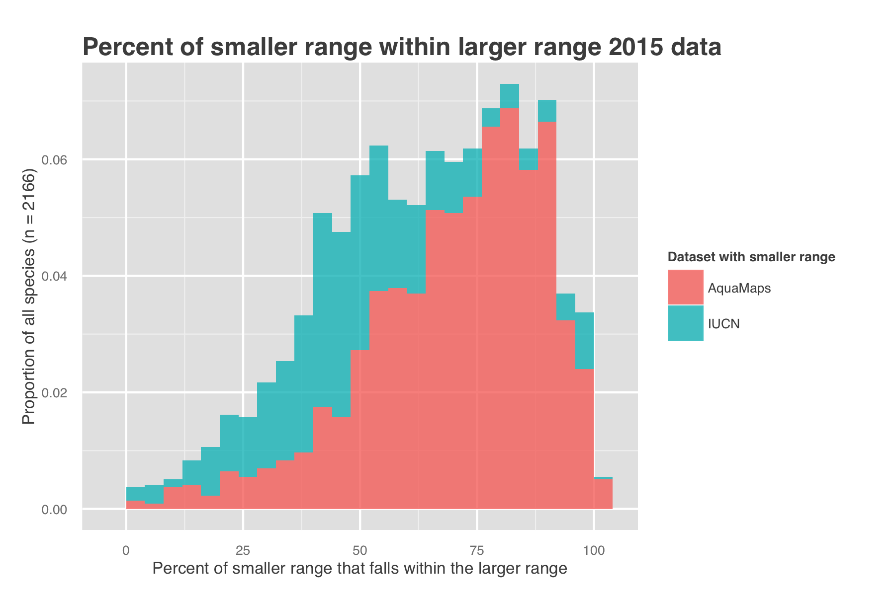
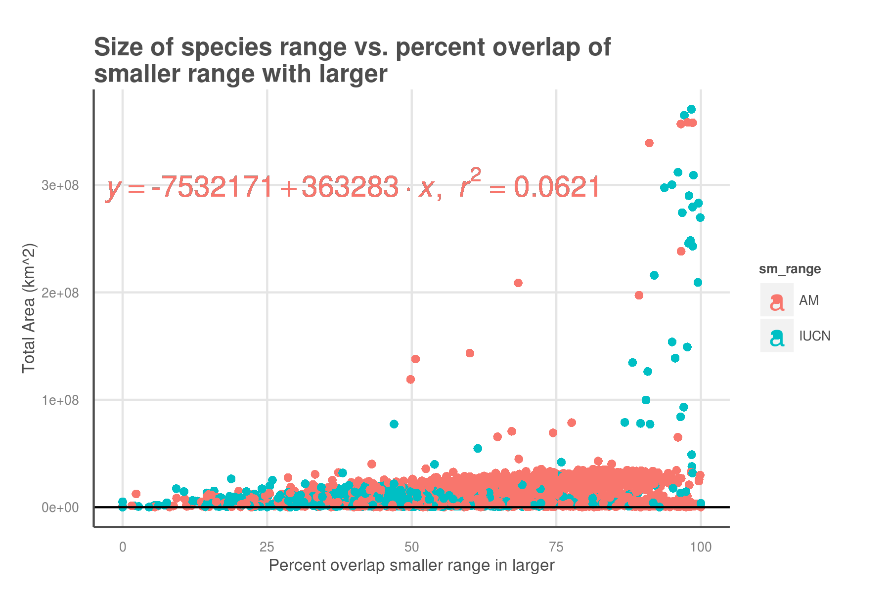
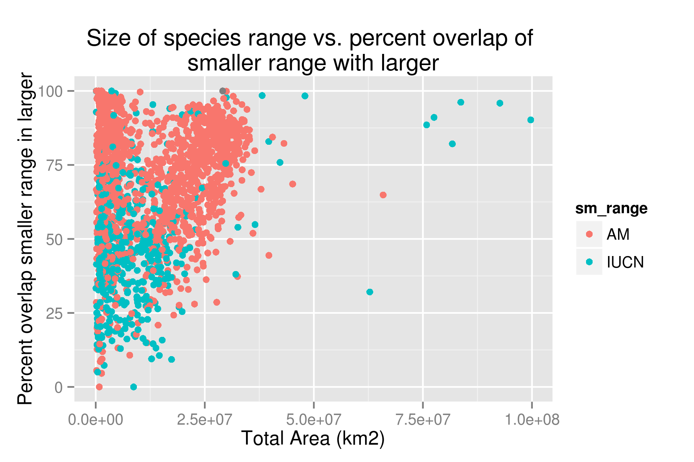
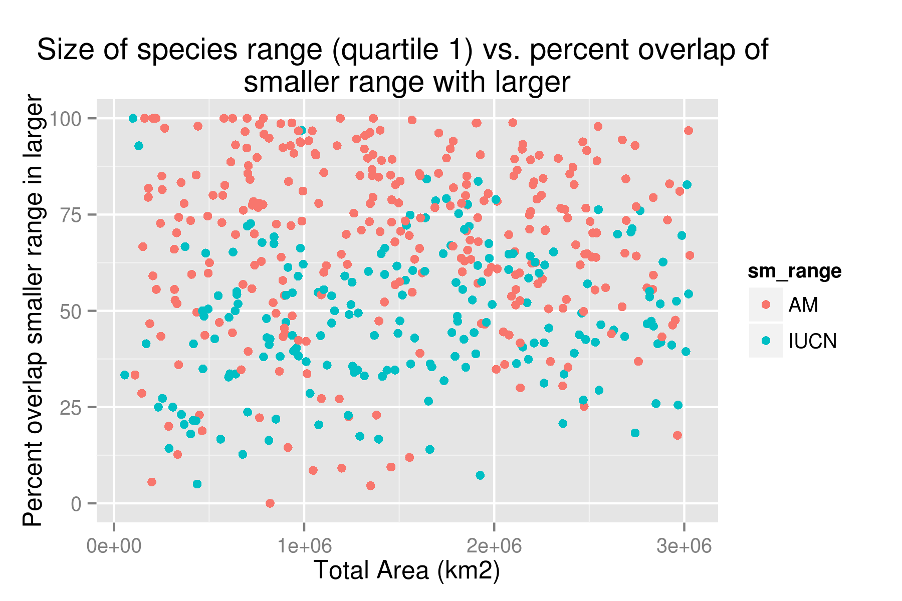
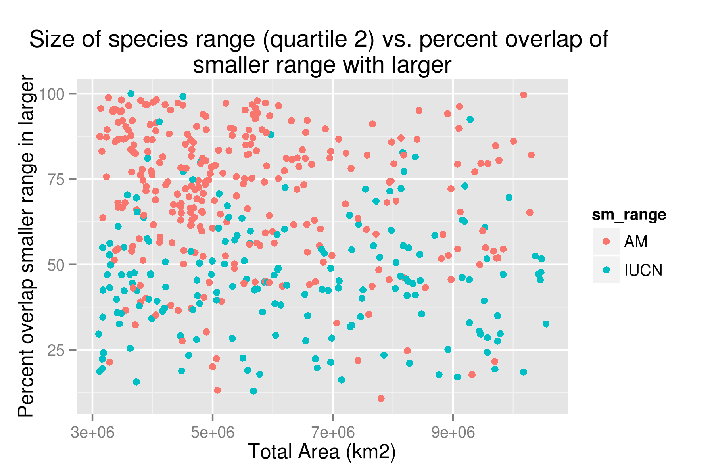
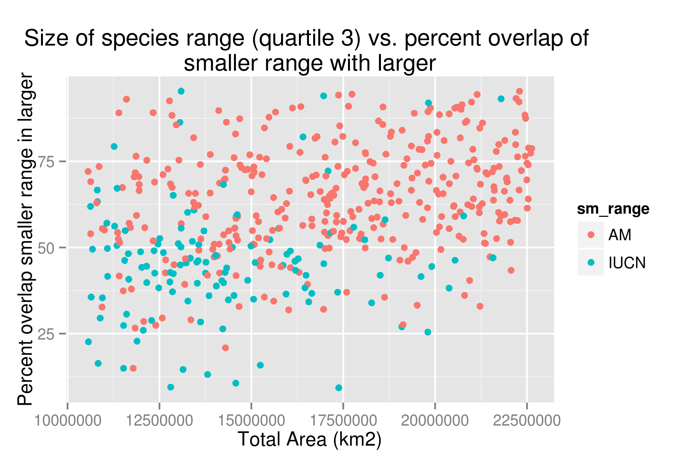
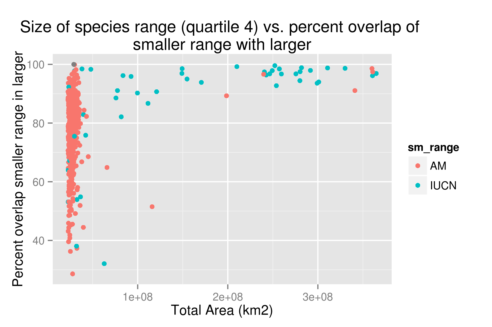
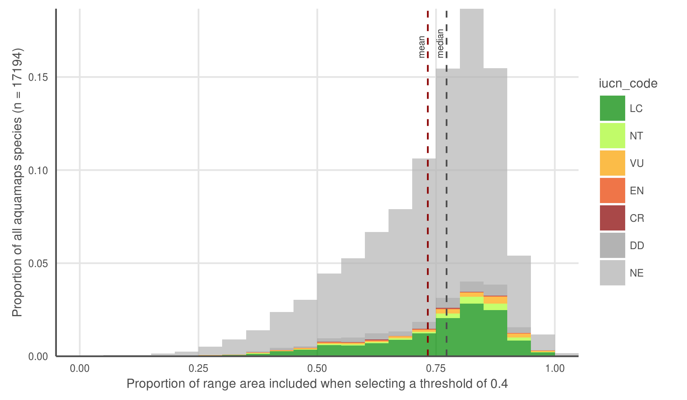

***  
##Section Three: Application to OHI

The global Ocean Health Index (Halpern et al. 2012), an index made up of 10 goals, utilizes both of these datasets to inform the  Biodiversity goal. The biodiversity goal is made up of two parts; Species and Habitats. The species subgoal uses the IUCN range map data and threat status to calculate average species status in global ocean regions around the world. Since IUCN only has range maps for X% of total assessed species, AquaMaps provided the data in instances where we have a threat status but no range map.

***  

##Section Four: Implications of data choices
- could talk about MPA gap analysis
- Highlights tudies that have used one and not the other. Could this have changed the results?

***  

##References
