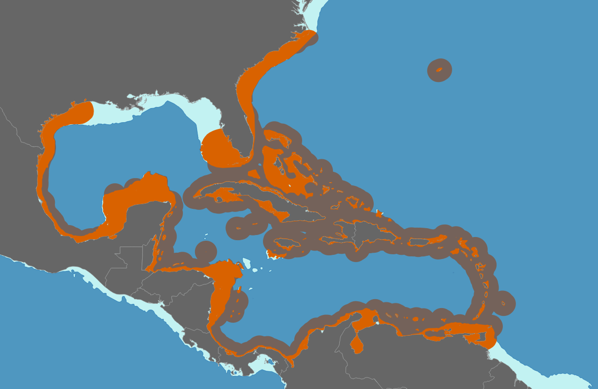
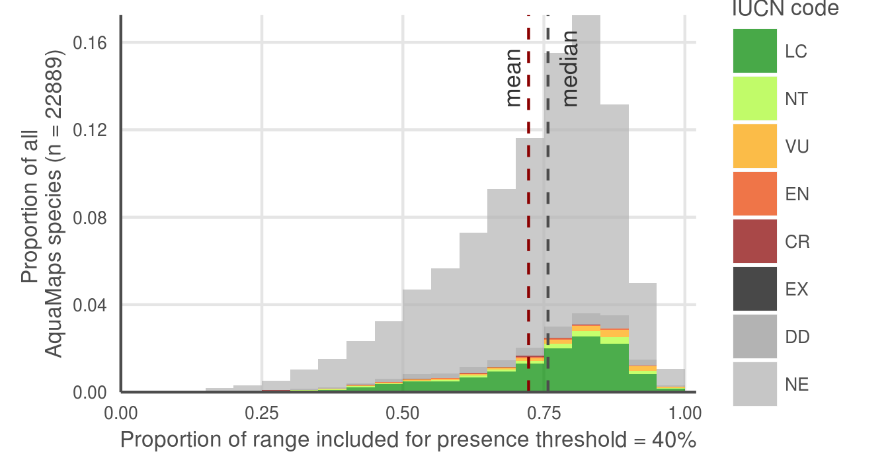
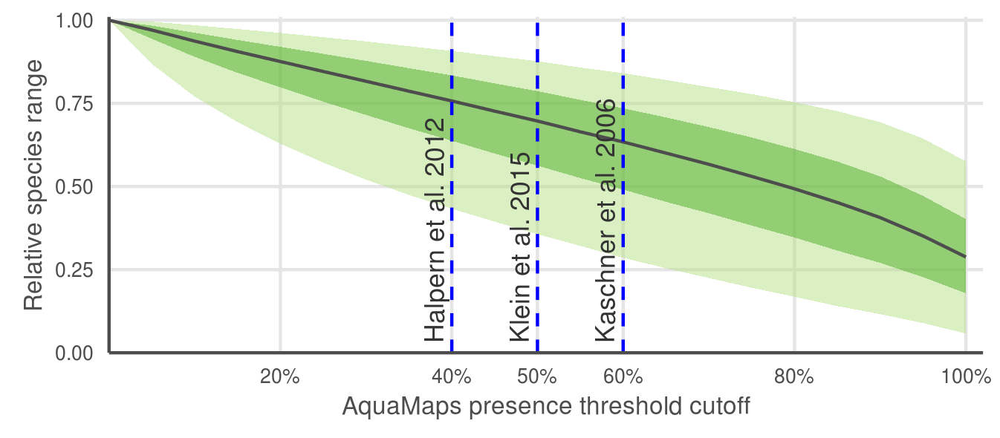

<!--

from PNAS http://www.pnas.org/site/authors/preparation.xhtml:

The main text of the paper must stand on its own without the SI. Refer to SI in the manuscript at an appropriate point in the text. Number supporting figures and tables starting with S1, S2, etc. Authors are limited to no more than 10 SI files, not including movie files.

Authors who place detailed materials and methods in SI must provide sufficient detail in the main text methods to enable a reader to follow the logic of the procedures and results and also must reference the online methods. If a paper is fundamentally a study of a new method or technique, then the methods must be described completely in the main text.

Because PNAS edits SI and composes it into a single PDF, authors must provide the following file formats only:

Text: Supply Word, RTF, or LaTeX files (LaTeX files must be accompanied by a PDF with the same file name for visual reference).
Figures: Provide a brief legend for each supporting figure after the supporting text. Provide figure images in TIFF, EPS, high-resolution PDF, JPEG, or GIF format; figures may not be embedded in manuscript text. When saving TIFF files, use only LZW compression; do not use JPEG compression. Do not save figure numbers, legends, or author names as part of the image. Composite figures must be preassembled.
3D figures: Supply a composable U3D or PRC file so that it may be edited and composed. Authors may submit a PDF file but please note it will be published in raw format and will not be edited or composed.
Tables: Supply Word, RTF, or LaTeX files (LaTeX files must be accompanied by a PDF with the same file name for visual reference); include only one table per file. Do not use tabs or spaces to separate columns in Word tables.
Datasets: Supply Excel (.xls), RTF, or PDF files. This file type will be published in raw format and will not be edited or composed.
Movies: Supply Audio Video Interleave (avi), Quicktime (mov), Windows Media (wmv), animated GIF (gif), or MPEG files and submit a brief legend for each movie in a Word or RTF file. All movies should be submitted at the desired reproduction size and length. Movies should be no more than 10 MB in size.
Still images: Authors must provide a still image from each video file. Supply TIFF, EPS, high-resolution PDF, JPEG, or GIF files.
Appendices: PNAS prefers that authors submit individual source files to ensure readability. If this is not possible, supply a single PDF file that contains all of the SI associated with the paper. This file type will be published in raw format and will not be edited or composed.
-->
<!--
# Data sources and methods

All code is publicly available and freely downloadable [here on GitHub](link to github).

## AquaMaps

AquaMaps data was provided by AquaMaps directly via ftp. Three SQL files were sent that contained (1) list of all 22,889 modeled species and their taxonomic information, (2) information for all (259,200) half degree cells used for range mapping and (3) the probability of occurrence per cell for all 22,889 species. These were extracted into .csv form using R Statistical Software. 

## IUCN

As of December 2015, IUCN had published species distribution maps for XXX marine species across 24 taxonomic groups.  For this analysis, we did not consider IUCN range maps for bird species, as those data are hosted separately by BirdLife International.

Each shapefile contains spatial polygons outlining limits of distribution for each species, indicating regions of presence/absence; additional attributes provide information on extant/extinct ranges, native/introduced ranges, and seasonality.
-->

## Representative maps from each quadrant

>  __Fig. S1.__ Representative species maps to illustrate each quadrant from Fig. 2A.  Note that B-E are arranged to match quadrants in Fig. S1A. (A) Alternative version of Figure 2A that includes extinction risk categories for each species.  Four representative species, one from each quadrant, are mapped in (B-E).
(B) Well-matched: Kajikia albida, the Atlantic white marlin.  Ranges from each data set show nearly complete overlap, and very similar area of coverage.
(C) Distribution-matched: Conus episcopatus, the dignified cone snail.  Ranges shows excellent overlap in the western Pacific, though IUCN range extends beyond the bounds of the AquaMaps range.
(D) Area-matched: Conus magnificus, the magnificent cone snail.  Ranges overlap in the southern Pacific, but align poorly elsewhere.  The total area for each range is similar.
(E) Poorly-matched: Acanthurus nigroris, the blue-lined surgeonfish.  IUCN predicts species range only near the Hawaiian islands; AquaMaps predicts extensive range throughout the central and western Pacific Ocean.  The datasets align in neither distribution nor area of coverage.

## Risk by quadrant

>  __Fig. S2.__ Breakdown of quadrants (Fig. S1A) by IUCN extinction risk categories.  IUCN and Aquamaps ranges were in better agreement (i.e., had a higher probability of being in the upper-right, "well-aligned" quadrant, Figure 2A/Figure S1A) for species at greater risk according to IUCN risk categories (p < 0.001, generalized linear model, family = binomial, Table S1).  This suggests at-risk species may receive more attention in terms of data collection or model refinement.  

> __Table S1.__  Generalized linear model (family = binomial) describing how the agreement between IUCN and Aquamap range maps (i.e., probability of occurring in quadrant 1, Figure 2A/S1A) increases for a species as its IUCN risk status increases.  For this analysis, we excluded all species that had "data deficient" IUCN status (n = 255).  We analyzed the IUCN risk categories as a continuous variable (LC = 0.0, NT = 0.2, VU = 0.4, EN = 0.6, CR = 0.8, EX = 1.0).

_Model: glm(quadrant 1 membership ~ IUCN category, family = binomial) n = 2,059_

| Coefficients:  | Estimate | Std. Error | z value | p value      |
| :-----         |   -----: |     -----: |  -----: |       -----: |
| Intercept      | -1.32933 |   0.05804  | -22.902 | < 2e-16 ***  |
| IUCN category  |  1.18672 |   0.33469  |   3.546 | 0.000391 *** |

### Coral depth map

>  __Fig. S3.__ IUCN-defined range of _Oculina varicosa_, a typical photosynthetic coral, plotted against a 200 m bathymetry contour. According to IUCN, _O. varicosa_ can be found to depths of 152 m.  Maps of many other coral species and other reef-associated organisms followed similar patterns.

### AquaMaps threshold examination

AquaMaps distribution maps indicate "probability of occurrence" within each 0.5° cell, with values ranging from zero to one, rather than a simple present/absent value as indicated by IUCN maps.  Many studies convert this AquaMaps probability to a simple presence value by assigning a threshold value.  

To examine the effect of different presence threshold selections on the represented range of a species, we varied the threshold from 0% to 100% and calculated the average species range relative to a zero threshold.

A. 
 

B. 

>  __Fig. S4.__ AquaMaps distribution map extent remaining after applying a presence threshold. A higher threshold constrains an analysis to cells with near certainty of occurrence, while a low threshold captures larger areas of increasingly marginal suitability. (A) A 40% threshold applied to all species in the AquaMaps dataset shows a mean loss of 28% of total range compared to a 0% threshold, with a wide distribution in which some species lose nearly all of their apparent range.  (B) Median remaining extent at increments of presence threshold. Dark green ribbon includes 25% to 75% quantiles of remaining species range, while lighter ribbon includes 5% to 95% quantiles.  Incrementing the presence threshold from 0.00 to 1.00 for the entire AquaMaps dataset, the shallow downward trend indicates a low but consistent sensitivity of apparent species range to threshold choice, with no surprising tradeoffs that could suggest an "optimal" threshold.

<!--
## MPA gap analysis - explanation
 
___why so many gaps and 10+ species show up with IUCN.  I will write up a paragraph once I've had a little more time to examine maps___

- check which species are gap species; check maps
- check which species are 10%+ species and check maps
- where do these species fall georegionally? is there anything odd about their ranges? any reason why IUCN would be 
- hypothesis to explain more gap species: Aquamaps more diffuse than IUCN, catching individual cells that could be suitable; a single cell (even low probability) moves a species from "gap" to non-gap status.  IUCN more clustered by polygon boundaries; so no scattered cells to accidentally fall into an MPA. 
    - introducing errors: AM = likely commission (overestimates species with tiny bits of range in MPAs) vs IUCN = possible omission (misses possible real habitat that falls within MPAs)
- hypothesis to explain more 10%+ species - ten random samples most have IUCN polygons just east of Australia where a large MPA is indicated - Great Barrier Reef I assume - a single large poly falling in GBR gets a high score, while for the same species, many of the AM ranges (also in same area) scatter suitable area over larger extent, so lower percent of species range is protected
    - introducing errors: IUCN = likely omission (skipping possible real habitat outside of MPAs) and likely commission (possibly overcounting real habitat in MPAs e.g. GBR); AquaMaps = probably a little commission (possibly underestimating, if it overpredicts lots of range outside MPAs, thus reducing the proportion of protected range)
-->

<!--
#### Caveats
For example, as of this writing, IUCN has released no spatial data for class Elasmobranchii (cartilaginous fishes including sharks and rays); and while IUCN offers a large number of maps within class Actinopterygii (ray-finned bony fishes), the available maps include only a few primarily tropical taxonomic sub-groups, such as wrasses, damselfish, butterflyfish, tunas, and billfishes, but are missing economically important subgroups including salmon, rockfish, and clupeids.  However, IUCN's criterion of comprehensive assessment greatly reduces the risk of sample bias within the bounds of the assessed taxonomic groups.
-->

