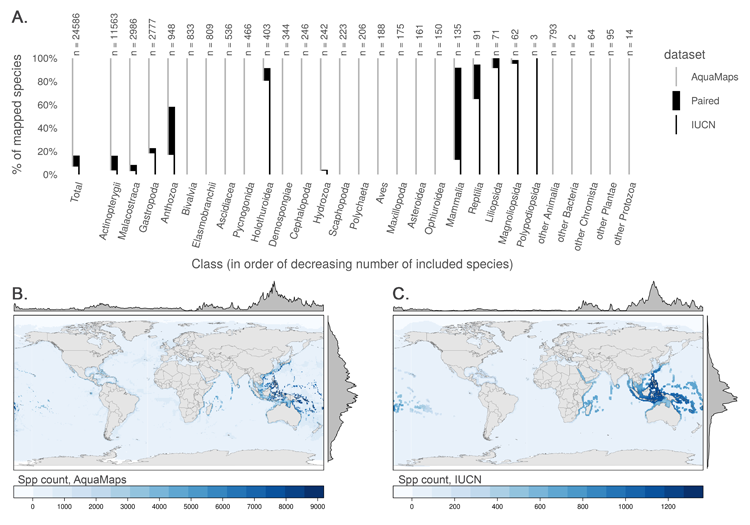

**Fig 1. Taxonomic and geographic coverage of AquaMaps and IUCN range data.** (A) Number and proportion of species by taxa included in each dataset (22,889 species in AquaMaps, 4,027 species in IUCN). Overlapping species are dominated by bony fishes (994 species, primarily tropical taxa) and corals (394 species). (B, C) Global marine species count per 0.5° cell according to (B) AquaMaps and (C) IUCN. The margin frequency plots show relative species count per cell at each latitude and longitude.