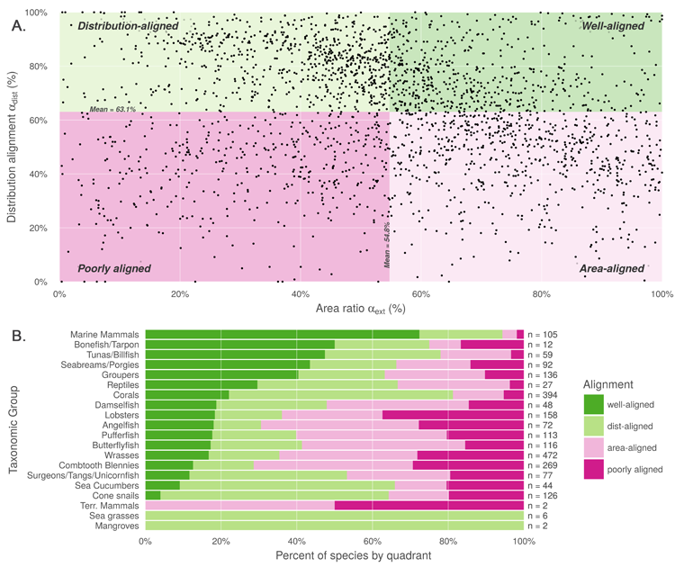

**Fig 2. Comparison of alignment between AquaMaps and IUCN range data.** (A) Distribution alignment (overlap of smaller range within larger) versus area ratio (the ratio of smaller range area to the larger range area) for 2,330 species included in both IUCN and AquaMaps datasets. The upper right quadrant comprises species whose maps largely agree in both spatial distribution and the extent of described ranges (n = 522; 22.4% of paired map species). The upper left quadrant comprises species whose maps agree well in distribution, but disagree in area (n = 715; 30.7%). The lower right quadrant includes species for which the paired maps generally agree in range area, but disagree on where those ranges occur (n = 649; 27.9%). The lower left quadrant indicates species for which the map pairs agree poorly in both area and distribution (n = 444; 19.1%). (B) Alignment quadrant breakdown of species by taxonomic group.
