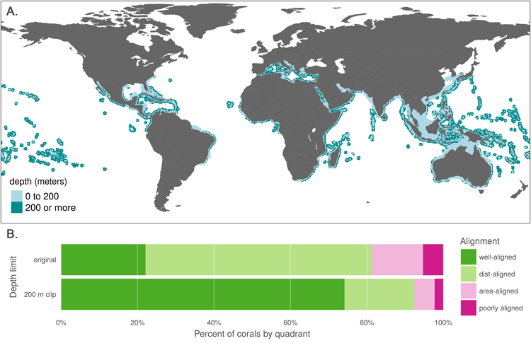

**Fig 3. Effect of 200 m depth constraint on IUCN range maps for coral species.** (A) Aggregate map combining ranges of the 562 coral species mapped in the IUCN dataset, showing raw ranges and ranges clipped to 200 m depth. (B) Alignment quadrant breakdown of paired map coral species using original data from IUCN and AquaMaps (as in Fig 2B) and the same species with IUCN ranges clipped to 200 m depth.