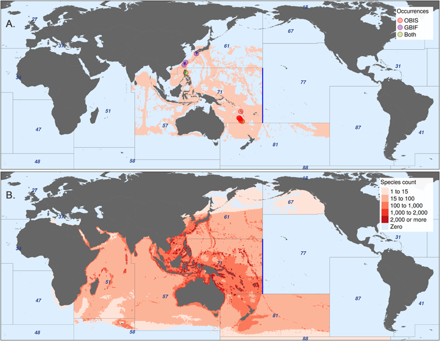

**Fig 4. Effect of FAO Major Fishing Area constraints on AquaMaps distributions.** (A) AquaMaps species distribution of Hoplichthys regani, the ghost flathead, with known occurrence records. (B) Aggregated AquaMaps predicted ranges for 3,208 species whose equatorial distribution encounters an eastern discontinuity exactly at 175° W, the boundary between FAO Major Fishing Areas 71 and 77 (shown in blue). Other FAO area boundaries create additional clear discontinuities.