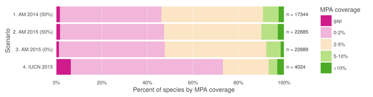

**Fig 5. MPA gap analysis results based upon alternate choices of datasets.** Percent of species range covered by MPAs based upon methods in Klein et al. (2015). Scenario 1 replicates the original results, measuring protected range of species in AquaMaps version 08/2013 dataset, with a 50% presence threshold, against the 2014 World Database of Protected Areas, filtered for IUCN categories I-IV that overlap marine areas. Scenario 2 updates the results using AquaMaps version 08/2015, showing very small changes despite the inclusion of an additional 5,545 species. Scenario 3, still using 2015 AquaMaps data, drops the presence threshold to zero, showing an expected decrease in gap species, but also a decrease in species with 5% or greater protected range. Scenario 4 examines species MPA coverage using only the IUCN dataset.