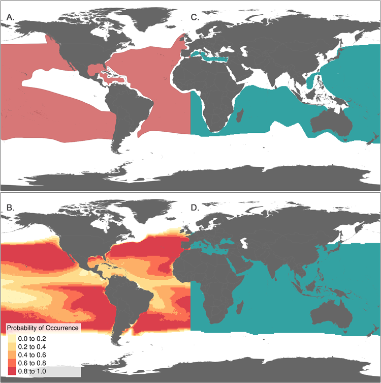

**S1 Fig. Examples of AquaMaps and IUCN raw species range data for _Thunnus alalunga_ (Albacore Tuna).** (A) IUCN species distribution represented as extent of occurrence polygons. (B) AquaMaps species distribution represented as varying probabilities of occurrence assigned to 0.5° grid cells. (C) IUCN and (D) AquaMaps distributions recalculated to represent presence within 0.5° grid cells.
