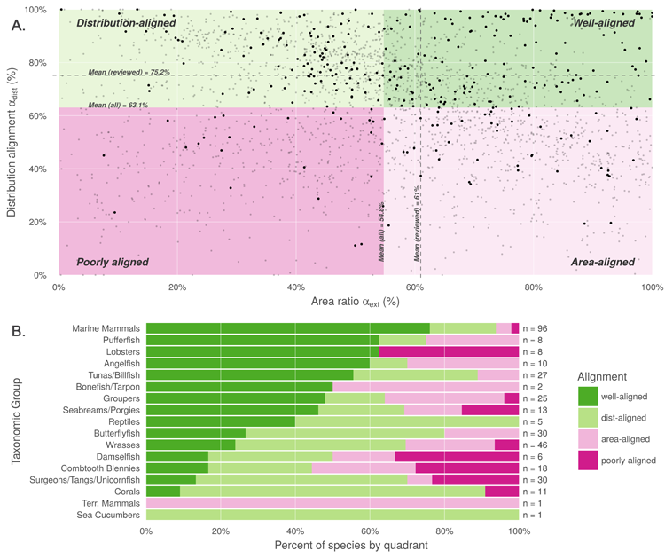

**S4 Fig. Improvement in alignment due to expert review of AquaMaps.** (A) Modification of Fig 2A to highlight species with expert-reviewed AquaMaps shows that the mean distribution alignment and mean area ratio both improve. (B) Including only expert-reviewed species in each quadrant shows increased membership in the well-aligned and distribution-aligned quadrants relative to Fig 2B.
