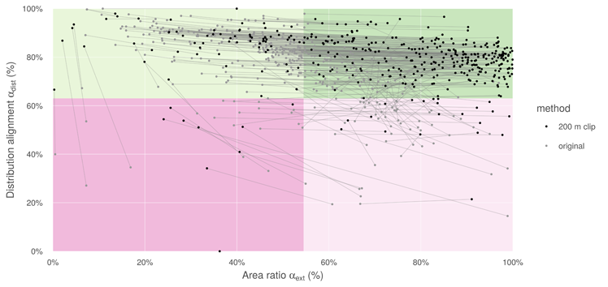

**S5 Fig. Shift in alignment of paired-map coral species due to clipping IUCN ranges to areas shallower than 200 m.** The grey lines represent the change in apparent alignment for a single species. Most coral species shift rightward from the upper left quadrant to the upper right, improving in area alignment with little if any loss in distribution alignment, since in general, only unsuitable habitat has been removed. Leftward shifts can be seen in species whose larger original range is represented in AquaMaps; by trimming IUCN ranges, the area ratio becomes smaller.